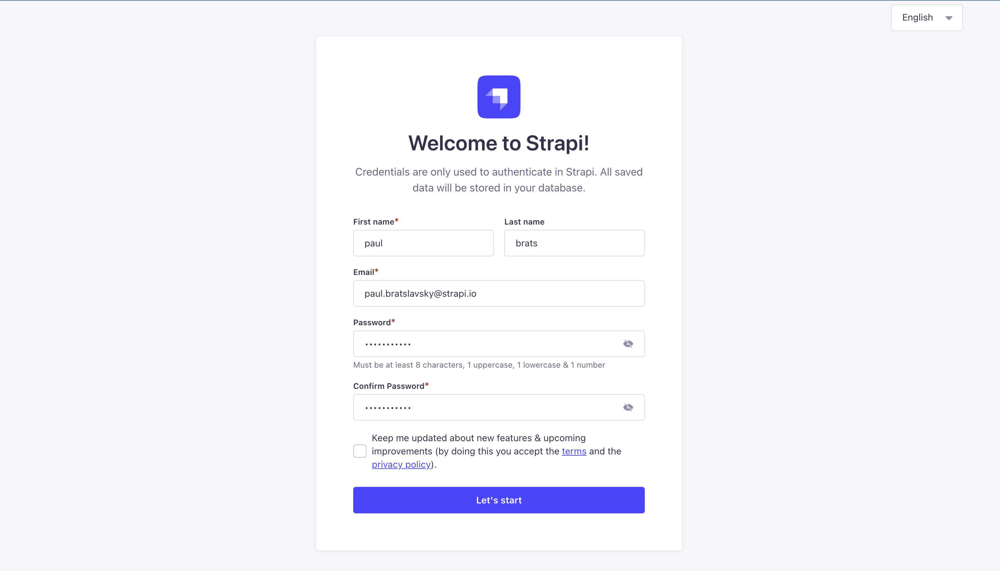
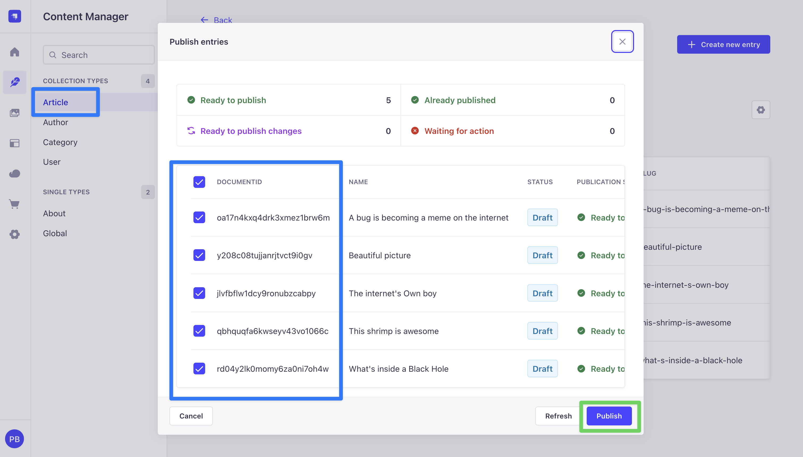
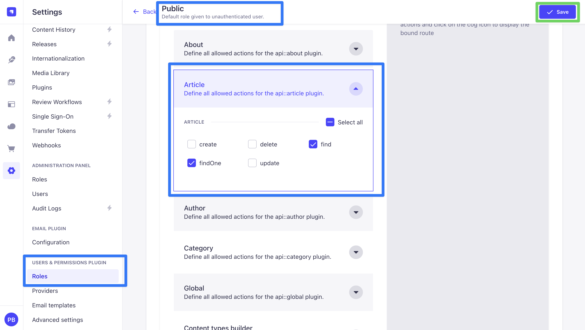
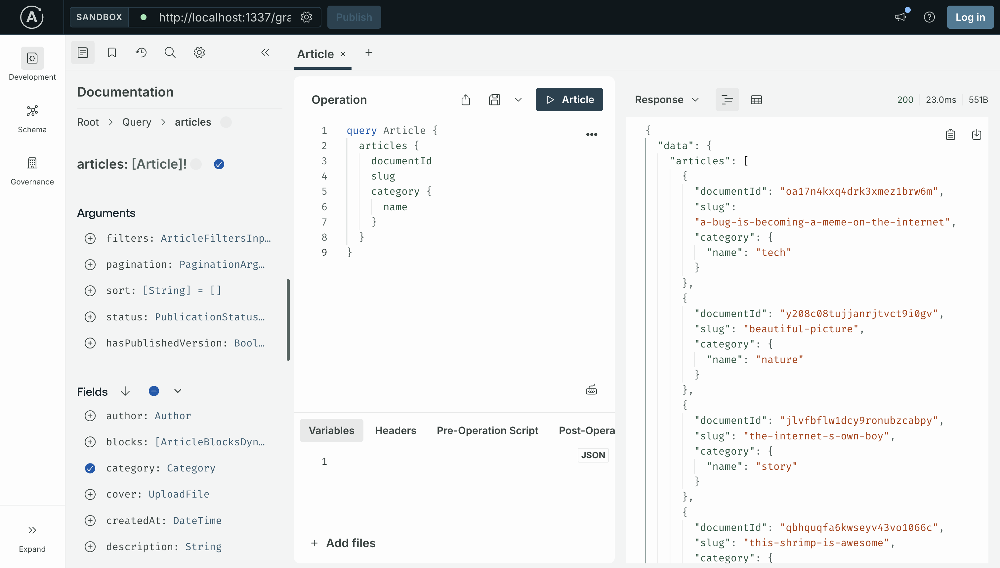

# REST or GraphQL: When to Pick Each, with a Strapi v5 Comparison

A common framing of the REST-vs-GraphQL debate goes: "REST forces you to over-fetch; GraphQL lets you ask for exactly what you need." That framing is incomplete. Field selection in REST has been part of widely-used specifications for over a decade.

We'll go through what differs between REST and GraphQL in 2026, then look at Strapi v5 specifically, where both APIs are available out of the box and the choice has practical consequences.

**TL;DR**

- Field selection is not unique to GraphQL. JSON:API, OData, GitHub's REST API, and Strapi v5 all support sparse fieldsets, populate-style includes, and rich filtering through query parameters. Modern REST returns the same precise data shape a GraphQL selection would.
- The two APIs differ in caching, error semantics, the N+1 problem, query-cost attacks, per-field authorization, file uploads, and operational tooling. Several of these favor REST. Federation and a typed, introspectable schema favor GraphQL, with use cases that have specific preconditions.
- Most projects do well on REST. GraphQL pays off when several clients pull different slices of the same graph, when custom queries need to aggregate across types, or when a frontend is already built around Apollo or Relay.
- In Strapi v5, the REST API is on by default and complete. GraphQL is a plugin. REST handles file uploads; GraphQL does not. With OpenAPI plus `openapi-fetch`, REST also gets end-to-end TypeScript types without an Apollo runtime.

## 1. Field selection is not a GraphQL-only feature

The over-fetching argument goes like this: a REST endpoint returns a fixed payload. If the page only needs the article title and slug, but the endpoint returns the full body, the byline, the cover image, and twelve other fields, the client paid for data it did not use. GraphQL solves this by letting the client name the fields it wants.

The same control exists in REST, and has for years.

- JSON:API, a published specification, has supported sparse fieldsets since 2015. A request of `?fields[articles]=title,slug` returns title and slug.
- OData has supported `$select`, `$expand`, and `$filter` since 2007.
- GitHub's REST API supports field expansion through the `Accept` header and media types.
- Stripe, Salesforce, Atlassian, and Klaviyo all expose some form of field selection.
- Strapi v5's REST API supports the same pattern through `?fields[0]=title&fields[1]=slug`.

A Strapi request like:

```
GET /api/articles?fields[0]=title&fields[1]=slug&populate[author][fields][0]=name
```

returns articles with the title, slug, and author name (plus the auto-included `id` and `documentId` that Strapi adds to every entry). The data shape is the same as the equivalent GraphQL selection.

That URL is the LHS bracket syntax, the format Strapi accepts on the wire. It is awkward to read once you start nesting `populate` inside `fields` inside another `populate`. Most code does not write it by hand. It writes a plain JavaScript object and lets `qs` serialize it:

```ts
import qs from "qs";

const query = qs.stringify(
  {
    fields: ["title", "slug"],
    populate: {
      author: { fields: ["name"] },
    },
  },
  { encodeValuesOnly: true },
);
// → "fields[0]=title&fields[1]=slug&populate[author][fields][0]=name"

await fetch(`/api/articles?${query}`);
```

The `@strapi/client` SDK does the same thing under the hood, and accepts the same shape:

```ts
import { strapi } from "@strapi/client";

const client = strapi({ baseURL: "http://localhost:1337/api" });
const articles = await client.collection("articles").find({
  fields: ["title", "slug"],
  populate: { author: { fields: ["name"] } },
});
```

So the bracket form is what the server sees, but it is not what the developer types.

Whether GraphQL's other properties (a typed schema, a single endpoint, introspection, federation, subscriptions) justify the costs that come with them is the question the next sections work through.

## 2. What actually differs

### 2.1 Setup

REST needs nothing on day one. An HTTP framework gives you routes and handlers. Every tool that exists, including curl, the browser address bar, Postman, your shell, your CI runner, and your CDN, already speaks HTTP.

```bash
curl https://api.example.com/articles/42?fields[0]=title&fields[1]=slug
```

That is the whole client.

GraphQL is more parts. On the server you need a library: Apollo Server, GraphQL Yoga, Mercurius, gqlgen, or the framework's plugin (Strapi's GraphQL plugin uses Apollo Server under the hood). You define a schema, write resolvers, and wire the two together. On the client you usually want Apollo Client, urql, or Relay. A raw `fetch` works, but the moment you want a normalized cache, optimistic updates, or any of the things people install Apollo for, you are back to a real client library. To get TypeScript types from your queries you also need GraphQL Code Generator and a build step that runs it.

None of this is hard. It is just more.

### 2.2 Errors

REST uses HTTP status codes. `404` means the resource does not exist. `401` means the caller is not signed in. `403` means signed in but not allowed. `429` means rate-limited. Every monitoring tool, every retry library, every load balancer, every CDN already understands these.

GraphQL replies with `200 OK` for almost everything, including failed queries. The actual error sits in the body:

```json
{
  "data": null,
  "errors": [
    { "message": "Forbidden", "extensions": { "code": "FORBIDDEN" } }
  ]
}
```

The HTTP response was successful. The query failed. The two pieces of information live in different places. This is the standard pattern for GraphQL over HTTP and is how Apollo Server, GraphQL Yoga, Mercurius, and Strapi's GraphQL plugin all reply by default.

The practical effect is that every monitoring dashboard that groups by HTTP status code shows your error rate as zero while you actually have a real one. Datadog, New Relic, and Sentry all need to be taught to read the response body to know an error happened. Cloudflare's WAF rules that fire on `5xx` will not fire on a GraphQL error. Retry libraries that back off on `5xx` will retry happily on a permanent failure that came back as `200`.

This is solvable. It is extra work that has to be added on top of any GraphQL deployment.

### 2.3 Caching

This is the place REST wins by a wide margin, and it is not close.

A REST `GET` is cacheable by default. The URL is the cache key. CDNs, browsers, and reverse proxies have been doing this since 1997. With one header, `Cache-Control: public, max-age=60, stale-while-revalidate=300`, the response sits at the edge for sixty seconds. With `ETag` plus `If-None-Match`, the server replies `304 Not Modified` with no body. With `Vary: Authorization` you can cache differently per signed-in user. None of this requires a server change. None of it requires a client change.

A GraphQL request is a `POST` to `/graphql` with the query in the body. By default `POST` is not cacheable. The URL is always `/graphql`, so the URL alone tells the cache nothing; the body is what changes. CDNs do not cache it.

The community workaround is Automatic Persisted Queries (APQ). The client hashes the query with SHA-256, sends only the hash, and on first contact registers the query body with the server. Subsequent requests use a `GET` with the hash in the query string, which a CDN can cache.

APQ works. It is also not free:

- You need a shared cache backend like Redis for the persisted-query store. An in-memory map loses entries on every deploy.
- The first request for any query is still a `POST` round trip to register the hash, then a retry.
- Variables still go in the URL, so a query with many variables can hit URL length limits.
- APQ only handles transport-level caching. It does not give you `Cache-Control` per resource because there is no resource, only a query.

The other option is client-side normalized caching (Apollo InMemoryCache, Relay store). This is a real win for single-page apps where the same `User` object appears in many components and you want them to stay in sync. It is also a meaningful runtime in your bundle, with its own edge cases (cache redirects, partial query results, list pagination merge functions). And none of it helps your CDN.

For a read-heavy public API (a blog, a marketing site, a product catalog), REST plus a CDN is hard to beat. For a logged-in dashboard where every response is per-user, edge caching does not apply and the gap closes.

### 2.4 Backend complexity

#### Resolvers vs handlers

A REST handler is a function from request to response. You can read it top to bottom. You can write the SQL by hand, add a Redis cache, instrument timing. Each endpoint is shaped on its own.

A GraphQL execution is a tree of resolver calls. Each field has its own resolver. The article resolver does not know whether the caller asked for the author. The author resolver does not know whether the caller asked for the author's email. This pushes you toward generic resolvers that fetch the field they own without looking at the rest of the query, and that is where the famous problem comes from.

#### The N+1 problem

A naive resolver setup:

```js
const resolvers = {
  Query: {
    posts: () => db.query("SELECT * FROM posts LIMIT 20"),
  },
  Post: {
    author: (post) =>
      db.query("SELECT * FROM users WHERE id = ?", [post.authorId]),
  },
};
```

A query of `{ posts { title author { name } } }` triggers 21 SQL queries: one for the twenty posts, then one per post for each author. If the post also has comments and each comment has an author, you can reach a hundred queries on a single request. This is not a bug. It is how GraphQL execution works.

The standard fix is DataLoader. You wrap each data source in a loader, and within one tick the loader collects keys and runs a single batched query. It works, but:

- You have to use it for every relation. Forget one and N+1 quietly comes back.
- DataLoader instances are per-request (otherwise users see each other's data). Setup belongs in the request context.
- Many real queries cannot be expressed as `WHERE id IN (...)`. Filtered subqueries, paginated child collections, conditional joins. DataLoader does not help there.
- Federation makes it worse. A four-subgraph query can fan out to sixteen backend calls.

A REST endpoint with `?include=author,comments.author` lets you write one SQL query with the right joins, tuned to the access pattern, with predictable cost.

#### Query-bomb attacks

Because GraphQL clients can compose any nested query, a careless or malicious client can submit:

```graphql
query Bomb {
  users {
    friends {
      friends {
        friends {
          friends {
            id
          }
        }
      }
    }
  }
}
```

If `users` returns a thousand rows and each `friends` has a hundred entries, you have ten billion fields to resolve. This shape of attack is well-known in the GraphQL community and is what every production GraphQL deployment has to defend against. To defend, you bolt on:

- Depth limiting (typically 5 to 10 levels).
- Cost analysis: assign each field a cost and reject queries that exceed a threshold.
- Alias and breadth limits to prevent `friends1: friends(limit:1) friends2: friends(limit:2) ...` enumeration tricks.
- Introspection disabling in production, otherwise attackers fetch your full schema.
- Persisted queries or trusted documents to reject any query not on a server-side allowlist (at which point you have given up most of GraphQL's flexibility for clients you do not control).

REST has none of these vulnerability classes because each endpoint shape is fixed at design time.

#### Authorization

REST authorization is per-route. The route `GET /admin/users` has one permission check; the handler enforces it once. The rule sits in middleware on a route, and the rule lives in one file the new hire can find.

GraphQL authorization is per-field. A query like `{ user(id: 1) { email internalNotes adminFlag } }` has one top-level resolver, but every field can leak data on its own. The flexible-query pattern means object and function-level authorization checks that work fine in REST do not necessarily cover every path in a GraphQL schema.

You end up with one of:

- Authorization in every resolver. Verbose. Easy to miss one.
- Schema directives like `@auth(requires: ADMIN)` on fields. Better, but the runtime has to enforce them.
- A central rules library like `graphql-shield`, layered over the resolver tree.

Strapi v5's GraphQL plugin handles this with `resolversConfig`. The plugin lets you attach middlewares and policies to specific resolvers in the schema, including nested ones, so you can run a permission check for every field that needs one. The flip side is that you now have to think about authorization at every node of the tree, not once per route.

#### Observability

A REST endpoint gives you natural span boundaries. `GET /articles` is one operation, one trace, one latency metric. APM dashboards work out of the box. Datadog, New Relic, OpenTelemetry instrumentation for Express, Koa, and Fastify all ship with sensible defaults.

GraphQL traces need per-resolver instrumentation. You either get one giant span called `POST /graphql` (useless) or a flame graph of nested resolver spans (useful but more setup). Tracking which endpoint is slow becomes tracking which field of which operation is slow, and the same field might be slow only when called as a child of one parent. It is solvable. It is more work.

### 2.5 Federation, BFFs, and distributed backends

Federation is where GraphQL has the strongest argument, but the architecture has specific preconditions. The case studies (Netflix, Shopify) come from teams with dozens of backend services and dedicated platform engineers. A team without those preconditions takes on the complexity without the payoff.

#### REST plus a backend-for-frontend

Sam Newman's BFF pattern: do not expose your microservices directly. Build one aggregation layer per client (web, iOS, Android), each tuned to that client's data needs. The BFF makes parallel calls to internal services and returns exactly what the UI needs.

REST plus a BFF is a fine answer to the "many clients, many services" problem. Each BFF is owned by the team that owns the corresponding frontend. The BFFs themselves call internal REST or gRPC services. The client side stays simple: one `GET /home-screen` returns everything the home screen needs, fully cacheable, fully typed via OpenAPI.

The downside is that you write and maintain N BFFs.

#### GraphQL as the BFF

The natural evolution: instead of writing N BFFs, run one GraphQL server and let each client write its own queries. This is a real win when client data needs are similar in shape but different in detail, and one team owns both the data graph and the schema.

#### Apollo Federation

Federation is for the case where many backend teams each own a slice of the graph and want to compose them into one client-facing API without one team becoming the bottleneck. Each team runs a subgraph. A router (Apollo Router, Hive Gateway, Cosmo) reads the composed supergraph schema, plans queries that cross subgraphs, and orchestrates the calls.

Netflix is the canonical example. Their architecture has been described publicly in posts and talks: dozens of Domain Graph Services owned by individual teams, one supergraph used by every UI surface, independent deploys per team. The motivation was that each UI team owning its own API surface no longer scaled past a certain organization size.

The preconditions for that win:

- Many backend teams (dozens) shipping independently.
- Many client teams that need a unified data view.
- A dedicated platform team to operate the router, govern the schema, run schema-check CI, and handle composition errors.
- Real domain complexity that is graph-shaped: movies relate to productions relate to talent relate to contracts.

Shopify is the other heavyweight. They have moved their Admin platform onto GraphQL as the primary API and require new public App Store apps to use it. The reasoning is the same shape as Netflix's: a huge content surface (products, variants, metafields, inventory, orders, fulfillments), many client surfaces, and the operational headcount to run the platform.

#### Where federation is overkill

If you have one backend team, one database, one or two clients, and no need for independent service ownership, federation is a complexity tax with no payback. You are paying for distributed-system complexity (supergraph composition, subgraph health, query planning, cross-service tracing) when a Postgres database and a single REST app would do the job.

Federation has costs (supergraph composition, subgraph health monitoring, query planning, cross-service tracing) that only pay off above a certain organization size. Below that, the same operational concerns are simpler to handle on a single REST app.

#### REST-first public infrastructure APIs

Stripe, Twilio, AWS, GitHub (REST), DigitalOcean, Heroku, Cloudflare, OpenAI, and Anthropic all expose REST as the primary public API. Stripe uses GraphQL internally for their dashboard but does not expose it publicly. The reasoning is that a public API is consumed by thousands of clients across many languages, and REST is easier to cache at the edge, rate-limit per endpoint, document via OpenAPI for SDK generation, debug from any environment, and secure.

### 2.6 Typing

A common claim is "GraphQL gives you end-to-end type safety." It does. So does REST plus OpenAPI. So does tRPC. These are three roads to the same place.

#### REST plus OpenAPI

In 2026 the OpenAPI ecosystem is genuinely good. The two libraries that matter for typed REST clients:

- [`openapi-typescript`](https://openapi-ts.dev/) is a CLI that reads an OpenAPI 3.0 or 3.1 spec (a JSON or YAML document describing every endpoint, every parameter, every response shape) and emits a single TypeScript file containing a `paths` type. That `paths` type is a giant object literal: keys are URL templates (`/articles/{id}`), values describe the methods, params, and response shapes for each one.
- [`openapi-fetch`](https://openapi-ts.dev/openapi-fetch/) is a tiny (around 6 KB) wrapper around the platform `fetch`. It takes that `paths` type as a generic and gives you a typed client. The published package is `openapi-fetch` on npm, currently on v7, and works with Node 18 or higher and TypeScript 4.7 or higher.

How it works in practice:

```ts
import createClient from "openapi-fetch";
import type { paths } from "./api-schema"; // generated by openapi-typescript

const client = createClient<paths>({ baseUrl: "https://api.example.com" });

const { data, error } = await client.GET("/articles/{id}", {
  params: { path: { id: "42" } },
});
```

What TypeScript knows here, purely from the `paths` type, with zero runtime overhead:

- `"/articles/{id}"` must be a real path on the API. A typo gets a compile error.
- The `params.path.id` shape is required because the path template has `{id}` in it. If the route also took query parameters, `params.query` would be required and typed.
- For methods that take a body (`POST`, `PUT`, `PATCH`), the call site requires a `body` argument typed against the spec.
- `data` is typed as the success-response shape from the spec.
- `error` is typed as the error-response shape from the spec.
- Either `data` or `error` is defined, never both. The check is enforced at the type level.

At runtime it is just a `fetch` call with the URL substituted and headers set; there is no client-side schema validation, no proxy, no magic. The whole library is a typed wrapper.

The end result is the same "compile error if the API changes" guarantee that GraphQL Code Generator gives you, with no codegen pipeline to maintain beyond a single CLI step that runs in CI.

#### GraphQL Code Generator

The mature path on the GraphQL side. Point `graphql-codegen` at the schema (introspection or SDL file). Configure plugins: `typescript`, `typescript-operations`, `typed-document-node`, plus framework adapters if you want hooks. Each `.graphql` file or inline `gql\`...\`` template produces typed query and mutation hooks. Newer libraries like `gql.tada` skip codegen entirely and infer types from a schema source-of-truth at compile time.

This works well. You also maintain a codegen pipeline as part of your build, and the generated artifacts can grow large in big projects.

#### tRPC

The third option, often forgotten. If both client and server are TypeScript and live in the same repo, tRPC gives you compile-time type safety with no schema language, no codegen, and almost no runtime overhead. It is not a replacement for a public API, because there is no schema artifact for non-TypeScript consumers, but for an internal Next.js or Remix backend it is often the right call over either REST or GraphQL.

#### Which one wins on developer experience?

For type safety alone, REST plus OpenAPI is at parity with or better than GraphQL for most teams. The OpenAPI document is human-readable, doubles as documentation, and can drive a mock server (Prism, Stoplight) and contract tests (Dredd, Schemathesis). `openapi-fetch` needs no build step. HTTP semantics (status codes, headers) are first-class in the type system. You do not pay the GraphQL runtime tax for the type benefit.

GraphQL still has a typing edge in two narrow cases:

- Fragment colocation. A React component declares the exact fields it needs, and those fields are merged into the parent query automatically. Relay has built its whole reputation on this.
- Truly variable query shapes, where the client genuinely composes different queries at runtime.

Outside those two cases, REST plus OpenAPI is at parity or better.

### 2.7 File uploads, subscriptions, real-time

#### File uploads

REST handles uploads with a plain `multipart/form-data` POST to `/upload`. Every framework supports it natively.

GraphQL has no spec-level upload type. The community pattern is the [GraphQL multipart request specification](https://github.com/jaydenseric/graphql-multipart-request-spec), which encodes files as `multipart/form-data` with a JSON `operations` field and a `map` field. Apollo Server removed its built-in upload integration in 2021 over CSRF concerns. The currently recommended pattern (Apollo's, GraphQL.org's, and the same one most REST APIs use) is to issue a presigned upload URL through a mutation and have the client `PUT` the file directly to the storage provider.

The recommended pattern is the same one most REST APIs use anyway: get a signed S3 URL via a mutation and have the client upload directly to S3.

Strapi's GraphQL plugin does not handle media uploads at all. Files go through the REST `POST /upload` endpoint regardless of which API you use for the rest of the app. Even a Strapi project that uses GraphQL for everything else writes REST calls for uploads.

#### Subscriptions and real-time

REST plus WebSockets, REST plus Server-Sent Events, or REST plus long-polling are all viable, with mature libraries (Socket.io, ws, native EventSource). They are decoupled from your data API.

GraphQL Subscriptions are part of the spec, transported over WebSocket (`graphql-ws`) or SSE. They feel natural in a GraphQL stack. They also have rough edges: Apollo Federation's subscription support has been historically problematic, and authentication over WebSocket needs its own conventions. For most apps that need real-time updates of a few resources, plain SSE or a focused WebSocket is simpler than spinning up subscription infrastructure.

### 2.8 Performance

The internet is full of benchmarks "proving" one is faster than the other. Most are useless because they ignore caching.

A fair summary:

- **Cold paths.** GraphQL can do in one round trip what naive REST does in three. With well-designed REST (compound endpoints, includes), the difference disappears. HTTP/2 multiplexing closes most of what is left.
- **Warm paths.** REST plus a CDN wins by a wide margin. A `304 Not Modified` or a CDN cache hit is in single-digit milliseconds. GraphQL POST requests bypass all of it unless you have set up APQ plus GET conversion plus edge caching, and the hit ratio is typically lower.
- **Server CPU.** GraphQL parsing, validation, and execution add overhead per request. For small queries it is negligible. For deeply nested queries it is measurable.
- **Database.** REST endpoints tend to be hand-tuned SQL. GraphQL leans on generic resolvers plus DataLoader, which is good but rarely matches a single optimized query.

At the protocol level, the differences are small and dominated by your database access patterns and your caching strategy. Choose for fit, not for benchmarks.

### 2.9 Public APIs

REST is the standard for public APIs because every property that matters for public consumers favors it:

- Cacheable at every layer.
- Predictable rate limiting per endpoint, with `429` and standard `Retry-After`.
- Universal tooling: curl, Postman, every language's HTTP client.
- OpenAPI-driven SDK generation for any consumer language.
- Clear semantics for errors, redirects, and authentication.

The set of major public GraphQL APIs is small. GitHub offers GraphQL alongside REST. Shopify's Admin and Storefront APIs offer both, and Shopify is now mandating GraphQL for new apps because their domain (products, variants, metafields, inventory, orders, fulfillments) is graph-shaped and they have the platform team to operate it. Stripe, Twilio, AWS, OpenAI, Cloudflare, Anthropic, none of them expose a public GraphQL API.

That is not because they are behind the times. It is because REST's properties are exactly what public-API consumers want.

## 3. Strapi v5 in practice

Strapi v5 ships both APIs out of the box. REST is on by default. GraphQL is `@strapi/plugin-graphql`, installed and configured separately. Both are auto-generated from your content types.

The examples below use the seeded blog content that Strapi v5 generates when you answer "Yes" to "Start with an example structure & data?" during `npx create-strapi@latest`. You get `Article`, `Author`, and `Category` content types with realistic data. The same project is the starting point for [Part 1 of the GraphQL series](./part-1.md), if you want a step-by-step build.

### 3.1 Set up the project to follow along

Scaffold a new Strapi project:

```bash
npx create-strapi-app@latest server
```

Reasonable answers to the prompts:

| Prompt | Answer |
| --- | --- |
| Strapi cloud login | Skip |
| "Do you want to use the default database (SQLite)?" | Yes |
| "Start with an example structure & data?" | Yes |
| "Use TypeScript?" | Yes |
| "Install dependencies with npm?" | Yes |
| "Would you like to initialize a git repository?" | Yes |


``` bash
 Strapi   v5.44.0 🚀 Let's create your new project

 
🚀 Welcome to Strapi! Ready to bring your project to life?
 
Create a free account and get:
30 days of access to the Growth plan, which includes:
✨ Strapi AI: content-type builder, media library and translations
✅ Live Preview
✅ Single Sign-On (SSO) login
✅ Content History
✅ Releases

? Please log in or sign up. Skip
? Do you want to use the default database (sqlite) ? Yes
? Start with an example structure & data? Yes
? Start with Typescript? Yes
? Install dependencies with npm? Yes
? Initialize a git repository? Yes

 Strapi  
```

Move into the project, install the GraphQL plugin, start the dev server:

```bash
cd server
npm install @strapi/plugin-graphql
npm run develop
```

Open `http://localhost:1337/admin` and fill in the one-time form to create an admin user.



Two more one-time setup steps before the API tests below will return data:

1. **Publish the seeded articles.** The example data ships with `draftAndPublish` enabled on Article, so every seeded article starts as a draft. Strapi's APIs only return published entries to public callers. In the admin, click `Content Manager → Article`, tick the header checkbox to select every row, click `Publish` in the bulk-action bar, then confirm in the modal. Author and Category do not have draft mode and are queryable as soon as you grant permissions.

2. **Grant public read permissions.** ( should already be granted ) Open `Settings → Users & Permissions Plugin → Roles → Public`. Expand `Article`, check `find` and `findOne`. Repeat for `Author` and `Category`. Save.


You now have two interactive endpoints to test against:

- `http://localhost:1337/api/<collection>` is the REST API. Hit it with curl, Postman, Bruno, or your browser.
- `http://localhost:1337/graphql` is both the GraphQL endpoint and (in development) the Apollo Sandbox UI. Open it in a browser and you get autocompletion, schema introspection, and a Run button. Every GraphQL query in this post can be pasted into the Sandbox and run there instead of curl.



### 3.2 Notes on the two APIs

The REST API uses LHS bracket syntax for query parameters. That bracket form is what hits the wire. In application code you usually write a JavaScript object and let [`qs`](https://github.com/ljharb/qs) (which Strapi already uses internally) serialize it. Each REST example below shows both: the curl form you can paste into a terminal, and the `qs` form you would write in code.

If you would rather build the URL visually before reaching for `qs`, the Strapi docs have an [Interactive Query Builder](https://docs.strapi.io/cms/api/rest/interactive-query-builder) that takes the endpoint and parameter object and produces the full query-string URL on the page.

A few things you need before reading the comparisons that follow:

- **Identifier.** Every entry has a `documentId` (string). It is what you query by, mutate by, and use when setting relations.
- **Filter operators.** GraphQL uses `eq`, `ne`, `containsi`, `notNull`, and so on. No dollar sign. REST uses `$eq`, `$ne`, `$containsi`, `$notNull`. Same set, different syntax.
- **Status.** REST takes `?status=draft` or `?status=published`. GraphQL takes `status: DRAFT` or `status: PUBLISHED` (an enum, no quotes).
- **Connections.** A list can be queried as a flat array (`articles { ... }`) or as a connection (`articles_connection { nodes { ... } pageInfo { ... } }`). `pageInfo` exposes `page`, `pageSize`, `total`, and `pageCount`. There is no `aggregate` field in 5.44.0; some older write-ups list one with `count`, `avg`, and `groupBy`.
- **Apollo Server v4** is the underlying server.

`fields` (REST) only works on scalar attributes: string, text, richtext, enumeration, email, password, uid, plus numbers, dates, booleans. Relations, components, media, and dynamic zones go through `populate`. GraphQL handles all of this through nested selection in the query body.

`populate=*` (REST) fetches every relation one level deep whether the page needs it or not. It is fine in development, not good practice in production. The Strapi post [Demystifying Strapi's Populate and Filtering](https://strapi.io/blog/demystifying-strapi-s-populate-and-filtering) goes deeper.

### 3.3 Side by side, topic by topic

Each topic shows the REST request (curl, a clickable link to run in your browser, and the `qs` form for code) and the GraphQL request (the query plus a curl POST so you can run it from a terminal). All examples assume the seeded articles have been published and the public role has `find` and `findOne` on Article, Author, and Category, as in the setup section above.

> The post only shows GET examples on the REST side. The same patterns (`fields`, `populate`, `filters`, `sort`, `pagination`, `locale`, `status`) work on POST, PUT, and DELETE through the request body and URL. Mutations on the GraphQL side use the same query-argument syntax as queries, just under `mutation { ... }`.

#### Field selection

Return only `title` and `slug`.

**REST:**

```bash
curl 'http://localhost:1337/api/articles?fields[0]=title&fields[1]=slug'
```

[Open this in your browser](http://localhost:1337/api/articles?fields[0]=title&fields[1]=slug)

```ts
import qs from "qs";

qs.stringify(
  { fields: ["title", "slug"] },
  { encodeValuesOnly: true },
);
// → "fields[0]=title&fields[1]=slug"
```

**GraphQL:**

```graphql
{
  articles {
    title
    slug
  }
}
```

```bash
curl -s -X POST http://localhost:1337/graphql \
  -H 'Content-Type: application/json' \
  -d '{"query":"{ articles { title slug } }"}'
```

You can also paste the GraphQL query into the Apollo Sandbox at [http://localhost:1337/graphql](http://localhost:1337/graphql) and hit Run.

REST also includes `id` and `documentId` on each entry whether you ask for them or not. GraphQL only returns the fields you select.

#### Populating relations

Return articles with the author's name and the category's name.

**REST:**

```bash
curl 'http://localhost:1337/api/articles?fields[0]=title&populate[author][fields][0]=name&populate[category][fields][0]=name'
```

[Open this in your browser](http://localhost:1337/api/articles?fields[0]=title&populate[author][fields][0]=name&populate[category][fields][0]=name)

```ts
qs.stringify(
  {
    fields: ["title"],
    populate: {
      author: { fields: ["name"] },
      category: { fields: ["name"] },
    },
  },
  { encodeValuesOnly: true },
);
```

**GraphQL:**

```graphql
{
  articles {
    title
    author { name }
    category { name }
  }
}
```

```bash
curl -s -X POST http://localhost:1337/graphql \
  -H 'Content-Type: application/json' \
  -d '{"query":"{ articles { title author { name } category { name } } }"}'
```

REST is explicit: every relation has to be named under `populate`. GraphQL is implicit: nesting `author { ... }` in the selection auto-resolves the relation. The two paths can hit the database differently, so the same logical query can have different performance profiles.

#### Filtering

Find articles whose title contains "internet", case-insensitive.

**REST:**

```bash
curl 'http://localhost:1337/api/articles?filters[title][$containsi]=internet'
```

[Open this in your browser](http://localhost:1337/api/articles?filters[title][$containsi]=internet)

```ts
qs.stringify(
  { filters: { title: { $containsi: "internet" } } },
  { encodeValuesOnly: true },
);
```

**GraphQL:**

```graphql
{
  articles(filters: { title: { containsi: "internet" } }) {
    documentId
    title
  }
}
```

```bash
curl -s -X POST http://localhost:1337/graphql \
  -H 'Content-Type: application/json' \
  -d '{"query":"{ articles(filters: { title: { containsi: \"internet\" } }) { documentId title } }"}'
```

#### Filtering through a relation

Find articles whose category slug is `news`.

**REST:**

```bash
curl 'http://localhost:1337/api/articles?filters[category][slug][$eq]=news'
```

[Open this in your browser](http://localhost:1337/api/articles?filters[category][slug][$eq]=news)

```ts
qs.stringify(
  { filters: { category: { slug: { $eq: "news" } } } },
  { encodeValuesOnly: true },
);
```

**GraphQL:**

```graphql
{
  articles(filters: { category: { slug: { eq: "news" } } }) {
    title
    category { name }
  }
}
```

```bash
curl -s -X POST http://localhost:1337/graphql \
  -H 'Content-Type: application/json' \
  -d '{"query":"{ articles(filters: { category: { slug: { eq: \"news\" } } }) { title category { name } } }"}'
```

Filters that traverse multiple relations can be slow on large tables. The query planner has to join across each relation in the path, and the deeper the path, the more joins.

#### Sort and pagination

Sort by title ascending, page 1, three per page.

**REST:**

```bash
curl 'http://localhost:1337/api/articles?sort[0]=title:asc&pagination[page]=1&pagination[pageSize]=3'
```

[Open this in your browser](http://localhost:1337/api/articles?sort[0]=title:asc&pagination[page]=1&pagination[pageSize]=3)

```ts
qs.stringify(
  {
    sort: ["title:asc"],
    pagination: { page: 1, pageSize: 3 },
  },
  { encodeValuesOnly: true },
);
```

**GraphQL:**

```graphql
{
  articles(
    sort: "title:asc"
    pagination: { page: 1, pageSize: 3 }
  ) {
    title
  }
}
```

```bash
curl -s -X POST http://localhost:1337/graphql \
  -H 'Content-Type: application/json' \
  -d '{"query":"{ articles(sort: \"title:asc\", pagination: { page: 1, pageSize: 3 }) { title } }"}'
```

REST returns a `meta.pagination` object with `page`, `pageSize`, `pageCount`, and `total`. To get the same totals from GraphQL you query `articles_connection` and select `pageInfo`.

#### A complete request

Title, slug, author name, cover URL, only published, sorted newest first, ten per page, English locale.

**REST:**

```ts
import qs from "qs";

const query = qs.stringify(
  {
    fields: ["title", "slug"],
    populate: {
      author: { fields: ["name"] },
      cover: { fields: ["url"] },
    },
    filters: { publishedAt: { $notNull: true } },
    sort: ["publishedAt:desc"],
    pagination: { pageSize: 10 },
    locale: "en",
  },
  { encodeValuesOnly: true },
);

const res = await fetch(`http://localhost:1337/api/articles?${query}`);
const articles = await res.json();
```

**GraphQL:**

```graphql
query GetArticles {
  articles(
    filters: { publishedAt: { notNull: true } }
    sort: "publishedAt:desc"
    pagination: { pageSize: 10 }
    locale: "en"
  ) {
    documentId
    title
    slug
    author { name }
    cover { url }
  }
}
```

```bash
curl -s -X POST http://localhost:1337/graphql \
  -H 'Content-Type: application/json' \
  -d '{"query":"query GetArticles { articles(filters: { publishedAt: { notNull: true } }, sort: \"publishedAt:desc\", pagination: { pageSize: 10 }, locale: \"en\") { documentId title slug author { name } cover { url } } }"}'
```

Same data, two ways to ask for it. The REST `GET` is cacheable at the edge by URL. The GraphQL query reads more cleanly in an editor with GraphQL syntax highlighting, and the same selection can be reused as a fragment across components.

### 3.4 Strapi GraphQL quirks worth knowing

- **No file uploads through GraphQL.** The [Strapi GraphQL API docs](https://docs.strapi.io/cms/api/graphql) state directly: "The GraphQL API does not support media upload. Use the [REST API `POST /upload` endpoint](https://docs.strapi.io/cms/api/rest/upload) for all file uploads and use the returned info to link to it in content types." The schema still exposes `updateUploadFile` and `deleteUploadFile` mutations, just no upload-creation mutation.
- **Media mutations use the numeric `id`, not `documentId`.** From the [mutations on media files](https://docs.strapi.io/cms/api/graphql#mutations-on-media-files) section: "Currently, mutations on media fields use Strapi v4 `id`, not Strapi 5 `documentId`, as unique identifiers for media files." Queries return `documentId`, but for a media mutation you have to look up the numeric `id` separately (admin UI or a REST call).
- **Filter operator names differ between REST and GraphQL.** REST operators carry a dollar sign: `$eq`, `$containsi`, `$notNull` ([REST filter operators](https://docs.strapi.io/cms/api/rest/filters)). GraphQL operators do not: `eq`, `containsi`, `notNull` ([GraphQL filter operators](https://docs.strapi.io/cms/api/graphql#filters)). The set is the same, the syntax differs.
- **`populate` versus nested selection.** REST is explicit: you ask for `populate[author]` ([REST populate docs](https://docs.strapi.io/cms/api/rest/populate-select)). GraphQL is implicit: nesting `author { ... }` in the selection auto-resolves the relation. The two paths can hit the database differently, so a request that is fast on one API might not be on the other.
- **Public role permissions apply per content type.** A nested GraphQL selection like `articles { author { name } }` reads both `Article` and `Author`. If the public role lacks `find` on `Author`, the relation comes back `null` while the `articles` query still succeeds.
- **Authentication uses the same JWT.** REST takes it in the `Authorization` header through curl, Postman, or any HTTP client. The Apollo Sandbox UI has its own header field for it.

### 3.5 Which is faster to ship in Strapi?

REST.

- REST works the moment you create a content type. No plugin install.
- The Permissions UI in the admin panel maps directly onto REST routes. New developers find it on day one.
- Most Strapi tutorials and plugin examples are REST-first.

GraphQL is the better fit for a few specific cases:

- A frontend already built around Apollo Client or Relay, where fragment colocation pays off.
- Custom queries that aggregate across content types in a single round trip (a `noteStats` query that totals notes by tag, for example).
- Several client surfaces (web, iOS, Android) that each need different field selections from the same content types.

## 4. TypeScript types in Strapi

### 4.1 The built-in generator

```bash
npx strapi ts:generate-types
```

This produces a `types/generated/` folder with interfaces for every content type, every component, and the Strapi schema as a whole. It can be set to autogenerate on server restart via `config/typescript.ts`:

```ts
export default { autogenerate: true };
```

These types are designed for backend code (Document Service calls, custom controllers, custom services). They are not intended to be consumed by a frontend client directly. The [Strapi TypeScript development docs](https://docs.strapi.io/cms/typescript/development#generate-typings-for-content-types-schemas) note this, and an official Strapi v5 path is still in development.

For a frontend on Strapi v5 today, three community-supported routes work:

- The [`strapi-typed-client`](https://market.strapi.io/plugins/strapi-typed-client) plugin (Strapi v5.0.0 and above, Node 18+) generates TypeScript interfaces from your schema and ships a fully typed fetch client with `find`, `findOne`, `create`, `update`, `delete`, populate-aware return types, and DynamicZone support.
- The Notum [`strapi-next-monorepo-starter`](https://github.com/notum-cz/strapi-next-monorepo-starter) shows the monorepo pattern for the same problem. Strapi v5 plus Next.js 16 in a Turborepo, with a dedicated `packages/strapi-types` package that mirrors the Strapi-generated content-type definitions and exposes them to the Next.js app as a shared workspace dependency. Read the repo's README for the full setup; it is the reference if you want full type-sharing across the boundary without writing the plumbing yourself.
- The OpenAPI plus `openapi-fetch` flow in section 4.2 below.

### 4.2 OpenAPI generation

Strapi v5 has two paths to an OpenAPI spec:

- A built-in CLI: `npx strapi openapi generate -o ./openapi.json` produces a JSON spec describing every auto-generated endpoint. It is marked experimental, but it ships with Strapi core.
- `@strapi/plugin-documentation`, the historical approach. It generates a Swagger UI at `/documentation` and emits a `full_documentation.json` OpenAPI 3.0.1 file. The [Documentation plugin page](https://docs.strapi.io/cms/plugins/documentation) flags it directly: "The Documentation plugin is not actively maintained and may not work with Strapi 5." The newer built-in CLI is the safer bet going forward.

### 4.3 End-to-end type-safe REST client

The three pieces from Strapi v5 plus the OpenAPI tooling fit together like this:

```bash
# 1. Have Strapi describe its own API as an OpenAPI 3 document.
npx strapi openapi generate -o ./openapi.json

# 2. Turn that document into a single TypeScript file.
#    The output exports a `paths` type whose keys are URL templates
#    ("/api/articles", "/api/articles/{documentId}", "/api/upload", ...)
#    and whose values describe each method, params, and response shape.
npx openapi-typescript ./openapi.json -o ./src/api-types.ts
```

Step 1 produces `openapi.json`, a JSON description of every auto-generated endpoint Strapi exposes for your content types. Step 2 produces `src/api-types.ts`, a pure-types file with no runtime cost. Run both in CI when content types change.

Then on the frontend:

```ts
// 3. Use openapi-fetch as your HTTP client.
import createClient from "openapi-fetch";
import type { paths } from "./api-types";

const strapi = createClient<paths>({ baseUrl: process.env.STRAPI_URL });

const { data, error } = await strapi.GET("/api/articles", {
  params: {
    query: {
      "fields[0]": "title",
      "fields[1]": "slug",
      "populate[author][fields][0]": "name",
    },
  },
});
```

What the editor and the type checker do for you here, all from `paths`:

- Autocomplete on the URL string. Type `strapi.GET("` and the editor lists every path Strapi exposes. Typo a path and you get a compile error before the request goes out.
- Param shape is enforced. `params.query` is typed against the operators and field names Strapi accepts for `/api/articles`. Pass `"sort"` instead of `"sort[0]"` and the compiler complains. Pass `"filters[title][$wrong]=foo"` and the compiler complains.
- For mutations, the body argument is required and typed against the spec. `strapi.POST("/api/articles", { body: { ... } })` fails to compile if the body shape does not match.
- `data` is typed as the success response shape that Strapi documented (the `{ data: [...], meta: { pagination: {...} } }` envelope). Reading `data.data[0].title` is a typed property access. `data.data[0].typoed_field` is a compile error.
- `error` is typed as the error response shape. `data` and `error` are mutually exclusive at the type level: you check one branch or the other, you cannot read both.

At runtime `openapi-fetch` does the URL substitution and calls the platform `fetch`. There is no schema validation on the wire and no proxy. The library is roughly six kilobytes and almost all of its value sits at the type layer. Strapi's API does not change, the responses do not change, the network behavior does not change. What changes is that the editor catches mistakes before the request runs.

The Strapi blog post [Type-Safe Fetch with Next.js, Strapi, and OpenAPI](https://strapi.io/blog/type-safe-fetch-with-next-js-strapi-and-openapi) walks through this same pattern with a Next.js client.

End-to-end TypeScript with no GraphQL stack, no Apollo runtime, no codegen pipeline beyond a single CLI step that runs in CI.

### 4.4 GraphQL types

```bash
npm i -D @graphql-codegen/cli @graphql-codegen/typescript @graphql-codegen/typescript-operations
```

Point `codegen.ts` at `http://localhost:1337/graphql` and your `*.graphql` operation files. You get typed query results.

### 4.5 The honest comparison in Strapi

For a Strapi app, REST plus OpenAPI plus `openapi-fetch` matches or beats GraphQL Code Generator on developer experience:

- No `.graphql` operation files to maintain.
- No Apollo Client or urql shipped to the browser.
- HTTP-level type safety (path params, query params, body, response, error).
- No data-shape mismatch to reconcile between REST and GraphQL responses.
- Edge caching just works.

The TypeScript argument for GraphQL evaporates the moment you pick up `openapi-fetch`.

## 5. Should you use GraphQL?

Probably not, unless there is a specific reason REST cannot solve for your project.

The cases where the answer is clearly yes:

- **Custom queries that aggregate across content types in one round trip.** A `noteStats` query that totals notes by tag. A dashboard query that returns the latest article, the current user, their unread notification count, and the site's footer settings, all in one payload. With REST you write a new controller per shape, or you compose multiple calls on the client. With GraphQL each is a single resolver that lives next to the auto-generated schema in `src/extensions/graphql/`.

- **Component-level field selection (fragment colocation).** Each React, Vue, or Svelte component declares only the fields it needs, and Apollo Client or Relay merges them into the parent query for you. A Strapi REST request can do per-call field selection through `?fields=` and `?populate=`, but every screen has to assemble one combined URL by hand from every component's needs, which gets unwieldy as components nest.

- **A frontend already built around Apollo Client or Relay.** Normalized client cache, optimistic updates, query-aware pagination. If your team has invested in these, the per-screen ergonomics are real and hard to give up.

- **Many backend teams converging on one client-facing API.** Apollo Federation (Netflix, Shopify scale). Overkill below that, but the strongest argument GraphQL has when the scale is there.

If you are not in one of those buckets, REST plus OpenAPI plus `openapi-fetch` covers the same ground with less infrastructure, less bundle size, and HTTP caching for free.

If you want to try GraphQL or just understand it well enough to make the call, the [four-part Strapi v5 + Next.js GraphQL series](./part-1.md) walks through it end to end: a fresh Strapi project, a content type with relations, custom resolvers, middlewares and policies, and a Next.js frontend that consumes the schema. Part 1 takes about an hour and gives you enough working code to decide whether GraphQL is for your next project.

### A note on tRPC and gRPC

REST and GraphQL are not the only options.

- **tRPC** fits when both client and server are TypeScript and live in the same monorepo. You get compile-time type safety with no schema language and no codegen, at the cost of no support for non-TypeScript consumers.
- **gRPC** fits for service-to-service traffic where performance matters and the consumer is not a browser. Not a fit for the public API of a CMS like Strapi.

## 6. Closing thoughts

Modern REST (JSON:API, OData, OpenAPI 3.1, the conventions Strapi v5 uses out of the box) supports field selection, sparse fieldsets, deep includes, and rich filtering. The "REST forces over-fetching" framing assumes a REST API that no major spec or product still ships.

The costs that come with GraphQL:

- **Operational surface.** Schema governance, persisted queries, query cost analysis, depth limiting, introspection control, federation router operations.
- **Caching.** HTTP caching is gone by default. APQ plus GET conversion plus edge cache configuration rebuilds part of it, with lower hit ratios than REST.
- **N+1 queries.** Structural in the resolver model. DataLoader is required at every relation, and a single forgotten resolver brings the problem back.
- **Field-level authorization.** Every resolver is a place a permission check can be missed.
- **Errors as 200.** Monitoring, retry, and routing tools that assume HTTP error codes have to be reconfigured.
- **Bundle size and onboarding.** A GraphQL client (Apollo or urql) plus codegen tooling is more for new team members to learn.
- **File uploads.** Strapi's GraphQL plugin does not support uploads. Apollo Server removed built-in upload support over CSRF concerns.

The teams where federation pays for itself (Netflix, Shopify, GitHub, large media companies) have many backend teams shipping independently against a single client-facing API and dedicated platform engineers to operate it. Outside that profile, the costs above arrive without the matching benefits.

In Strapi v5 the REST API is on by default, supports field selection (`fields`), relation/component/media inclusion (`populate`), a full filter operator set, sorting, pagination, locales, and draft/published filtering. The built-in OpenAPI CLI plus `openapi-typescript` plus `openapi-fetch` gives end-to-end TypeScript types with no Apollo runtime and no codegen pipeline. The GraphQL plugin offers the same data through a typed schema and the Apollo Sandbox, with the tradeoffs in section 2.

REST as the default, GraphQL when the use case justifies the cost.

## Appendix: quick reference

| Dimension | REST (modern, with OpenAPI) | GraphQL |
| --- | --- | --- |
| Field selection | JSON:API sparse fieldsets, `?fields=` | Native |
| Includes / relations | `?include=`, `?populate=` | Native nested |
| HTTP caching | Free, mature, CDN-friendly | Needs APQ plus GET plus setup |
| Type safety | `openapi-typescript` / `openapi-fetch` | GraphQL Code Generator |
| Polyglot SDK generation | OpenAPI Generator, all languages | Uneven outside JS/TS |
| Authorization | Per-route middleware | Per-field, more attack surface |
| N+1 problem | Endpoint-shaped, you control the SQL | Structural, needs DataLoader |
| Query DoS | Endpoints have fixed cost | Needs depth and cost limiting |
| File uploads | Trivial multipart | Awkward, CSRF concerns |
| Real-time | SSE / WebSocket | Subscriptions (federation gaps) |
| Error semantics | HTTP status codes | Always 200, errors in body |
| Federation across teams | BFFs, manual aggregation | Apollo Federation excels |
| Public API ecosystem | Universal standard | Niche outside Shopify and GitHub |
| Versioning | Both work; both need discipline | Both work; both need discipline |
| Strapi v5 maturity | Default, complete | Plugin, no uploads, ID quirks |

When in doubt, REST.

## Citations

- Strapi REST API parameters: https://docs.strapi.io/cms/api/rest/parameters
- Strapi REST `populate` and field selection: https://docs.strapi.io/cms/api/rest/populate-select
- Strapi REST filters: https://docs.strapi.io/cms/api/rest/filters-locale-publication
- Strapi GraphQL plugin: https://docs.strapi.io/cms/plugins/graphql
- Strapi Document Service: https://docs.strapi.io/cms/api/document-service
- Strapi `@strapi/client` SDK: https://docs.strapi.io/cms/api/client
- Shopify Admin GraphQL error semantics: https://shopify.dev/docs/api/admin-graphql
- GraphQL multipart request specification: https://github.com/jaydenseric/graphql-multipart-request-spec
- OpenAPI tooling for REST clients: https://openapi-ts.dev
- Apollo Federation: https://www.apollographql.com/docs/federation/
- Netflix's federated graph architecture: https://netflixtechblog.com/how-netflix-scales-its-api-with-graphql-federation-part-1-ae3557c187e2
- OWASP API security guide on GraphQL: https://owasp.org/www-project-api-security/
