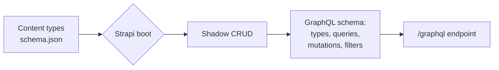
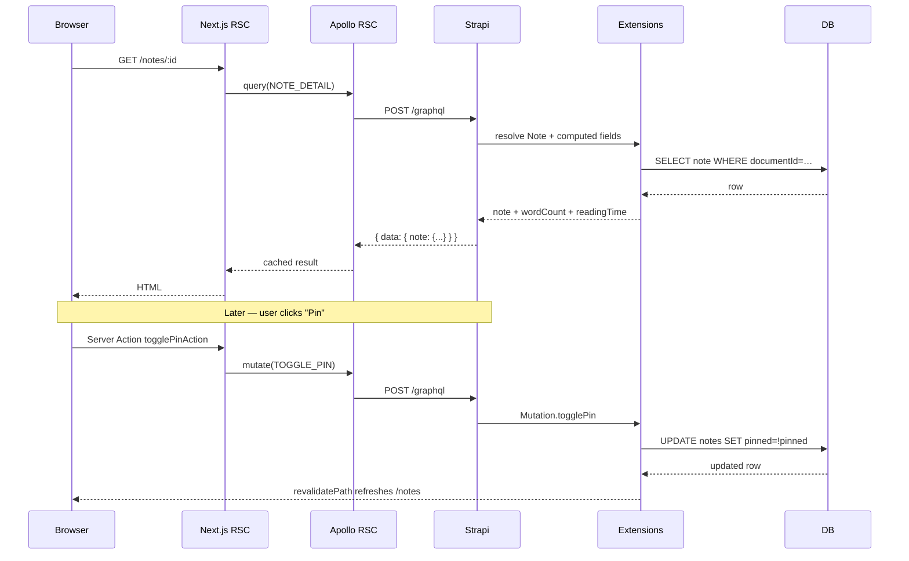

**TL;DR**

- GraphQL lets a client ask for exactly the fields it needs in one round trip — no over-fetching, no waterfall of REST calls.
- Strapi's GraphQL plugin gives you a fully working schema for every content type the moment you install it — a feature called "Shadow CRUD" — so list/detail queries, creates, updates, deletes, filters, sorting, and pagination are free.
- Most real apps outgrow what Shadow CRUD gives you. The plugin's customization surface covers the rest: `resolversConfig` (middlewares and policies), selectively turning off Shadow CRUD pieces, adding computed fields to existing types, creating brand-new object types, and writing custom queries and mutations with Nexus.
- We build a small note-taking demo that exercises every one of those customization surfaces, then consume the schema from Next.js 16 App Router with Apollo Client and Server Actions.
- The repo is laid out as "one concept per file" under `src/extensions/graphql/`, so each section of this post maps to a single file you can read in isolation.

## Why GraphQL exists

Before covering Strapi, a brief refresher on what GraphQL is designed to solve.

REST APIs ship fixed response shapes. If your `/notes` endpoint returns 20 fields per note and your list screen only needs three of them, you still pay for all 20 on the wire. Need a piece of data that lives on a related resource? That's a second request — or a custom `?include=tags,author` parameter that every backend invents in its own flavor.

GraphQL flips the contract. The server publishes a **schema** — a strongly typed catalogue of every field and every relation — and the client writes a query describing the exact shape it wants back. One request, no over-fetching, no under-fetching, no bespoke query-string conventions.

```graphql
query {
  notes(filters: { archived: { eq: false } }, sort: "pinned:desc") {
    documentId
    title
    tags {
      name
      color
    }
  }
}
```

The server returns a JSON blob that mirrors the shape of your query. Types are checked at build time; the client gets autocompletion and the server rejects malformed requests before they touch your business logic.

The tradeoff is that building a GraphQL server by hand is a significant amount of work. You define types, resolvers, input types, filter types, pagination, mutations, and authorization for every entity in your schema. This is the portion that Strapi's GraphQL plugin automates.

## Strapi's GraphQL plugin and Shadow CRUD

Install `@strapi/plugin-graphql` and Strapi generates the entire schema from your content types at boot. The feature is called **Shadow CRUD**. For every collection you have, the plugin exposes:

- `notes` — list with filters, sort, pagination
- `notes_connection` — same list but with page info for cursor-style pagination
- `note(documentId: ID!)` — single item
- `createNote`, `updateNote`, `deleteNote` — mutations
- Auto-generated `NoteFiltersInput`, `NoteInput` types with the right shape

No additional code is required. The GraphQL playground at `http://localhost:1337/graphql` is the primary tool for exploring and testing the generated schema: you can run queries, inspect types, execute mutations, and copy the final query into your client code. Filters, sort, pagination, and JWT auth via the `users-permissions` plugin are all supported by the generated schema.



The auto-generated schema covers a wide range of common CRUD use cases, and many smaller applications never need more than Shadow CRUD. However, as soon as the application requires a computed field, a custom aggregation, a mutation that performs more than a single update, or a way to hide parts of the auto-generated schema, you need the customization APIs. The rest of this post covers those APIs.

## The example project

A small note-taking application with two content types:

- **Note** — `title`, `content` (Strapi blocks), `pinned` (boolean), `archived` (boolean), `internalNotes` (text, will be hidden), and a many-to-many relation to Tag
- **Tag** — `name`, `slug`, `color`, and the inverse relation back to notes

The code lives in a monorepo:

```
graphql-customization/
├── graphql-server/   # Strapi 5 backend
└── frontend/         # Next.js 16 App Router + Apollo Client + Tailwind
```

Each subproject has its own `node_modules`, wired together at the root with `concurrently`:

```bash
npm install
npm run install:all   # installs both subprojects
npm run seed          # 5 tags + 10 notes
npm run dev           # Strapi on :1338, Next on :3001
```

Authentication is intentionally omitted to keep the focus on the GraphQL customization surface rather than the users-permissions plugin.

## Step 1: Install and configure the plugin

*Reference: [Strapi GraphQL plugin — Usage](https://docs.strapi.io/cms/plugins/graphql#usage).*

```bash
npm install @strapi/plugin-graphql
```

Configure the plugin in `config/plugins.ts`. The example below sets the four options that are worth understanding before a deployment: `depthLimit`, `amountLimit`, `landingPage`, and `apolloServer.introspection`.

```typescript
// graphql-server/config/plugins.ts
import type { Core } from '@strapi/strapi';

const config = ({ env }: Core.Config.Shared.ConfigParams): Core.Config.Plugin => ({
  graphql: {
    config: {
      endpoint: '/graphql',
      shadowCRUD: true,
      depthLimit: 10,       // maximum query nesting depth
      amountLimit: 100,     // maximum items per response
      landingPage: env('NODE_ENV') !== 'production',
      apolloServer: {
        introspection: env('NODE_ENV') !== 'production',
      },
    },
  },
});

export default config;
```

### Why each option matters

**`depthLimit` and `amountLimit`.** Without these, a client can submit a query that is either deeply nested or returns a very large page, and the server will attempt to execute it. A nested query such as `notes { tags { notes { tags { notes { ... } } } } }` can force the server to perform many joins and fetch large related datasets for every traversal, which can exhaust database connections and memory. `depthLimit` rejects the query before execution if it exceeds the configured depth. `amountLimit` caps the number of items any single resolver returns. Together they prevent a single malformed or malicious query from consuming disproportionate resources. Reasonable starting values are 10 and 100; tune them based on the real query shapes your clients send.

**`landingPage`.** When you visit `http://localhost:1337/graphql` in a browser, Strapi v5 serves the **Apollo Sandbox** — an interactive UI for writing queries, inspecting the schema, and running mutations. It is useful during development but should not be exposed in production, for several reasons:

- The Sandbox is a human-facing tool. Programmatic clients do not need it; they POST GraphQL documents to the endpoint directly.
- Combined with schema introspection (see below), the Sandbox gives anyone with a browser a complete, searchable map of every type, field, filter operator, and mutation your API exposes. This information is often useful for attackers during reconnaissance and provides no benefit to legitimate clients.
- It increases the public asset surface of the server: the Sandbox ships JavaScript and CSS that Strapi must serve.

Setting `landingPage` to `false` in production disables the UI while keeping the GraphQL endpoint itself functional.

**`apolloServer.introspection`.** Introspection is the GraphQL feature that lets a client query the schema itself (for example, `{ __schema { types { name } } }`). It is required for the Sandbox, for tools like GraphQL Code Generator, and for IDE plugins that offer autocompletion. In production it is typically disabled for the same reasons as the landing page: it hands a complete schema map to anyone who asks. Public, documented APIs may choose to leave it on; internal or partially-public APIs usually do not.

The pattern `env('NODE_ENV') !== 'production'` enables both the landing page and introspection in development and test environments while disabling them in production. Adjust the condition if your deployment uses a different environment variable (many Strapi deployments use `STRAPI_DISABLE_*` flags, a staging flag, or a dedicated `EXPOSE_GRAPHQL_UI` variable).

## Step 2: The extension service

*Reference: [Extending the GraphQL schema](https://docs.strapi.io/cms/plugins/graphql#extending-the-schema).*

Customizations are registered through the plugin's **extension service**. You obtain a reference to it inside Strapi's `register()` hook and call `extensionService.use(...)` with a factory function for each extension:

```typescript
// graphql-server/src/index.ts
import type { Core } from '@strapi/strapi';
import registerGraphQLExtensions from './extensions/graphql';

export default {
  register({ strapi }: { strapi: Core.Strapi }) {
    registerGraphQLExtensions(strapi);
  },

  async bootstrap({ strapi }) {
    // grant public permissions for Note + Tag so the demo works anonymously
  },
};
```

The file `src/extensions/graphql/index.ts` is the **aggregator** — a single entry point that imports each customization module and registers it with the extension service. The term "aggregator" is used here in its plain programming sense: a module whose only job is to collect several independent units and compose them into one coherent registration step. It is equivalent in spirit to a barrel file, except that it also performs the side effect of registering each module rather than just re-exporting it.

```typescript
// graphql-server/src/extensions/graphql/index.ts
import type { Core } from '@strapi/strapi';
import middlewaresAndPolicies from './middlewares-and-policies';
import computedFields from './computed-fields';
import queries from './queries';
import mutations from './mutations';
import configureShadowCRUD from './shadow-crud';

export default function registerGraphQLExtensions(strapi: Core.Strapi) {
  const extensionService = strapi.plugin('graphql').service('extension');

  configureShadowCRUD(strapi);

  extensionService.use(middlewaresAndPolicies);
  extensionService.use(computedFields);
  extensionService.use(({ nexus }) => queries({ nexus, strapi }));
  extensionService.use(({ nexus }) => mutations({ nexus, strapi }));
}
```

### The five imports are all files we author

Every import in the aggregator besides `@strapi/strapi` refers to a file inside the example project, not a library from `node_modules`. The relative paths (`./middlewares-and-policies`, `./computed-fields`, and so on) indicate that each imported module lives in the same directory: `graphql-server/src/extensions/graphql/`.

None of these files exist by default in a fresh Strapi project; you create them as part of organizing your GraphQL customizations. Strapi provides the `src/extensions/` convention as the recommended location for extending plugin behavior, but the subdirectory structure inside it (`extensions/graphql/*.ts`) is a choice the developer makes. The names used here describe the concept each file addresses.

The table below summarizes the purpose of each file. Each one is shown in full in the step it is introduced:

| File | Exports | Purpose | Introduced in |
|---|---|---|---|
| `shadow-crud.ts` | `configureShadowCRUD(strapi)` function | Calls the `extension.shadowCRUD(...)` builder to disable specific actions, fields, and filters in the auto-generated schema. | Step 4 |
| `middlewares-and-policies.ts` | Factory returning a `resolversConfig` object | Attaches middlewares (logging, cache hints) and a named policy to the `Query.notes` resolver. | Step 3 |
| `computed-fields.ts` | Factory returning Nexus `extendType` calls on `Note` | Adds the `wordCount`, `readingTime`, and `excerpt` fields to the existing `Note` type. | Step 5 |
| `queries.ts` | Factory returning Nexus `objectType` and `extendType` calls on `Query` | Introduces the new `NoteStats` and `TagCount` types and the custom `searchNotes`, `noteStats`, and `notesByTag` queries. | Steps 6 and 7 |
| `mutations.ts` | Factory returning Nexus `extendType` calls on `Mutation` | Defines the custom `togglePin`, `archiveNote`, and `duplicateNote` mutations. | Step 8 |

### What the aggregator does at runtime

1. **Obtains the extension service** from the GraphQL plugin via `strapi.plugin('graphql').service('extension')`. All customization APIs are methods on this service.
2. **Calls `configureShadowCRUD(strapi)`** directly. This function uses a different API surface — `extension.shadowCRUD(...)` builder calls that run immediately — so it is invoked as a plain function rather than registered as a schema-extension factory.
3. **Registers each schema-extension factory** with `extensionService.use(...)`. Each factory receives `{ nexus, strapi }` at build time and returns an object describing the types, resolvers, and configuration to merge into the final schema.

### Why the code is split across files

Splitting the code across one file per concept (`middlewares-and-policies.ts`, `computed-fields.ts`, `queries.ts`, `mutations.ts`, `shadow-crud.ts`) has two practical benefits:

- Each customization technique can be read and understood in isolation. A reader learning about computed fields opens `computed-fields.ts` and sees only the Nexus calls relevant to that topic, without the noise of unrelated middlewares or mutations.
- Changes are localized. Adding a new custom query does not touch the file that defines policies, and disabling a field does not require editing the custom-mutations file.

An alternative organization is to put every extension into a single large file. That works for very small projects but becomes hard to navigate as the number of custom types and resolvers grows. The file-per-concept structure scales more gracefully.

The aggregator itself contains no business logic. It exists to keep wire-up in one place so that the rest of the codebase stays focused on individual concerns.

Each `use()` call receives a factory that returns any combination of `types`, `typeDefs`, `resolvers`, `resolversConfig`, and `plugins`. The plugin merges these into the final schema served at `/graphql`.

### What Nexus is, and why Strapi uses it

The factories that extend the schema receive a `nexus` argument and reference helpers like `nexus.extendType` and `nexus.objectType`. [Nexus](https://nexusjs.org/) is a code-first schema-construction library for GraphQL servers, originally developed by Prisma Labs. It provides a typed JavaScript/TypeScript API for defining object types, fields, arguments, and resolvers, which the library then compiles into a standard `GraphQLSchema` at startup.

Strapi's GraphQL plugin is built on Nexus internally. When `shadowCRUD` runs at boot, it uses Nexus to generate the `Note`, `Tag`, `NoteFiltersInput`, `NoteInput`, and related types automatically from your `schema.json` files. When you extend the schema through the extension service, the plugin passes the same `nexus` reference into your factory so your extensions compose with the generated types as a single, coherent schema.

#### Nexus syntax reference

The rest of this post uses a small subset of the Nexus API. The following examples explain the syntax you will see.

**Defining a new object type.** `nexus.objectType` creates a new type. The `definition` callback receives a type builder `t` and declares each field on it:

```typescript
nexus.objectType({
  name: 'TagCount',
  definition(t) {
    t.string('slug');           // nullable String
    t.nonNull.string('name');   // non-null String (GraphQL: String!)
    t.nonNull.int('count');     // non-null Int (GraphQL: Int!)
  },
});
```

The resulting GraphQL SDL equivalent is:

```graphql
type TagCount {
  slug: String
  name: String!
  count: Int!
}
```

**The builder chain (`t.nonNull`, `t.list`).** Nullability and list modifiers are chained in front of the field type. The order matters and mirrors the GraphQL SDL shape:

| Nexus call | GraphQL type |
|---|---|
| `t.string('a')` | `a: String` |
| `t.nonNull.string('a')` | `a: String!` |
| `t.list.string('a')` | `a: [String]` |
| `t.list.nonNull.string('a')` | `a: [String!]` |
| `t.nonNull.list.nonNull.string('a')` | `a: [String!]!` |

For object-typed fields, use `t.field(name, { type })` or the chained forms (`t.list.field`, `t.nonNull.field`):

```typescript
t.nonNull.list.nonNull.field('byTag', { type: 'TagCount' });
// byTag: [TagCount!]!
```

**Extending an existing type.** `nexus.extendType` appends fields to a type that already exists in the schema (either your own or one that the Strapi plugin has generated):

```typescript
nexus.extendType({
  type: 'Note',
  definition(t) {
    t.nonNull.int('wordCount', {
      resolve: (parent) => computeWordCount(parent.content),
    });
  },
});
```

The same pattern is used to add custom queries and mutations: `Query` and `Mutation` are object types, so custom top-level queries and mutations are fields added to those types via `extendType`:

```typescript
nexus.extendType({
  type: 'Query',
  definition(t) {
    t.list.field('searchNotes', {
      type: nexus.nonNull('Note'),
      args: { query: nexus.nonNull(nexus.stringArg()) },
      async resolve(_parent, { query }) { /* ... */ },
    });
  },
});
```

**Resolvers.** Any field definition can include a `resolve` function with the signature `(parent, args, context, info) => value`. If `resolve` is omitted, Nexus uses default field resolution (the field is read from `parent[fieldName]`). Resolvers are where your custom logic runs.

**Argument helpers.** Arguments on a field are declared through helpers that produce GraphQL input types:

| Helper | GraphQL input type |
|---|---|
| `nexus.stringArg()` | `String` |
| `nexus.intArg()` | `Int` |
| `nexus.booleanArg()` | `Boolean` |
| `nexus.idArg()` | `ID` |
| `nexus.nonNull(nexus.stringArg())` | `String!` |
| `nexus.intArg({ default: 180 })` | `Int = 180` (default value) |

Combined:

```typescript
args: {
  query: nexus.nonNull(nexus.stringArg()),        // query: String!
  length: nexus.intArg({ default: 180 }),         // length: Int = 180
  includeArchived: nexus.booleanArg({ default: false }),
}
```

**Type references by name.** When a field's type is declared as a string (`type: 'Note'`, `type: 'NoteStats'`), Nexus resolves the reference at build time against all registered types. This is what makes cross-file composition work — the `queries.ts` file can reference `'Note'` without importing anything, because the type is already in the schema by the time Nexus composes everything together. The tradeoff is that a misspelled type name produces a build-time error if strict mode is enabled, or a silent `null` if not.

#### Why Nexus instead of SDL

An alternative to a code-first tool like Nexus is a schema-first tool, where you write SDL (`type Note { title: String! }`) and separately implement resolvers for it. Strapi's plugin chose the code-first approach because it is easier to compose programmatically: the plugin can generate types from content-type schemas and then let user code extend them through the same API, without parsing SDL strings or requiring you to keep an SDL file in sync with your content types.

```mermaid
flowchart TD
    A[src/index.ts register&#40;&#41;] --> B[registerGraphQLExtensions]
    B --> C[shadow-crud.ts<br/>disable fields/actions]
    B --> D[middlewares-and-policies.ts<br/>resolversConfig]
    B --> E[computed-fields.ts<br/>extendType Note]
    B --> F[queries.ts<br/>objectType + extendType Query]
    B --> G[mutations.ts<br/>extendType Mutation]
    C --> H[GraphQL schema]
    D --> H
    E --> H
    F --> H
    G --> H
```



## Step 3: `resolversConfig` — middlewares and policies

*Reference: [resolversConfig (plugin docs)](https://docs.strapi.io/cms/plugins/graphql#resolversconfig) and [Policies (core docs)](https://docs.strapi.io/cms/backend-customization/policies).*

`resolversConfig` is how you attach middlewares, policies, and auth rules to any resolver — Shadow CRUD-generated *or* custom. Here we wrap `Query.notes` with a logger, a cache-hint setter, and a policy that blocks archived queries unless a header is set:

```typescript
// graphql-server/src/extensions/graphql/middlewares-and-policies.ts
export default () => ({
  resolversConfig: {
    'Query.notes': {
      auth: false,
      middlewares: [
        async (next, parent, args, context, info) => {
          const label = `[graphql] Query.notes (${JSON.stringify(args?.filters ?? {})})`;
          console.time(label);
          try {
            return await next(parent, args, context, info);
          } finally {
            console.timeEnd(label);
          }
        },
        async (next, parent, args, context, info) => {
          info?.cacheControl?.setCacheHint?.({ maxAge: 30, scope: 'PUBLIC' });
          return next(parent, args, context, info);
        },
      ],
      policies: ['global::include-archived-requires-header'],
    },
    'Query.note': { auth: false },
    'Query.tags': { auth: false },
    'Query.tag': { auth: false },
  },
});
```

The signatures are worth memorizing:

- **Middleware**: `async (next, parent, args, context, info) => next(parent, args, context, info)` — call `next(...)` to continue, wrap before/after with whatever you need.
- **Policy**: `(policyContext, config, { strapi }) => boolean` — return `false` to reject. Policies run *before* the resolver; middlewares run around it.

Inline policy functions have a limitation in Strapi v5: the resolver configuration expects a registered policy name. The solution is to define the policy as a file under `src/policies/`, which Strapi automatically registers under the `global::<filename>` identifier:

```typescript
// graphql-server/src/policies/include-archived-requires-header.ts
export default (policyContext, _config, { strapi }) => {
  const filter = policyContext?.args?.filters?.archived;
  const wantsArchived =
    filter === true ||
    (typeof filter === 'object' && (filter?.eq === true || filter?.$eq === true));

  if (!wantsArchived) return true;

  const koa = policyContext?.context?.http ?? policyContext?.http ?? policyContext?.context;
  const header =
    koa?.request?.header?.['x-include-archived'] ??
    koa?.request?.headers?.['x-include-archived'];

  if (header === 'yes') return true;
  strapi.log.warn('Query.notes with archived filter blocked — missing x-include-archived header.');
  return false;
};
```

You can confirm the policy is applied by sending the same request with and without the required header:

```bash
# blocked
curl -s -X POST http://localhost:1338/graphql \
  -H 'Content-Type: application/json' \
  -d '{"query":"{ notes(filters:{ archived:{ eq: true } }){ title } }"}'
# → {"errors":[{"message":"Policy Failed", ... }]}

# allowed
curl -s -X POST http://localhost:1338/graphql \
  -H 'Content-Type: application/json' \
  -H 'X-Include-Archived: yes' \
  -d '{"query":"{ notes(filters:{ archived:{ eq: true } }){ title archived } }"}'
# → {"data":{"notes":[ ... ]}}
```

## Step 4: Restricting Shadow CRUD

*Reference: [Shadow CRUD — disable pieces of the auto-generated schema](https://docs.strapi.io/cms/plugins/graphql#disable-aspects-of-shadow-crud) in the Strapi v5 GraphQL plugin docs.*

Shadow CRUD is permissive by default: it exposes every content type, every field, every filter operator, and every create, update, and delete mutation. For a public API this is almost always too broad. There are three concrete reasons to restrict it:

1. **Some operations are dangerous.** A public `deleteNote` mutation means anyone who can hit your endpoint can wipe rows. In most apps you want soft-delete (archive) semantics, not hard delete.
2. **Some fields are internal.** Editors often need metadata columns that shouldn't leak past the admin UI — draft comments, moderation flags, cost fields, PII.
3. **Hiding a field from *output* isn't the same as hiding it from *filtering*.** If a client can still write `filters: { internalNotes: { $containsi: "probe" } }` and check whether the result set changes, they can extract the content one character at a time. This is the classic "blind SQL injection" shape, reapplied to GraphQL.

The extension service's `shadowCRUD()` builder covers all three:

```typescript
// graphql-server/src/extensions/graphql/shadow-crud.ts
import type { Core } from '@strapi/strapi';

export default function configureShadowCRUD(strapi: Core.Strapi) {
  const extension = strapi.plugin('graphql').service('extension');

  // 1. Block hard deletes — force users to archive instead.
  //    After this call, `Mutation.deleteNote` is gone from the schema.
  //    See docs: "disableAction"
  extension.shadowCRUD('api::note.note').disableAction('delete');

  // 2. Hide an internal admin-only field from public GraphQL output.
  //    The field still exists in the database and in the admin UI —
  //    it just stops appearing on the `Note` GraphQL type.
  //    See docs: "field(...).disableOutput"
  extension.shadowCRUD('api::note.note').field('internalNotes').disableOutput();

  // 3. Disable filtering on that same field. Without this, a client
  //    could probe its contents indirectly with $contains / $startsWith.
  //    See docs: "field(...).disableFilters"
  extension.shadowCRUD('api::note.note').field('internalNotes').disableFilters();
}
```

### Why each call matters

**`disableAction('delete')`** — Strapi lets you switch each of the five CRUD actions (`find`, `findOne`, `create`, `update`, `delete`) on or off independently. Calling `disableAction('delete')` removes `Mutation.deleteNote` and its input type from the schema entirely. This is better than relying on a permission check, because:
- introspection-friendly clients (Apollo Studio, GraphiQL) won't even offer the field in autocomplete;
- a typo'd client mutation fails at validation time, not runtime;
- there's no attack surface to permission-bypass.

**`field('internalNotes').disableOutput()`** — By default, every attribute in your `schema.json` shows up on the generated GraphQL type. `disableOutput()` removes the field from the `Note` type's output shape. Writing a query that selects `notes { internalNotes }` now fails at parse time with "Cannot query field `internalNotes` on type `Note`." Strapi's admin UI, REST endpoints, and your own custom resolvers can still read and write it — the restriction is GraphQL-output-only.

**`field('internalNotes').disableFilters()`** — This is the non-obvious one. Even after `disableOutput()`, the Shadow CRUD-generated `NoteFiltersInput` still has an `internalNotes` entry because Strapi builds filter types from the schema, not from the GraphQL output. A motivated attacker could iterate:

```graphql
{ notes(filters: { internalNotes: { $startsWith: "a" } }) { documentId } }
{ notes(filters: { internalNotes: { $startsWith: "b" } }) { documentId } }
# … if one of these returns hits, you've leaked the first character.
```

`disableFilters()` removes the field from the generated filter input, closing the side channel. Always pair it with `disableOutput()` for anything sensitive.

### The full vocabulary

| Content-Type level | Field level |
|---|---|
| `.disable()` | `.disable()` |
| `.disableQueries()` | `.disableOutput()` |
| `.disableMutations()` | `.disableInput()` |
| `.disableAction('delete')` | `.disableFilters()` |
| `.disableActions(['create','update'])` | |

(All of these are documented in the [Shadow CRUD section of the plugin docs](https://docs.strapi.io/cms/plugins/graphql#disable-aspects-of-shadow-crud).)

After `disableAction('delete')` is called, `Mutation.deleteNote` is removed from the schema entirely. This is observable through an introspection query, and any existing client that previously called the mutation will fail at GraphQL validation rather than at the permission layer.

## Step 5: Extending existing types with computed fields

*Reference: [Extending the schema with Nexus types](https://docs.strapi.io/cms/plugins/graphql#extending-the-schema) and the [Nexus docs](https://nexusjs.org/docs/api/extend-type).*

Computed fields let you add new fields to an existing type. These fields do not exist in the database; they are derived from other fields at query time.

The example project adds three computed fields to `Note`: `wordCount`, `readingTime`, and `excerpt` (which accepts a `length` argument). All three are derived from the Strapi blocks content:

```typescript
// graphql-server/src/extensions/graphql/computed-fields.ts
function blocksToText(blocks) {
  if (!Array.isArray(blocks)) return '';
  const walk = (nodes) =>
    Array.isArray(nodes)
      ? nodes.map((n) => (typeof n?.text === 'string' ? n.text : walk(n?.children))).join('')
      : '';
  return blocks.map((b) => walk(b?.children)).filter(Boolean).join('\n');
}

const countWords = (text) => {
  const t = text.trim();
  return t ? t.split(/\s+/).length : 0;
};

export default ({ nexus }) => ({
  types: [
    nexus.extendType({
      type: 'Note',
      definition(t) {
        t.nonNull.int('wordCount', {
          resolve: (parent) => countWords(blocksToText(parent?.content)),
        });
        t.nonNull.int('readingTime', {
          description: 'Estimated reading time in minutes (200 wpm).',
          resolve: (parent) => Math.max(1, Math.ceil(countWords(blocksToText(parent?.content)) / 200)),
        });
        t.nonNull.string('excerpt', {
          args: { length: nexus.intArg({ default: 180 }) },
          resolve: (parent, args) => {
            const text = blocksToText(parent?.content).replace(/\s+/g, ' ').trim();
            return text.length <= args.length ? text : text.slice(0, args.length).trimEnd() + '…';
          },
        });
      },
    }),
  ],
  resolversConfig: {
    'Note.wordCount': { auth: false },
    'Note.readingTime': { auth: false },
    'Note.excerpt': { auth: false },
  },
});
```

`nexus.extendType({ type: 'Note', ... })` appends fields to the type that the plugin already generated; it does not replace or wrap the type. The `resolve(parent, args, context)` callback receives the Note entity that was just fetched and must return a value matching the declared field type.

From the client, the computed fields are selected like any other field:

```graphql
query {
  notes {
    title
    wordCount
    readingTime
    excerpt(length: 80)
  }
}
```

## Step 6: Creating brand-new object types

*Reference: [nexus.objectType](https://nexusjs.org/docs/api/object-type).*

Not every response shape corresponds to a content type. Aggregate results, union types, and ad-hoc response envelopes all need their own object types. `nexus.objectType()` is the API for defining them.

In the example project, the `noteStats` query returns a `NoteStats` object containing totals and a per-tag breakdown. Both types are new:

```typescript
// graphql-server/src/extensions/graphql/queries.ts (excerpt)
nexus.objectType({
  name: 'TagCount',
  definition(t) {
    t.nonNull.string('slug');
    t.nonNull.string('name');
    t.nonNull.int('count');
  },
}),

nexus.objectType({
  name: 'NoteStats',
  definition(t) {
    t.nonNull.int('total');
    t.nonNull.int('pinned');
    t.nonNull.int('archived');
    t.nonNull.list.nonNull.field('byTag', { type: 'TagCount' });
  },
}),
```

These types are registered alongside the auto-generated `Note`, `Tag`, and other types. Type names matter: Nexus resolves types by string reference, so a misspelled name produces a silent `null` at query time rather than a compile-time error.

## Step 7: Custom queries

*Reference: [Document Service API](https://docs.strapi.io/cms/api/document-service) · [Database Query Engine](https://docs.strapi.io/cms/api/query-engine).*

Three patterns, all in the same file:

```typescript
// graphql-server/src/extensions/graphql/queries.ts (excerpt)
nexus.extendType({
  type: 'Query',
  definition(t) {
    // Pattern 1 — filter via Strapi's document service (high-level)
    t.list.field('searchNotes', {
      type: nexus.nonNull('Note'),
      args: {
        query: nexus.nonNull(nexus.stringArg()),
        includeArchived: nexus.booleanArg({ default: false }),
      },
      async resolve(_parent, { query, includeArchived }) {
        const where: any = { title: { $containsi: query } };
        if (!includeArchived) where.archived = false;
        return strapi.documents('api::note.note').findMany({
          filters: where,
          populate: ['tags'],
          sort: ['pinned:desc', 'updatedAt:desc'],
        });
      },
    });

    // Pattern 2 — count aggregation via db.query + raw SQL
    t.nonNull.field('noteStats', {
      type: 'NoteStats',
      async resolve() {
        const [total, pinned, archived] = await Promise.all([
          strapi.db.query('api::note.note').count(),
          strapi.db.query('api::note.note').count({ where: { pinned: true } }),
          strapi.db.query('api::note.note').count({ where: { archived: true } }),
        ]);

        const rows = await strapi.db.connection.raw(`
          SELECT tags.slug as slug, tags.name as name, COUNT(link.note_id) as count
          FROM tags
          LEFT JOIN notes_tags_lnk link ON link.tag_id = tags.id
          GROUP BY tags.id
          ORDER BY count DESC, tags.name ASC
        `);

        return {
          total, pinned, archived,
          byTag: (Array.isArray(rows) ? rows : []).map((r) => ({
            slug: r.slug, name: r.name, count: Number(r.count ?? 0),
          })),
        };
      },
    });

    // Pattern 3 — navigate a relation via the document service
    t.list.field('notesByTag', {
      type: nexus.nonNull('Note'),
      args: { slug: nexus.nonNull(nexus.stringArg()) },
      async resolve(_parent, { slug }) {
        return strapi.documents('api::note.note').findMany({
          filters: { archived: false, tags: { slug: { $eq: slug } } },
          populate: ['tags'],
          sort: ['pinned:desc', 'updatedAt:desc'],
        });
      },
    });
  },
}),
```

The three data-access APIs shown above — `strapi.documents(...)`, `strapi.db.query(...)`, and `strapi.db.connection.raw(...)` — sit at different levels of abstraction. The appropriate choice depends on the operation:

| API | When to use |
|---|---|
| `strapi.documents('api::foo.foo')` | Default. Respects draft/publish, locales, and lifecycle hooks. |
| `strapi.db.query('api::foo.foo')` | Lower-level query engine. Skips some Strapi conventions. Suitable for counts and simple aggregates. |
| `strapi.db.connection.raw` | Direct SQL access via Knex. Use when the other APIs cannot express the query. |

## Step 8: Custom mutations

*Reference: [Document Service — update / create](https://docs.strapi.io/cms/api/document-service).*

Same pattern, different target type. `Mutation` instead of `Query`:

```typescript
// graphql-server/src/extensions/graphql/mutations.ts (excerpt)
nexus.extendType({
  type: 'Mutation',
  definition(t) {
    t.field('togglePin', {
      type: 'Note',
      args: { documentId: nexus.nonNull(nexus.idArg()) },
      async resolve(_parent, { documentId }) {
        const current = await strapi.documents('api::note.note').findOne({ documentId });
        if (!current) throw new Error(`Note ${documentId} not found`);
        return strapi.documents('api::note.note').update({
          documentId,
          data: { pinned: !current.pinned },
          populate: ['tags'],
        });
      },
    });

    t.field('archiveNote', {
      type: 'Note',
      args: { documentId: nexus.nonNull(nexus.idArg()) },
      async resolve(_parent, { documentId }) {
        return strapi.documents('api::note.note').update({
          documentId,
          data: { archived: true, pinned: false },
          populate: ['tags'],
        });
      },
    });

    t.field('duplicateNote', {
      type: 'Note',
      args: { documentId: nexus.nonNull(nexus.idArg()) },
      async resolve(_parent, { documentId }) {
        const original = await strapi.documents('api::note.note').findOne({
          documentId, populate: ['tags'],
        });
        if (!original) throw new Error(`Note ${documentId} not found`);
        const tagIds = (original.tags ?? []).map((t) => t.documentId).filter(Boolean);
        return strapi.documents('api::note.note').create({
          data: {
            title: `${original.title} (copy)`,
            content: original.content,
            pinned: false,
            archived: false,
            tags: tagIds,
          },
          populate: ['tags'],
        });
      },
    });
  },
}),
```

Two points worth noting:

1. **Return the mutated entity.** Clients expect mutations to return the affected object so they can update their cache without an additional fetch.
2. **Always `populate` relations that are selected in the response.** Without `populate`, the resolver returns `null` for those relations. Apollo then caches that `null`, and subsequent reads for the same entity render as if the relation were empty.

## Step 9: Consuming the schema from Next.js

*Reference: [Apollo Client — Next.js App Router](https://www.apollographql.com/docs/react/integrations/next-js/) · [Next.js — Server Actions](https://nextjs.org/docs/app/api-reference/directives/use-server) · [Strapi — GraphQL query examples](https://docs.strapi.io/cms/plugins/graphql#graphql-api-documentation).*

The frontend uses `@apollo/client` v4 together with `@apollo/client-integration-nextjs` for React Server Components. The RSC client is configured once:

```typescript
// frontend/lib/apollo-client.ts
import { HttpLink } from '@apollo/client';
import { registerApolloClient, ApolloClient, InMemoryCache } from '@apollo/client-integration-nextjs';

const STRAPI_GRAPHQL_URL = process.env.STRAPI_GRAPHQL_URL ?? 'http://localhost:1338/graphql';

export const { getClient, query, PreloadQuery } = registerApolloClient(() => {
  return new ApolloClient({
    cache: new InMemoryCache({
      typePolicies: {
        Note: { keyFields: ['documentId'] },
        Tag: { keyFields: ['documentId'] },
      },
    }),
    link: new HttpLink({
      uri: STRAPI_GRAPHQL_URL,
      fetchOptions: { cache: 'no-store' },
    }),
  });
});
```

The `typePolicies` override configures Apollo's cache to key `Note` and `Tag` entities by `documentId` (Strapi v5's stable identifier) rather than the default `id`. Without this override, optimistic updates can become inconsistent because Strapi's numeric `id` is not guaranteed to be stable across operations.

### Fetching and filtering data with GraphQL

Before showing the mutation side, it is worth walking through how the frontend actually queries Strapi: where the GraphQL documents live, how fragments are reused, how filters and sorting are expressed, and how variables flow from a URL parameter into a GraphQL query and then into Strapi's Shadow CRUD resolver.

#### A single operations file

Every GraphQL document used by the frontend is defined in `frontend/lib/graphql.ts`. Co-locating the operations makes them easy to grep, lint, and later generate TypeScript types for (with tools such as `graphql-codegen`). The file exports plain `DocumentNode` values produced by the `gql` template tag:

```typescript
// frontend/lib/graphql.ts
import { gql } from '@apollo/client';

export const NOTE_FIELDS = gql`
  fragment NoteFields on Note {
    documentId
    title
    pinned
    archived
    updatedAt
    wordCount
    readingTime
    excerpt(length: 180)
    tags {
      documentId
      name
      slug
      color
    }
  }
`;
```

#### Fragments for reuse

Every list view and every detail view needs the same core fields on a `Note`. Rather than repeat those fields in every query, they are declared once as a fragment (`NoteFields`) and composed into each query:

```typescript
export const ACTIVE_NOTES = gql`
  ${NOTE_FIELDS}
  query ActiveNotes {
    notes(
      filters: { archived: { eq: false } }
      sort: ["pinned:desc", "updatedAt:desc"]
    ) {
      ...NoteFields
    }
  }
`;

export const NOTE_DETAIL = gql`
  ${NOTE_FIELDS}
  query Note($documentId: ID!) {
    note(documentId: $documentId) {
      ...NoteFields
      content
    }
  }
`;
```

Notice that `NOTE_DETAIL` extends the fragment with an extra field (`content`) that only the detail view needs. Apollo's cache handles fragment composition transparently — if a list query has already populated the shared fields for a `Note` with a given `documentId`, a later detail query only needs to fetch the fields the list did not cover.

#### Filter syntax

Strapi's Shadow CRUD resolvers generate a `NoteFiltersInput` (and equivalents for every content type) with operators for each scalar field. The operators are the same ones used by the Document Service and follow Strapi's conventions:

| Operator | Meaning |
|---|---|
| `eq` / `ne` | Equals / not equals |
| `lt` / `lte` / `gt` / `gte` | Less / less or equal / greater / greater or equal |
| `in` / `notIn` | Membership in a list |
| `contains` / `containsi` | Substring match (case-sensitive / case-insensitive) |
| `startsWith` / `endsWith` | Prefix / suffix match |
| `null` / `notNull` | Boolean null check |
| `and` / `or` / `not` | Logical combinators taking a list of sub-filters |

Filters on relations are nested: to find notes whose tag has a given slug, write `tags: { slug: { eq: "work" } }`. Multiple conditions within the same object are combined with logical AND:

```graphql
{
  notes(
    filters: {
      archived: { eq: false }
      pinned: { eq: true }
      tags: { slug: { eq: "work" } }
    }
  ) {
    documentId
    title
  }
}
```

For anything that needs explicit OR or NOT, use the combinators:

```graphql
filters: {
  or: [
    { title: { containsi: "meeting" } }
    { tags: { slug: { eq: "work" } } }
  ]
}
```

#### Sort and pagination

`sort` accepts either a single string or an array of strings, each in the form `field:asc` or `field:desc`. Array order determines precedence:

```graphql
notes(sort: ["pinned:desc", "updatedAt:desc"]) { ... }
# pinned first, then most-recent within each group
```

Pagination is exposed via `pagination: { page, pageSize }` or `pagination: { start, limit }`:

```graphql
notes(pagination: { page: 2, pageSize: 20 }) { ... }
```

For cursor-style pagination with page metadata (total count, page count), use the `_connection` suffix query that Shadow CRUD generates automatically:

```graphql
notes_connection(pagination: { page: 1, pageSize: 20 }) {
  nodes { ...NoteFields }
  pageInfo { page pageSize pageCount total }
}
```

#### Passing variables from the URL

In an App Router route, the URL search parameters arrive as a prop. They become GraphQL variables with no extra plumbing:

```tsx
// frontend/app/notes/page.tsx
import { query } from '@/lib/apollo-client';
import { ACTIVE_NOTES, SEARCH_NOTES } from '@/lib/graphql';

export default async function NotesPage({
  searchParams,
}: {
  searchParams: Promise<{ q?: string }>;
}) {
  const { q } = await searchParams;
  const term = (q ?? '').trim();

  const { data } = term
    ? await query({ query: SEARCH_NOTES, variables: { q: term } })
    : await query({ query: ACTIVE_NOTES });

  const notes = term ? data?.searchNotes ?? [] : data?.notes ?? [];
  // render notes...
}
```

`SEARCH_NOTES` is a distinct operation defined in `lib/graphql.ts`:

```typescript
export const SEARCH_NOTES = gql`
  ${NOTE_FIELDS}
  query SearchNotes($q: String!) {
    searchNotes(query: $q) {
      ...NoteFields
    }
  }
`;
```

`searchNotes` is the custom query from Part 7. Because it is a custom resolver, it chooses how to interpret the search term — the current implementation uses `strapi.documents('api::note.note').findMany({ filters: { title: { $containsi: query } } })` server-side. The frontend does not need to know which operator it uses; it sends one variable and receives a list of notes.

#### Full request flow for a filtered list

When a user types into the debounced search box, the sequence is:

1. The client-side input updates `router.replace('/notes?q=…')` inside `startTransition`.
2. Next.js re-renders `app/notes/page.tsx` as an RSC.
3. The RSC reads `searchParams` and calls `query({ query: SEARCH_NOTES, variables: { q: term } })`.
4. The Apollo RSC client serializes the query and variables into a single POST `/graphql` request to Strapi.
5. Strapi's plugin dispatches to the `searchNotes` custom resolver, which calls the Document Service with a `$containsi` filter.
6. The matching rows are returned, each populated with the fields selected in the fragment (including computed fields like `wordCount`).
7. The RSC receives the data and renders the list; the HTML streams to the browser.

No client-side JavaScript is involved in steps 3 through 7. The browser only ever sees the final HTML.

### Mutations via Server Actions

Mutations run from **Server Actions**, which keeps the browser bundle smaller because no Apollo client instance is sent to the client:

```typescript
// frontend/app/notes/[documentId]/actions.ts
'use server';

import { revalidatePath } from 'next/cache';
import { redirect } from 'next/navigation';
import { getClient } from '@/lib/apollo-client';
import { TOGGLE_PIN, ARCHIVE_NOTE, DUPLICATE_NOTE } from '@/lib/graphql';

export async function togglePinAction(documentId: string) {
  await getClient().mutate({ mutation: TOGGLE_PIN, variables: { documentId } });
  revalidatePath(`/notes/${documentId}`);
  revalidatePath('/notes');
}

export async function archiveNoteAction(documentId: string) {
  await getClient().mutate({ mutation: ARCHIVE_NOTE, variables: { documentId } });
  revalidatePath('/notes');
  redirect('/notes');
}
```

The button is a small Client Component that calls the action inside `useTransition` so the UI can show a pending state during the server round trip:

```tsx
// frontend/components/note-actions.tsx
'use client';

import { useTransition } from 'react';
import { togglePinAction } from '@/app/notes/[documentId]/actions';

export function PinButton({ documentId, pinned }: { documentId: string; pinned: boolean }) {
  const [isPending, startTransition] = useTransition();
  return (
    <button
      disabled={isPending}
      onClick={() => startTransition(() => togglePinAction(documentId))}
    >
      {pinned ? 'Unpin' : 'Pin'}
    </button>
  );
}
```

The full request flow is shown below:



## Debounced search on the client

The `/notes?q=...` route runs the `searchNotes` custom query server-side, and the input debounces client-side to avoid issuing a request on every keystroke:

```tsx
// frontend/components/notes-search.tsx (excerpt)
function onChange(e) {
  setValue(e.target.value);
  if (timerRef.current) clearTimeout(timerRef.current);
  timerRef.current = setTimeout(() => pushQuery(e.target.value), 300);
}
```

`pushQuery` calls `router.replace('/notes?q=...')` inside `startTransition`. The route re-renders as an RSC. No additional network code runs on the client, no Apollo subscription is required, and there is no `useEffect`. The full pattern — 300 ms debounce, `startTransition`, and a pending indicator — is approximately 40 lines of code.

## Summary

The full customization surface of Strapi's GraphQL plugin, in order of increasing scope:

1. **Install** the plugin, set `depthLimit` and `amountLimit`.
2. **Attach cross-cutting behavior** with `resolversConfig` middlewares and named policies.
3. **Trim Shadow CRUD** with `disableAction`, field-level `disableOutput`/`disableFilters`.
4. **Add computed fields** with `nexus.extendType` on existing types.
5. **Introduce new types** with `nexus.objectType`.
6. **Write custom queries and mutations** that `extendType` on `Query` and `Mutation`.
7. **Consume it all** from Next.js App Router — RSC for reads, Server Actions for writes.

The example repository's file layout mirrors this list: `config/plugins.ts` for plugin configuration, followed by one file per concept under `src/extensions/graphql/`. Each section of this post maps to a single file.

For deeper reference, the authoritative sources are the official Strapi GraphQL plugin documentation, the Document Service API reference, and the Nexus documentation. All are linked inline throughout the post and collected in the citations below.

## Coming next: Part 2 — Users, Permissions, and Per-User Content

The example project in this post is intentionally single-user. Every note is public, every mutation is anonymous, and the access control story ends at the `X-Include-Archived` header. Real applications need more: user accounts, login, and an ownership model so that each user can only read and modify their own data.

Part 2 of this series builds on top of the same repository and covers:

- Enabling Strapi's `users-permissions` plugin and the GraphQL mutations it exposes (`register`, `login`, JWT issuance).
- Adding an `owner` relation from `Note` to `User`, and assigning ownership automatically on create.
- Enforcing read-level ownership with a resolver middleware that injects `owner: { id: { $eq: me.id } }` into filters — users only ever see their own notes, no client-side cooperation required.
- Enforcing write-level ownership with resolver policies on `updateNote`, `togglePin`, `archiveNote`, and `duplicateNote` that reject requests targeting someone else's notes.
- Wiring cookie-stored JWTs into the Next.js frontend: an Apollo auth link for RSC, a login form, a sign-up form, and a logout Server Action.
- Handling the auth redirect flow: middleware that sends unauthenticated visitors to `/login`, and a safe return-URL scheme.

The goal of Part 2 is to demonstrate authorization patterns that compose with everything built in Part 1, so the custom queries, mutations, and computed fields continue to work — they just now run in the context of an authenticated user.

**Citations**

- Strapi GraphQL Plugin (v5 docs): https://docs.strapi.io/cms/plugins/graphql
- A Deep Dive Into Strapi GraphQL: https://strapi.io/blog/a-deep-dive-into-strapi-graph-ql
- Building Custom Resolvers with Strapi: https://strapi.io/blog/building-custom-resolvers-with-strapi
- GraphQL API Customizations Explained: https://strapi.io/blog/graph-ql-api-customizations-explained-fine-tuning-your-strapi-experience
- Nexus schema documentation: https://nexusjs.org/
- Apollo Client Next.js integration: https://www.apollographql.com/docs/react/integrations/next-js/
- Next.js App Router — Server Actions: https://nextjs.org/docs/app/api-reference/directives/use-server
