**TL;DR**

- This post builds a fresh Strapi v5 project from zero with the built-in example data (Article, Author, Category), installs `@strapi/plugin-graphql`, and walks through every auto-generated query and mutation the plugin exposes for those content types in the Apollo Sandbox.
- It then introduces the customization APIs through three hands-on examples: production-grade plugin configuration (`depthLimit`, `amountLimit`, `landingPage`, introspection), a computed `wordCount` field on `Article` via `nexus.extendType`, and a custom top-level `searchArticles` query. All three use the same extension-service and aggregator pattern the rest of the series builds on.
- Along the way you set up the `src/extensions/graphql/` folder structure (aggregator, `computed-fields.ts`, `queries.ts`) used by every subsequent post in the series — so Part 2 only adds files, it does not refactor any you wrote here.
- By the end you have a working Strapi project serving a customized GraphQL schema at `http://localhost:1337/graphql`, an Apollo Sandbox for testing, and the first two custom resolvers in your codebase.
- Target audience: developers comfortable with Node and TypeScript who have not used Strapi before, or who have used Strapi's REST API but not its GraphQL plugin.

## What is GraphQL?

GraphQL is a query language and runtime for APIs. It was developed at Facebook in 2012 and open-sourced in 2015 — it came out of the internal challenge of delivering structured data to mobile clients without forcing every screen into the response shape a particular REST endpoint happened to return. The design goal was that the **client** should describe, in one request, exactly the fields and relations it needs, and the server should return precisely that shape against a published schema.

In a GraphQL server there is one endpoint — conventionally `/graphql` — and a typed schema that lists every object type, field, argument, and relation the server can expose. Clients send a query document that walks the schema, the server validates it against the schema, and the response mirrors the shape of the query.

Strapi's REST API already supports the same kind of response shaping. The [Strapi v5 REST parameters reference](https://docs.strapi.io/cms/api/rest/parameters) documents seven query-string parameters that work on any collection or single-type endpoint:

- `populate` — controls which relations, components, or dynamic zones come back.
- `fields` — restricts which scalar attributes appear in the response.
- `filters` — narrows results with operators like `$eq`, `$ne`, `$contains`, `$in`, and the same logical operators you will see in GraphQL.
- `sort` — orders results by one or more attributes.
- `pagination` — page-based or offset-based paging.
- `locale` — selects which locale's content is returned.
- `status` — draft or published.

You can confirm the shaping parameters from a terminal against the project you will build in this post:

```bash
# No relations in the response (the default).
curl 'http://localhost:1337/api/articles'

# `populate=category` brings the category relation back for every article.
curl 'http://localhost:1337/api/articles?populate=category'

# `fields` restricts which scalar attributes are returned.
curl 'http://localhost:1337/api/articles?populate=category&fields[0]=title'
```

The Strapi docs cover both:

- [REST API — `populate` and field selection](https://docs.strapi.io/cms/api/rest/populate-select)

With those, `GET /api/articles?populate=category&fields[0]=title&fields[1]=description` gets you articles with their category in one request and only the two fields you asked for. So why choose GraphQL at all if REST can do most of the same things in Strapi?

Honestly — in most cases it is not necessary. Strapi's REST API combined with `qs` on the client, or the official [`@strapi/client`](https://docs.strapi.io/cms/api/client) SDK, is enough for the majority of applications built on Strapi:

```ts
// With qs
import qs from 'qs';
const query = qs.stringify(
  { populate: ['category', 'author'], fields: ['title'] },
  { encodeValuesOnly: true },
);
// → "populate[0]=category&populate[1]=author&fields[0]=title"

// With the Strapi client SDK
import { strapi } from '@strapi/client';
const client = strapi({ baseURL: 'http://localhost:1337/api' });
const articles = await client.collection('articles').find({
  populate: ['category', 'author'],
  fields: ['title'],
});
```

Between those two, you get shaping (`populate`, `fields`), filtering, sorting, pagination, draft/publish handling, and locale selection without touching GraphQL at all. Many production Strapi deployments — small and large — ship on REST alone.

GraphQL remains a reasonable choice when your requirements push past what the generated REST surface covers comfortably. Specifically:

- **Aggregations and custom response shapes.** Counting entries, grouping by a relation, or returning a payload that stitches several content types together requires a custom controller per shape in REST. In GraphQL, a custom resolver lives alongside the auto-generated schema and can return any shape the client asks for (this post shows the `searchArticles` version; Part 2 goes further with a `noteStats` aggregate).
- **Multiple clients, each consuming a different slice of the schema.** When a web app, a mobile app, and a third-party integration all talk to the same backend but each wants a different subset of fields and relations, GraphQL lets each client declare its own query shape without the server negotiating a lowest-common-denominator REST response.
- **Runtime schema introspection and schema-driven tooling.** Apollo Sandbox, IDE plugins, and GraphQL-specific code generators all work off the live schema without any extra step. Strapi's REST API has an OpenAPI spec too, but GraphQL's introspection protocol is more tightly coupled to the running server.
- **Per-operation TypeScript types via code generation.** With GraphQL Code Generator (or a similar code-generation step), every query and mutation in your client code gets its own TypeScript type — matching exactly the fields you selected and the relations you traversed. If you add a field to a query, the generated type updates and every place that reads the result is type-checked against the new shape. `@strapi/client` is written in TypeScript and has typed method signatures, but it does not derive response types from your specific content types, the returned `data` is not shape-aware against your project, so you end up applying types by hand (or leaving them generic) at the call site. GraphQL plus codegen is the closest you get to end-to-end, project-specific type safety without maintaining those types yourself.

None of this is a function of project size. Pick REST if your clients consume the API in a stable, well-understood shape and you want the simplest possible request ergonomics. Pick GraphQL if you are already reaching for aggregations, multiple client types, or custom resolvers. The rest of this post is about the GraphQL surface — when you want it, what Strapi exposes for you, and how to extend it.

GraphQL is a different way to expose data. Instead of many endpoints that each return a fixed response shape, a GraphQL server exposes **one endpoint** (usually `/graphql`) and the client sends a **query** that says exactly what it wants. The server returns exactly that shape.

Here is the same "articles with their author and category" request written as a GraphQL query:

```graphql
query {
  articles {
    title
    description
    author {
      name
    }
    category {
      name
    }
  }
}
```

And the response:

```json
{
  "data": {
    "articles": [
      {
        "title": "First article",
        "description": "...",
        "author": { "name": "Ada Lovelace" },
        "category": { "name": "news" }
      },
      {
        "title": "Second article",
        "description": "...",
        "author": { "name": "Grace Hopper" },
        "category": { "name": "tutorials" }
      }
    ]
  }
}
```

No second request for the related category or author. No over-fetching of fields the UI never displays. No bracket-indexed populate keys to build by hand.

### Three terms to know

GraphQL introduces a small vocabulary. You will see all three throughout this post:

- **Schema** — the catalogue of everything the server can return: every type, every field, every argument. Think of it as a typed API contract. Strapi generates this automatically from your content types.
- **Query** — a read operation. "Give me this data in this shape." Queries are safe and idempotent.
- **Mutation** — a write operation. "Create / update / delete this." Mutations change server state.

There are a few more terms (resolvers, subscriptions, fragments) but you will not need them until later.

### Why GraphQL over REST

Summarized as four practical reasons:

- **The client controls the response shape.** Different screens can ask for different fields without the backend changing.
- **Related data comes in one request.** Nested fields (like `articles → author`) are fetched in the same round trip.
- **The schema is self-describing.** Tools like the Apollo Sandbox read the schema and offer autocompletion, inline documentation, and validation out of the box. There is no separate API reference to keep in sync.
- **Errors surface early.** Misspelled fields, wrong argument types, and missing required values are rejected at parse time, before any business logic runs.

The tradeoff is that building a GraphQL server by hand is a lot of work — every type, resolver, filter, mutation, and input type has to be written out. This is the portion that Strapi's GraphQL plugin automates.

## Why this post exists

Strapi is a headless CMS. Install the GraphQL plugin and it generates a full GraphQL schema from whatever content types you have defined, with no additional code. The feature is called **Shadow CRUD**, and it is the foundation everything else in the Strapi GraphQL ecosystem builds on.

Before reading a deep-dive on custom resolvers, middlewares, policies, and computed fields, it helps to have hands-on experience with what Shadow CRUD gives you for free. This post is that experience. It produces a minimal but complete Strapi + GraphQL project, demonstrates every CRUD operation against it, and introduces the three most common customizations so the advanced material feels familiar.

This is not *only* a Shadow CRUD walkthrough. By the end of the post you will also have added three customizations to the schema: plugin-level safety limits (`depthLimit` / `amountLimit` / production `landingPage` and `introspection` flags), a computed `wordCount` field on `Article` via `nexus.extendType`, and a custom top-level `searchArticles` query wired up through the same extension-service and aggregator pattern the advanced tutorial uses. If you skip Part 1 you miss the customization fundamentals that the rest of the series builds on.

You can skip this post if **all** of the following are true:

- you already have a Strapi v5 project with `@strapi/plugin-graphql` installed and running;
- you are comfortable running the auto-generated queries and mutations in the Apollo Sandbox;
- you have written at least one `nexus.extendType` factory and registered it through the extension service.

If any of those are new to you, start here.

## Prerequisites

- Node.js 20 or newer (Strapi v5 supports up to 24.x)
- A terminal and a code editor
- Basic TypeScript familiarity

You do not need prior Strapi experience.

## Step 1: Create a new Strapi project

In an empty directory, run the Strapi scaffold command:

```bash
npx create-strapi@latest server
```

```bash

 Strapi   v5.42.1 🚀 Let's create your new project


🚀 Welcome to Strapi! Ready to bring your project to life?

Create a free account and get:
30 days of access to the Growth plan, which includes:
✨ Strapi AI: content-type builder, media library and translations
✅ Live Preview
✅ Single Sign-On (SSO) login
✅ Content History
✅ Releases

? Please log in or sign up.
  Login/Sign up
❯ Skip
```

The CLI will ask a series of questions. Reasonable answers for this tutorial:

| Prompt                                              | Answer |
| --------------------------------------------------- | ------ |
| "Do you want to use the default database (SQLite)?" | Yes    |
| "Start with an example structure & data?"           | Yes     |
| "Use TypeScript?"                                   | Yes    |
| "Install dependencies with npm?"                    | Yes    |
| "Would you like to initialize a git repository?"    | Yes    |

The installer takes a few minutes. When it finishes, move into the project directory:

```bash
cd server
```

## Step 2: Run Strapi and create an admin user

Start the development server:

```bash
npm run develop
```

Strapi compiles the project, migrates the SQLite database, and prints a banner when it is ready. It serves two things at `http://localhost:1337`:

- `/admin` — the admin UI for editing content types and entries
- `/api` — the REST API (we will not use this)

Open `http://localhost:1337/admin` in a browser. Fill in the one-time registration form to create your first admin user. This account only exists locally and is not connected to any Strapi cloud service.

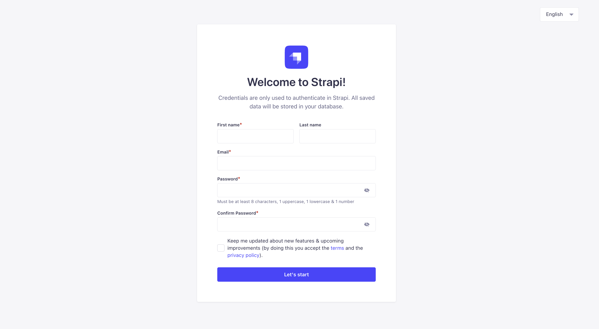

## Step 3: Install the GraphQL plugin

Stop the dev server with Ctrl+C, then install the GraphQL plugin:

```bash
npm install @strapi/plugin-graphql
```

Strapi picks up the plugin at boot; no configuration file edit is required. Start the server again:

```bash
npm run develop
```

Open `http://localhost:1337/graphql` in a browser. You should see the **Apollo Sandbox** — an interactive UI for writing GraphQL queries against your Strapi server. Leave the tab open; every query and mutation in this post is run here.

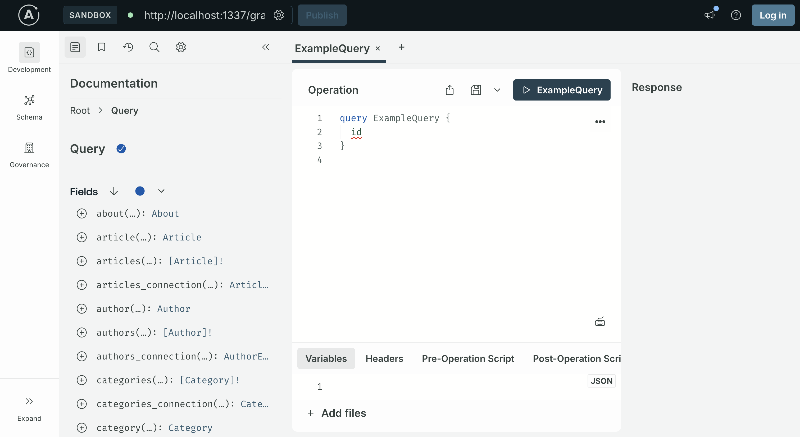

Because you chose to start with example data in Step 1, the Sandbox's left-hand **Schema** panel already shows a full GraphQL schema — queries and mutations for every seeded content type. The next step walks through what is there.

## Step 4: The content types you got for free

Because you answered **Yes** to "Start with an example structure & data?", Strapi generated a small blog-style content model and seeded it with entries. The files live under `src/api/` and `src/components/shared/`.

Three collection types:

- **Article** — `title`, `description` (short text, max 80 chars), `slug`, `cover` (media), `blocks` (dynamic zone of rich-text / media / quote / slider), plus `manyToOne` relations to Author and Category. `draftAndPublish` is enabled, which matters in the next step.
- **Author** — `name`, `email`, `avatar`, and a `oneToMany` back-relation to `articles`.
- **Category** — `name`, `slug`, `description`, and a `oneToMany` back-relation to `articles`.

Two single types:

- **About** — `title` and a `blocks` dynamic zone.
- **Global** — `siteName`, `siteDescription`, `favicon`, and a `defaultSeo` component.

The Article schema is the one this post focuses on. It lives at `src/api/article/content-types/article/schema.json` — open it to see the exact attribute definitions. The interesting fields for GraphQL purposes:

- `title` (string), `description` (text), `slug` (uid) — simple scalars you can query and filter on.
- `author` and `category` — relations you can traverse in a single GraphQL query.
- `blocks` — a **dynamic zone**. It holds an ordered list of components (rich-text, media, quote, slider). Dynamic zones show up in GraphQL as a union of component types and are more complex to query. This post skips them; the advanced tutorial covers blocks-style content in detail.

As soon as Strapi boots, the GraphQL plugin generates queries, mutations, and input types for Article, Author, and Category. The Sandbox's Schema panel on the left shows them all.

## Step 5: Publish the seeded articles

The example data ships with `draftAndPublish` enabled on `Article`, which means every seeded article starts as a **draft**. Strapi's GraphQL plugin only returns published entries to public queries, so querying `articles` at this point returns an empty list.

Publish the seeded entries:

1. In the admin UI, click **Content Manager** in the left sidebar and select **Article** under **Collection Types**. The seeded articles appear in the list, each showing a **Draft** status.
2. Tick the checkbox in the header row of the table to select every article at once. A bulk-action bar becomes available above the list.
3. Click **Publish** in the bulk-action bar. A **Publish entries** modal opens showing a preview: how many are *Ready to publish*, how many are *Already published*, and a per-row list with each article's `documentId`, name, current status, and publication state.
4. Confirm each row is checked in the modal and click the **Publish** button in the bottom-right corner.

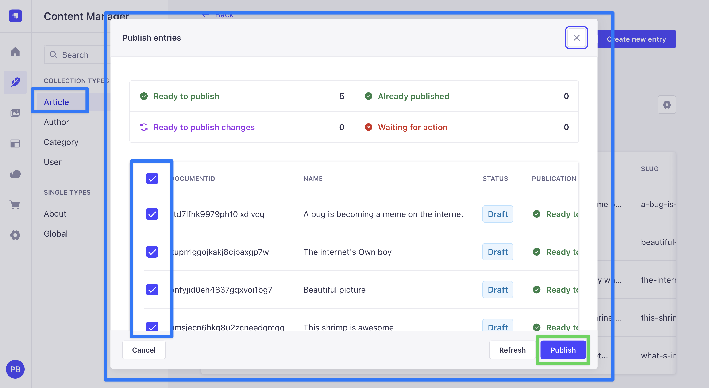

Every article now shows a **Published** status in the list and becomes visible to the public GraphQL API.

Author and Category do not have `draftAndPublish` enabled, so their entries are queryable immediately and do not require this step.

## Step 6: Grant public permissions

By default, every API is locked down. To let the Apollo Sandbox query the seeded content without authentication, grant the public role access:

1. In the admin UI, open **Settings** (the gear icon at the bottom of the left sidebar).
2. Under **Users & Permissions Plugin**, click **Roles**.
3. Click **Public**.
4. Expand **Article** and check `find`, `findOne`, `create`, `update`, and `delete`.
5. Repeat for **Author** and **Category** — check all five actions for each.
6. Click **Save** in the top right.

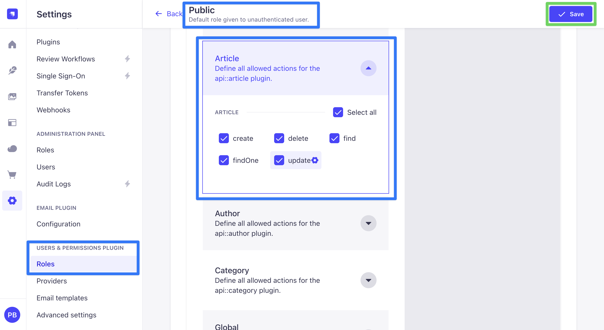

This is only for development. Real deployments use API tokens or the `users-permissions` login flow to authorize requests.

With Article, Author, and Category permissions enabled, public GraphQL queries can now reach the seeded data. The Sandbox tour in the next step doubles as the verification that Steps 5 and 6 took effect.

## Step 7: Explore the auto-generated queries

Switch to the Apollo Sandbox at `http://localhost:1337/graphql`. The queries below are ready to paste into the **Operation** editor.

### List all published articles

```graphql
query Articles {
  articles {
    documentId
    title
    description
    slug
    publishedAt
  }
}
```

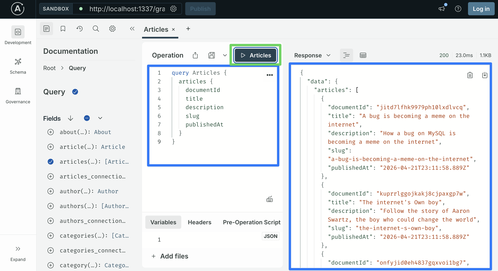

This returns every published Article. The `documentId` is Strapi v5's stable identifier for an entry; use it anywhere you need to refer to a specific article.

If the response comes back as an empty list, the permission grant or the draft-to-published step did not take effect. Revisit Step 5 (publish the seeded articles) and Step 6 (grant public permissions) before moving on.

### Traverse relations in one query

One of GraphQL's main advantages: relations come back in the same request. The seeded Article relates to Author and Category, so you can select fields from both without extra round trips:

```graphql
query ArticlesWithRelations {
  articles {
    title
    author {
      name
      email
    }
    category {
      name
      slug
    }
  }
}
```

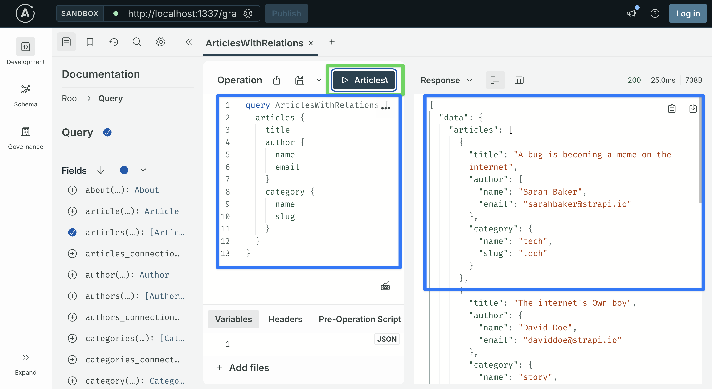

### Filter articles

```graphql
query FilteredArticles {
  articles(filters: { title: { containsi: "internet" } }) {
    documentId
    title
  }
}
```

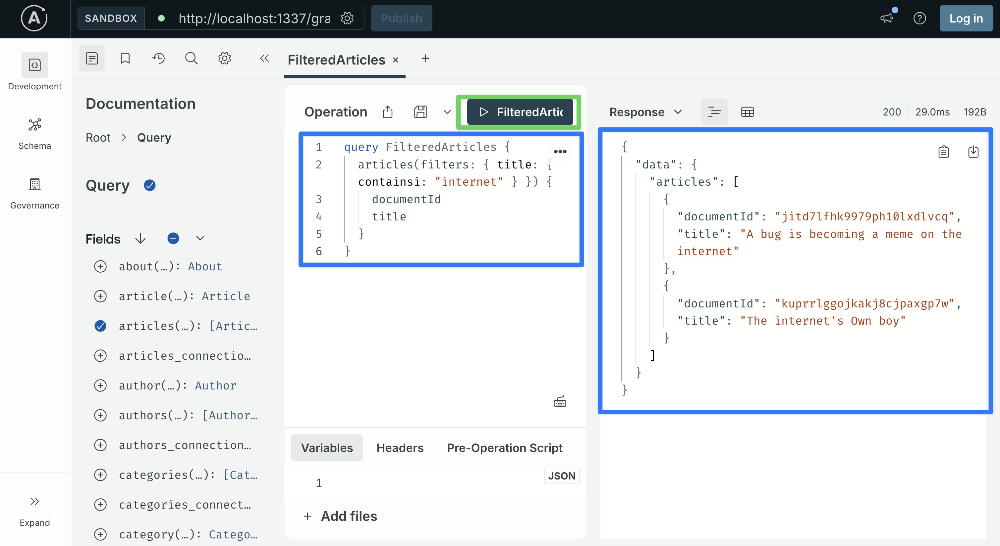

`filters` is a generated input type with one field per attribute. Each attribute accepts operators like `eq`, `ne`, `contains`, `containsi`, `startsWith`, `lt`, `gt`, `in`, and the logical operators `and` / `or` / `not`.

The word `"internet"` is used here because it appears in at least one of the titles seeded by the example data. If your database does not return a match, open the Content Manager, pick a word from any published article's title, and substitute it.

Filters on relations are nested. To find articles whose category has a given slug:

```graphql
query NewsArticles {
  articles(filters: { category: { slug: { eq: "news" } } }) {
    documentId
    title
    category { name }
  }
}
```

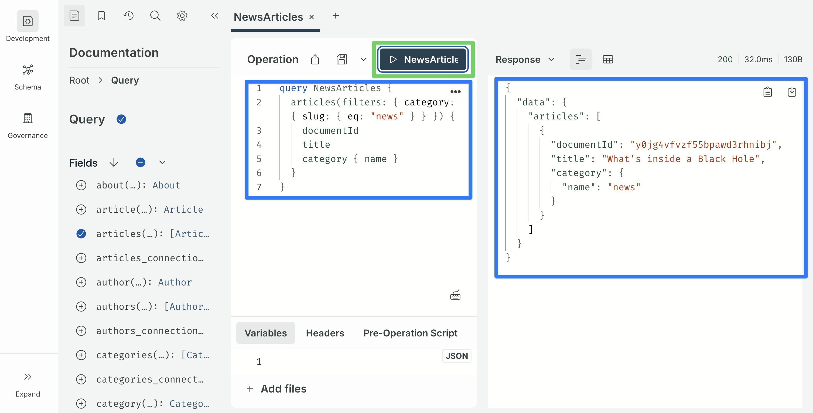

### Sort and paginate

```graphql
query PagedArticles {
  articles(sort: "title:asc", pagination: { page: 1, pageSize: 10 }) {
    documentId
    title
  }
}
```

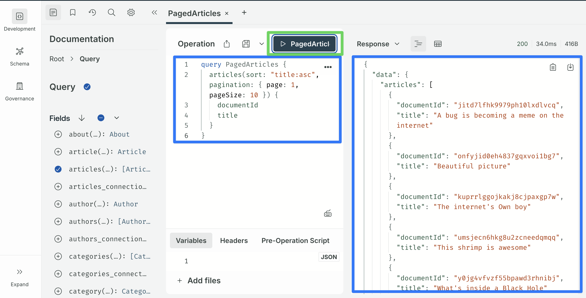

`sort` takes a single string or an array of strings of the form `field:asc` / `field:desc`. `pagination` accepts either `{ page, pageSize }` or `{ start, limit }`.

### Fetch a single article

Grab a `documentId` from any of the responses above and paste it into the **Variables** tab:

```graphql
query Article($documentId: ID!) {
  article(documentId: $documentId) {
    documentId
    title
    description
    slug
    author { name }
    category { name }
  }
}
```

Variables:

```json
{ "documentId": "paste-a-real-documentId-here" }
```

**About the Variables panel.** The Variables tab at the bottom of the Operation editor expects a complete JSON **object** — the outer `{ ... }` braces are part of the payload, not decoration. Copy the entire code block above, braces included. If the Sandbox responds with `Expected variables json to be an object`, it means the outer braces were left out. This applies to every variables block in the rest of this post, including the mutations in the next step.

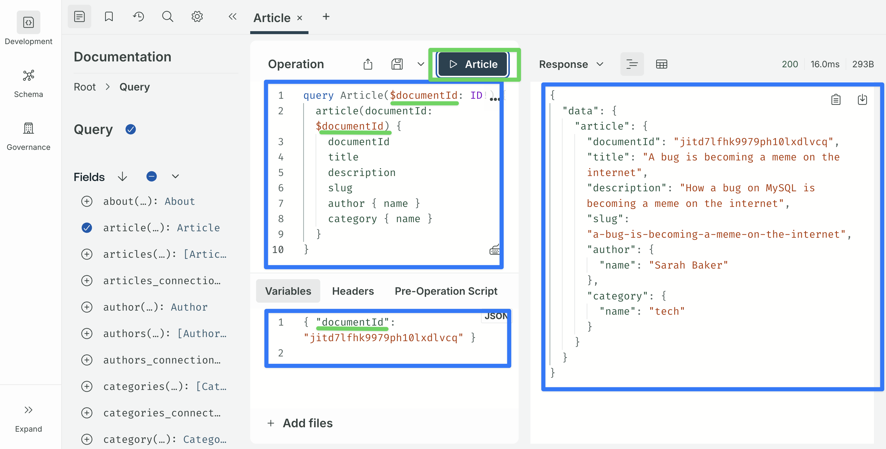

That is the core Shadow CRUD read surface: list, traverse relations, filter (including on relations), sort, paginate, and fetch-by-id — all generated from your content types with no resolver code.

## Step 8: Explore the auto-generated mutations

### Create an article

```graphql
mutation CreateArticle($data: ArticleInput!) {
  createArticle(data: $data) {
    documentId
    title
  }
}
```

Variables:

```json
{
  "data": {
    "title": "Hello from Apollo Sandbox",
    "description": "A short article created via GraphQL.",
    "slug": "hello-from-apollo-sandbox"
  }
}
```

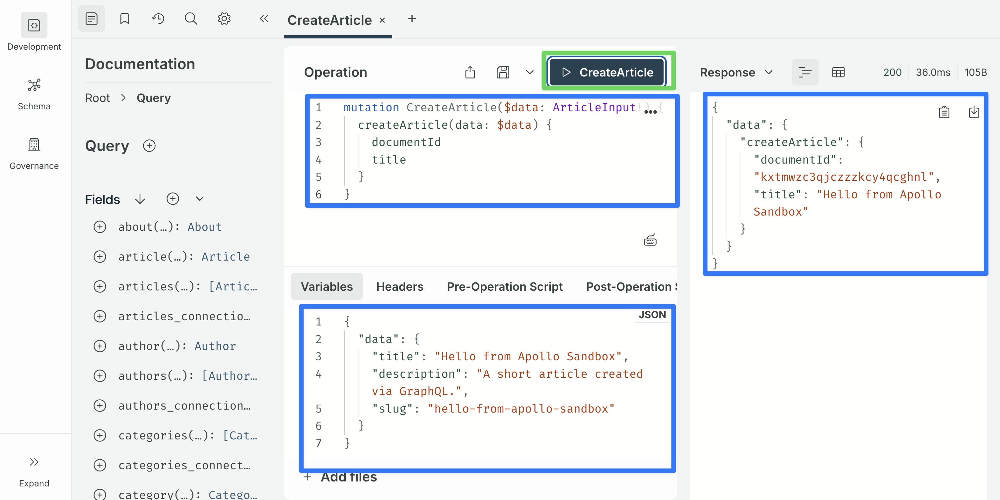

You getting the hang of it.

The `ArticleInput` type was generated from the content type. Every non-relation scalar attribute is available, and relations can be referenced by `documentId` (e.g. `author: "<documentId>"`, `category: "<documentId>"`). The `blocks` dynamic zone is accepted but requires a specific input shape per component type — out of scope for this post.

### Update an article

```graphql
mutation UpdateArticle($documentId: ID!, $data: ArticleInput!) {
  updateArticle(documentId: $documentId, data: $data) {
    documentId
    title
  }
}
```

Variables:

```json
{
  "documentId": "paste-a-real-documentId-here",
  "data": { "title": "Edited title" }
}
```

Only the fields included in `data` are changed; everything else is left alone.

### Delete an article

```graphql
mutation DeleteArticle($documentId: ID!) {
  deleteArticle(documentId: $documentId) {
    documentId
  }
}
```

Variables:

```json
{ "documentId": "paste-a-real-documentId-here" }
```

At this point the schema is complete for standard CRUD. You can build a reasonable blog reader on top of this with no further server-side work.

## Step 9: First customization — plugin limits

Before writing any custom code, add two configuration values that every production Strapi + GraphQL setup should have. Create or edit `config/plugins.ts`:

```typescript
// config/plugins.ts
import type { Core } from "@strapi/strapi";

const config = ({
  env,
}: Core.Config.Shared.ConfigParams): Core.Config.Plugin => ({
  graphql: {
    config: {
      endpoint: "/graphql",
      shadowCRUD: true,
      depthLimit: 10,
      amountLimit: 100,
      landingPage: env("NODE_ENV") !== "production",
      apolloServer: {
        introspection: env("NODE_ENV") !== "production",
      },
    },
  },
});

export default config;
```

- `depthLimit` caps how deeply a query can nest. Without it, a query like `articles { author { articles { author { ... } } } }` can exhaust the database.
- `amountLimit` caps how many entries any single resolver returns.
- `landingPage` controls whether the Apollo Sandbox is served at `/graphql`. Keep it on in development; turn it off in production so the schema is not handed to anyone with a browser.
- `apolloServer.introspection` controls whether the schema can be introspected. Same reasoning as `landingPage`.

Restart the dev server to pick up the change. The Sandbox still works in development, but a production deployment would no longer expose it.

## Step 10: Set up the customization folder structure

Before writing any custom resolver, establish the folder structure you will keep using as the project grows. Customizations can technically all live inside `src/index.ts`, but that file becomes hard to read as soon as you have more than one. 

The convention used here — **one file per concept** under `src/extensions/graphql/`, wired together by an aggregator — is the same structure used by the advanced tutorial, so moving from this post to the next requires adding files, not refactoring the ones you already have.

The structure you will end up with by the end of this post:

```
src/
├── index.ts                              # calls the aggregator
└── extensions/
    └── graphql/
        ├── index.ts                      # aggregator
        ├── computed-fields.ts            # Step 11 — Article.wordCount
        └── queries.ts                    # Step 12 — Query.searchArticles
```

Each file under `src/extensions/graphql/` exports a factory function. The aggregator imports every factory and registers them with the plugin's extension service. `src/index.ts` then calls the aggregator in the `register()` lifecycle hook. Additional customization files — for example, middlewares, policies, mutations, or shadow-CRUD restrictions — can be added to this same directory later without touching the ones defined in this post.

Start by replacing the contents of `src/index.ts`:

```typescript
// src/index.ts
import type { Core } from "@strapi/strapi";
import registerGraphQLExtensions from "./extensions/graphql";

export default {
  register({ strapi }: { strapi: Core.Strapi }) {
    registerGraphQLExtensions(strapi);
  },

  bootstrap() {},
};
```

**Expect a temporary TypeScript error here.** Your editor will flag the `import registerGraphQLExtensions from "./extensions/graphql"` line with `Cannot find module './extensions/graphql' or its corresponding type declarations.`, and Strapi will fail to compile for the same reason. That is expected — the target file does not exist yet. The error resolves as soon as you create the aggregator file in the next code block.

Create the aggregator at `src/extensions/graphql/index.ts`. It will be empty initially — Steps 11 and 12 fill it in:

```typescript
// src/extensions/graphql/index.ts
import type { Core } from "@strapi/strapi";

export default function registerGraphQLExtensions(strapi: Core.Strapi) {
  const extensionService = strapi.plugin("graphql").service("extension");
  // Customization factories will be registered here in Step 11 and Step 12.
}
```

**Expect a second temporary warning here.** Your editor will flag `'extensionService' is declared but its value is never read.` on the `const extensionService = …` line. This is also expected — no factories are registered yet, so the reference is unused until Step 11 adds the first `extensionService.use(...)` call. The warning goes away as soon as that line is added in the next step.

Restart the dev server. Nothing has changed in the schema yet — the aggregator is a no-op — but the wiring is in place.

### A brief introduction to Nexus

The next two steps use an API called `nexus.extendType`. Before using it, a short explanation of what Nexus is will save you a lot of guessing.

**Nexus is the library Strapi's GraphQL plugin uses under the hood to build its schema.** It is a small JavaScript/TypeScript library whose job is to describe GraphQL types in code. When Shadow CRUD runs at boot, it uses Nexus to generate `Post`, `PostInput`, `PostFiltersInput`, and all the other types automatically. When you extend the schema with your own custom fields or queries, you also use Nexus — the plugin hands you a `nexus` reference so your code and the auto-generated code end up in the same schema.

You only need to know three things about Nexus to follow this post:

1. **`nexus.extendType({ type: 'Article', definition(t) { ... } })`** — adds new fields to an existing type. You will use this in Step 11 to add `wordCount` to `Article`.
2. **`nexus.extendType({ type: 'Query', definition(t) { ... } })`** — adds new top-level queries. You will use this in Step 12 to add `searchArticles`. (`Query` and `Mutation` are themselves types, so adding custom queries is just a specific use of `extendType`.)
3. **Field types are chained.** Inside `definition(t)`, you call methods on `t` to declare each field. The chain reads almost like the GraphQL type it produces:

   | Nexus call                   | GraphQL type produced |
   | ---------------------------- | --------------------- |
   | `t.string('title')`          | `title: String`       |
   | `t.nonNull.string('title')`  | `title: String!`      |
   | `t.list.string('tags')`      | `tags: [String]`      |
   | `t.nonNull.int('wordCount')` | `wordCount: Int!`     |

That is enough to read every Nexus example in this post. The [Nexus documentation](https://nexusjs.org/) covers the rest for when you need it.

## Step 11: First customization — a computed field

Computed fields are fields that do not exist in the database but are derived at query time. They are the simplest introduction to the GraphQL plugin's extension API.

The example we will add: `wordCount` on `Article`, computed from the `description` field. (The Article's main body lives in the `blocks` dynamic zone, which requires walking the component tree — a pattern the advanced tutorial covers in detail. `description` is a plain text field and works well for a beginner example.)

Create the file `src/extensions/graphql/computed-fields.ts`:

```typescript
// src/extensions/graphql/computed-fields.ts
export default function computedFields({
  nexus,
}: {
  nexus: typeof import("nexus");
}) {
  return {
    types: [
      nexus.extendType({
        type: "Article",
        definition(t) {
          t.nonNull.int("wordCount", {
            description: "Word count of the article description.",
            resolve(parent: { description?: string | null }) {
              const text = (parent?.description ?? "").trim();
              return text ? text.split(/\s+/).length : 0;
            },
          });
        },
      }),
    ],
    resolversConfig: {
      "Article.wordCount": { auth: false },
    },
  };
}
```

What is happening:

- The file exports a named `computedFields` function that takes `{ nexus }` and returns an extension object. Naming the function (instead of using an anonymous arrow) gives you a readable name in error stack traces.
- `nexus.extendType({ type: 'Article', definition })` appends a new field to the auto-generated `Article` type without replacing or wrapping it. The plugin passes a `nexus` reference into the factory so your extension composes with the generated types.
- The `resolve(parent, args, context)` callback receives the Article row and returns whatever the declared field type requires. Here it splits the description on whitespace and returns an integer.
- `resolversConfig` with `auth: false` tells the Users & Permissions plugin that this field is readable without authentication.

Register the factory in the aggregator:

```typescript
// src/extensions/graphql/index.ts
import type { Core } from "@strapi/strapi";
import computedFields from "./computed-fields";

export default function registerGraphQLExtensions(strapi: Core.Strapi) {
  const extensionService = strapi.plugin("graphql").service("extension");

  extensionService.use(computedFields);
}
```

Restart the dev server. In the Sandbox, the `Article` type should now show a `wordCount: Int!` field, and this query should return word counts for every article:

```graphql
query ArticlesWithWordCount {
  articles {
    title
    description
    wordCount
  }
}
```

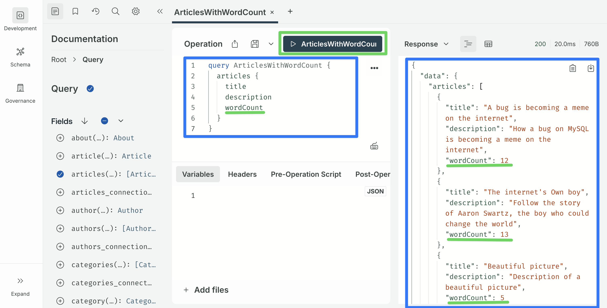

## Step 12: Second customization — a custom query

The same `nexus.extendType` pattern extends `Query` to define brand-new top-level queries. A small example: return only articles whose title contains a substring.

Create `src/extensions/graphql/queries.ts`:

```typescript
// src/extensions/graphql/queries.ts
import type { Core } from "@strapi/strapi";

export default function queries({
  nexus,
  strapi,
}: {
  nexus: typeof import("nexus");
  strapi: Core.Strapi;
}) {
  return {
    types: [
      nexus.extendType({
        type: "Query",
        definition(t) {
          t.list.field("searchArticles", {
            type: nexus.nonNull("Article"),
            args: { q: nexus.nonNull(nexus.stringArg()) },
            async resolve(_parent: unknown, args: { q: string }) {
              return strapi.documents("api::article.article").findMany({
                filters: { title: { $containsi: args.q } },
                sort: ["publishedAt:desc"],
              });
            },
          });
        },
      }),
    ],
    resolversConfig: {
      "Query.searchArticles": { auth: false },
    },
  };
}
```

Key points:

- `nexus.extendType({ type: 'Query', ... })` adds a field to the top-level `Query` type. That field becomes a new top-level GraphQL query: `searchArticles(q: String!): [Article!]`.
- The resolver calls `strapi.documents('api::article.article').findMany(...)` — the Document Service API, Strapi v5's recommended way to read and write content entries.
- `$containsi` is a case-insensitive substring filter. The full set of operators matches those available to Shadow CRUD filters.
- The `queries` factory takes `{ nexus, strapi }` because it needs the `strapi` instance to run the Document Service call. `computedFields` only needed `{ nexus }` because its resolvers only inspect the parent row.

Register it in the aggregator. Because `queries` needs `strapi`, wrap it in a named inner function rather than passing it directly:

```typescript
// src/extensions/graphql/index.ts
import type { Core } from "@strapi/strapi";
import computedFields from "./computed-fields";
import queries from "./queries";

export default function registerGraphQLExtensions(strapi: Core.Strapi) {
  const extensionService = strapi.plugin("graphql").service("extension");

  extensionService.use(computedFields);
  extensionService.use(function extendQueries({ nexus }: any) {
    return queries({ nexus, strapi });
  });
}
```

Restart. In the Sandbox:

```graphql
query SearchArticles($q: String!) {
  searchArticles(q: $q) {
    documentId
    title
    wordCount
  }
}
```

Variables:

```json
{ "q": "internet" }
```

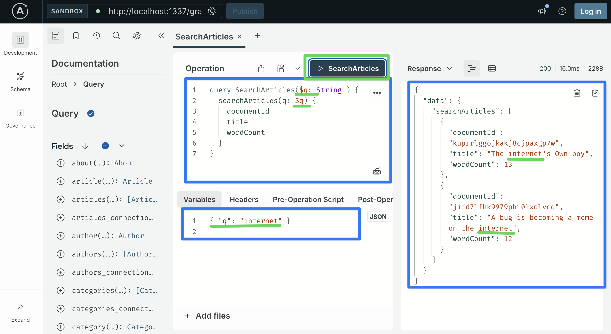

Every Article whose title contains "internet" (case-insensitive) should come back, with their word counts. The seeded example data includes titles like "A bug is becoming a meme on the internet" and "The internet's Own boy", so the word matches. Swap in a different word if your seeded titles differ.

## What you just built

- A Strapi v5 project with the GraphQL plugin installed and the seeded blog-style content model (Article, Author, Category, About, Global).
- A complete Shadow CRUD surface on `Article`: list, traverse relations, filter (including filters that cross relations), sort, paginate, create, update, delete.
- A customization folder structure under `src/extensions/graphql/` with an aggregator, a computed-fields factory, and a custom-queries factory — the same layout the advanced tutorial uses.
- Plugin limits configured in `config/plugins.ts`.

The final file layout:

```
src/
├── index.ts                              # calls registerGraphQLExtensions
└── extensions/
    └── graphql/
        ├── index.ts                      # aggregator
        ├── computed-fields.ts            # Article.wordCount
        └── queries.ts                    # Query.searchArticles
```

That is enough to understand the shape of Strapi's GraphQL customization APIs: the extension service, the `nexus.extendType` pattern, and the one-file-per-concept convention you will continue to use as the project grows.

## What's next

This is **Part 1** of a four-part series. Each part is self-contained and builds on the same `src/extensions/graphql/` folder structure you just created:

- **Part 2 — Advanced backend customization.** Takes the same Strapi project and adds the full customization surface: `resolversConfig` middlewares and named policies, selectively disabling Shadow CRUD (hiding fields, disabling filters, removing mutations), custom object types for aggregate responses, and several new custom queries and mutations on a note-taking content model. Everything lives under the same `src/extensions/graphql/` directory — new files, no refactors.

- **Part 3 — Consuming the schema from a Next.js frontend.** Wires the backend up to a Next.js 16 App Router application using Apollo Client. Covers RSC-based reads, Server Actions for writes, fragment composition, filter syntax on the client, and the create / update / inline-action flows for mutations.

- **Part 4 — Users, permissions, and per-user content.** Adds authentication via Strapi's users-permissions plugin and an ownership model so each user only reads and modifies their own data. Uses cookie-stored JWTs on the Next.js side and a two-layer authorization model on the backend (read middlewares + write policies), added as two more files (`ownership-middlewares.ts` and `ownership-policies.ts`) in the same extensions directory.

Each part can be read independently if you already have a project at the required state, but they are written to be followed in order.

**Citations**

- Strapi — GraphQL plugin: https://docs.strapi.io/cms/plugins/graphql
- Strapi — Document Service API: https://docs.strapi.io/cms/api/document-service
- Strapi — Content-Type Builder: https://docs.strapi.io/cms/features/content-type-builder
- Nexus schema documentation: https://nexusjs.org/
