> **Part 2 of a 4-part series on building with GraphQL, Strapi v5, and Next.js 16.** Each part builds directly on the project from the previous post, so keep an eye out as we release them:

- **Part 1**, GraphQL basics with Strapi v5. Fresh install, a full Shadow CRUD tour, and your first custom resolvers.
- **Part 2 (this post)**, Advanced backend customization. A `Note` + `Tag` model, middlewares and policies, Shadow CRUD restrictions, custom queries, and custom mutations.
- **Part 3**, Next.js 16 frontend. Apollo Client on the App Router: Server Component reads, Server Action writes, typed operations via codegen.
- **Part 4**, Users and per-user content. Authentication, an ownership model, and two-layer authorization (read middlewares, write policies).

New to Strapi or GraphQL? Start with Part 1. Already comfortable with Shadow CRUD and basic custom resolvers? You are in the right place.

**TL;DR**

- This post is a direct continuation of Part 1. It uses the same Strapi v5 project, the same `src/extensions/graphql/` folder, and the same aggregator you wired up there. Nothing is thrown away, everything new is added alongside.
- You will add a two-content-type note-taking model (`Note` and `Tag`, many-to-many) in the Content-Type Builder, then walk through the full remaining surface of the GraphQL plugin's customization APIs against it.
- Topics covered: `resolversConfig` middlewares and a named policy, selectively disabling parts of Shadow CRUD (actions, output fields, filter inputs), new object types for aggregate responses via `nexus.objectType`, three custom queries that demonstrate the Strapi Document Service plus a raw-SQL escape hatch (`strapi.documents` and `strapi.db.connection.raw`), and three custom mutations.
- Every resolver added here is validated in the Apollo Sandbox before moving on. Part 3 picks up the same schema and consumes it from a Next.js 16 App Router frontend.
- Target audience: developers who completed Part 1, or who already have a Strapi v5 project with `@strapi/plugin-graphql` installed and a working aggregator under `src/extensions/graphql/`.

## Picking up from Part 1

Part 1 left you with a working Strapi v5 project named `server`, the example blog content model (Article, Author, Category), `@strapi/plugin-graphql` installed and configured in `config/plugins.ts`, and a small customization folder under `src/extensions/graphql/` containing an aggregator, a computed-fields factory (`Article.wordCount`), and a custom-queries factory (`Query.searchArticles`).

Concretely, the folder you ended Part 1 with:

```
server/
├── config/
│   └── plugins.ts                        # depthLimit, maxLimit, defaultLimit, landingPage, introspection
└── src/
    ├── index.ts                          # calls registerGraphQLExtensions
    └── extensions/
        └── graphql/
            ├── index.ts                  # aggregator
            ├── computed-fields.ts        # Article.wordCount
            └── queries.ts                # Query.searchArticles
```

Part 2 does not refactor any of these files. It adds:

- Two new content types (Note and Tag) through the admin UI.
- One new file under `src/extensions/graphql/`: `middlewares-and-policies.ts`.
- A policy file at `src/policies/include-archived-requires-header.ts`.
- New entries in the existing `computed-fields.ts` and `queries.ts` (alongside what Part 1 wrote, not in place of it).
- A new `mutations.ts` under `src/extensions/graphql/`.
- Updated wiring in `src/extensions/graphql/index.ts` to register the three new factories.

If you skipped Part 1, run through it first. The setup steps, plugin configuration, and aggregator scaffolding will not be repeated here.

## What you will build

The note-taking model has two collection types:

- **Tag**: `name` (text), `slug` (UID), `color` (enumeration with a fixed palette). No relations to define by hand; the inverse relation back to Note is generated automatically.
- **Note**: `title` (text), `content` (rich text, Markdown), `pinned` (boolean, default `false`), `archived` (boolean, default `false`), `internalNotes` (long text, marked **private**), plus a many-to-many relation to Tag.

The customizations applied to that model, in the order this post introduces them:

1. Prevent hard deletes, hide `internalNotes` from the public schema, and close the filter side channel on it.
2. Log every call to `Query.notes`, attach a public cache hint, and gate archived queries behind an HTTP header.
3. Add three computed fields to `Note`: `wordCount`, `readingTime`, and `excerpt(length: Int)`.
4. Introduce two brand-new object types, `NoteStats` and `TagCount`, for aggregate responses.
5. Add three custom queries: `searchNotes`, `noteStats`, and `notesByTag`.
6. Add three custom mutations: `togglePin`, `archiveNote`, and `duplicateNote`.

By the final step, every customization API the GraphQL plugin exposes has been exercised at least once against a realistic content model.

## Step 1: Create the Tag content type

Start the dev server if it is not already running:

```bash
npm run develop
```

Open the admin UI at `http://localhost:1337/admin`, then:

1. Click **Content-Type Builder** in the left sidebar (the blocks icon).
2. Under **Collection Types**, click **Create new collection type**.
3. Set **Display name** to `Tag`. Leave **API ID (singular)** as `tag` and **API ID (plural)** as `tags`. Click the **Advanced Settings** tab in the same dialog and uncheck **Draft & Publish**. Click **Continue**.
4. In the **Select a field** modal:
   - Click **Text**, name it `name`, leave the type as **Short text**. Open the **Advanced settings** tab and check **Required field**. Click **Add another field**.
   - Click **UID**, name it `slug`, and set **Attached field** to `name`. Click **Add another field**.
   - Click **Enumeration**, name it `color`, and add these values one per line: `red`, `blue`, `green`, `yellow`, `purple`, `gray`. Open the **Advanced settings** tab and set **Default value** to `gray`. Click **Finish**.
5. Click **Save** in the top right. The server restarts.

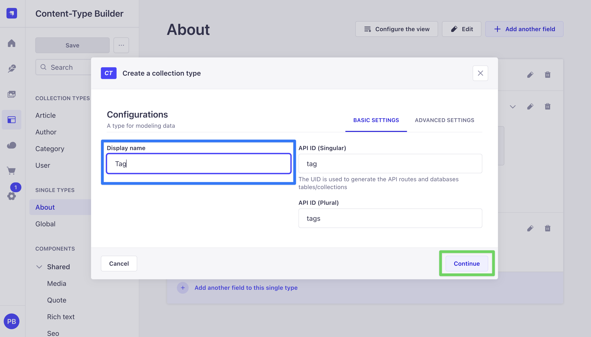

Tags are pure labels, so Draft & Publish adds no value here. Disabling it keeps tag entries live the moment they are saved and removes `status: 'published'` bookkeeping from any tag-related query you might write later.

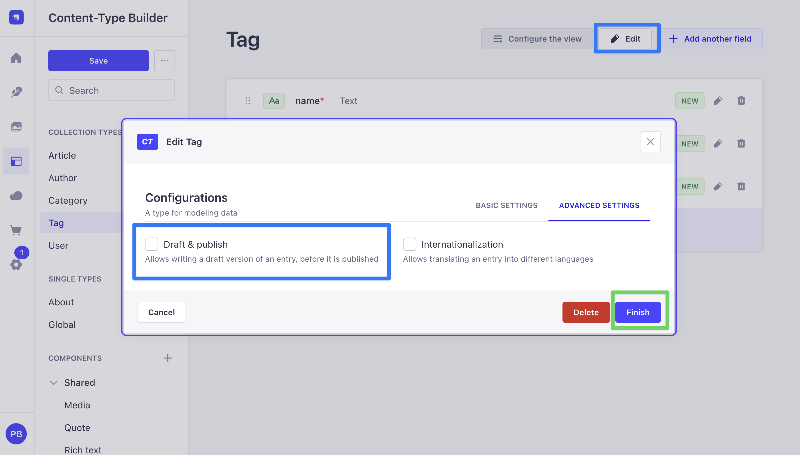

Here is the final look at our `tag` collection:

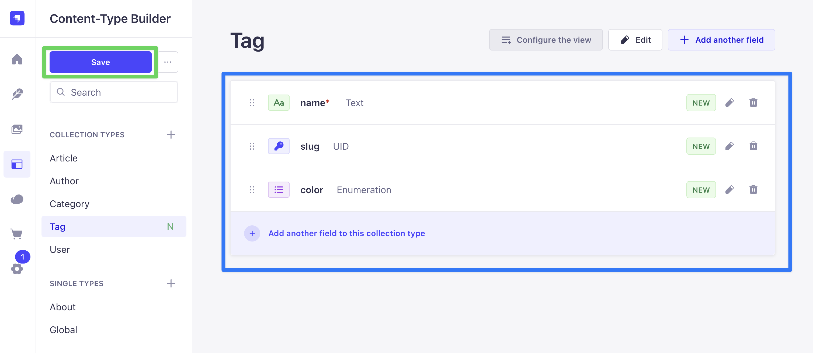

Open `src/api/tag/content-types/tag/schema.json` to confirm the attributes look right:

```json
{
  "kind": "collectionType",
  "collectionName": "tags",
  "info": {
    "singularName": "tag",
    "pluralName": "tags",
    "displayName": "Tag"
  },
  "options": {
    "draftAndPublish": false
  },
  "pluginOptions": {},
  "attributes": {
    "name": {
      "type": "string",
      "required": true
    },
    "slug": {
      "type": "uid",
      "targetField": "name"
    },
    "color": {
      "type": "enumeration",
      "default": "gray",
      "enum": ["red", "blue", "green", "yellow", "purple", "gray"]
    }
  }
}
```

## Step 2: Create the Note content type

Back in the Content-Type Builder:

1. Click **Create new collection type** under **Collection Types**.
2. Set **Display name** to `Note` and click the **Advanced Settings** tab in the same dialog. Uncheck **Draft & Publish**. Click **Continue**. (Disabling Draft & Publish on Note keeps the rest of the post free of `status: 'published'` handling in custom resolvers. Article in Part 1 had it on, which is why `searchArticles` had to pass `status: 'published'` explicitly.)
3. Add the fields one at a time:
   - **Text** named `title`, **Short text**, Required.
   - **Rich text (Markdown)** named `content`. (Strapi offers two rich-text variants: Blocks, an AST-style array structure, and Markdown, a plain string. Markdown is simpler to render on the Next.js frontend in Part 3 and cheaper to process on the backend, so we pick it here.)
   - **Boolean** named `pinned`. Under **Advanced settings**, set **Default value** to `false`.
   - **Boolean** named `archived`. Under **Advanced settings**, set **Default value** to `false`.
   - **Text** named `internalNotes`, **Long text**. No required flag. Open the **Advanced settings** tab and check **Private field**. `internalNotes` is meant for admin-only context (moderation notes, triage flags, anything the public API should never see), so marking it **private** is the cleanest way to keep it out of every client-facing surface. On REST, Strapi strips private attributes from response bodies during sanitization. On GraphQL, the plugin goes further and removes private attributes from the **output type**, the **filter input type**, and the **mutation input type** — we verify this with an introspection query right after the schema snippet below.

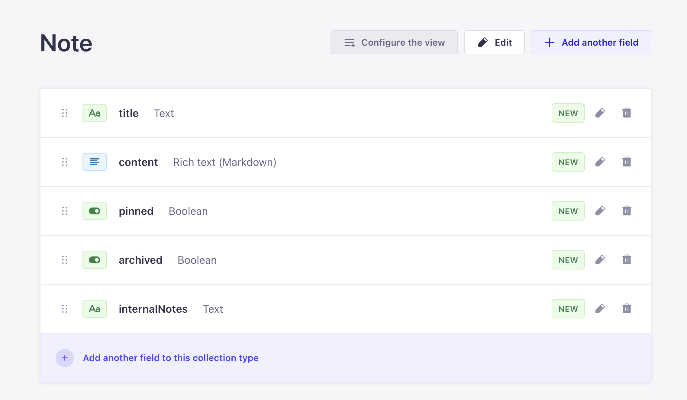

4. Add the relation to Tag:
   - Click **Relation** in the field picker.
   - In the relation builder, the left card is `Note` (you are editing it) and the right card is the target. Click the right-hand dropdown and pick **Tag**.
   - Choose the **many-to-many** icon (the one where both sides show multiple arrows). The field on the Note side should be named `tags`, the inverse field on the Tag side should be named `notes`.
   - Click **Finish**.
     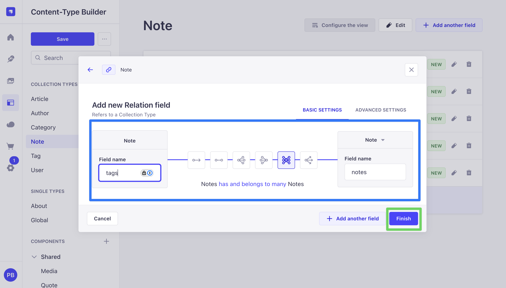
5. Click **Save**. The server restarts again.

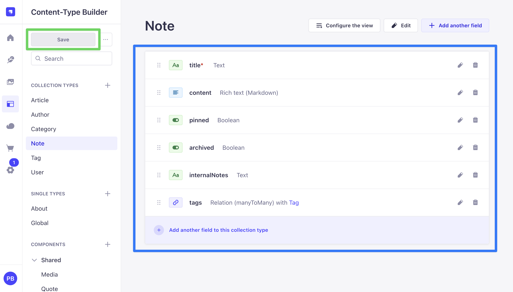

Open `src/api/note/content-types/note/schema.json` to confirm the attributes look right:

```json
{
  "kind": "collectionType",
  "collectionName": "notes",
  "info": {
    "singularName": "note",
    "pluralName": "notes",
    "displayName": "Note"
  },
  "options": {
    "draftAndPublish": false
  },
  "pluginOptions": {},
  "attributes": {
    "title": {
      "type": "string",
      "required": true
    },
    "content": {
      "type": "richtext"
    },
    "pinned": {
      "type": "boolean",
      "default": false
    },
    "archived": {
      "type": "boolean",
      "default": false
    },
    "internalNotes": {
      "type": "text",
      "private": true
    },
    "tags": {
      "type": "relation",
      "relation": "manyToMany",
      "target": "api::tag.tag",
      "inversedBy": "notes"
    }
  }
}
```

### Verify `private: true` hid `internalNotes` from GraphQL

Open the Apollo Sandbox at `http://localhost:1337/graphql` and run:

```graphql
query PrivateReference {
  note: __type(name: "Note") {
    fields {
      name
    }
  }
  filter: __type(name: "NoteFiltersInput") {
    inputFields {
      name
    }
  }
  input: __type(name: "NoteInput") {
    inputFields {
      name
    }
  }
}
```

Scan all three lists in the response. `internalNotes` is **absent** from every one. The GraphQL plugin reads the `private: true` flag out of `schema.json` and excludes the attribute from the output type, the filter input type, and the mutation input type in a single move. REST sanitization strips it from response bodies at the same time, so `GET /api/notes` never returns `internalNotes` either.

This is the Strapi-idiomatic way to hide sensitive fields from the public API. No extension code required.

## Step 3: Grant public permissions for Note and Tag

Same flow as Part 1, applied to the new content types.

1. In the admin UI, open **Settings** (gear icon, bottom of the left sidebar).
2. Under **Users & Permissions Plugin**, click **Roles**, then **Public**.

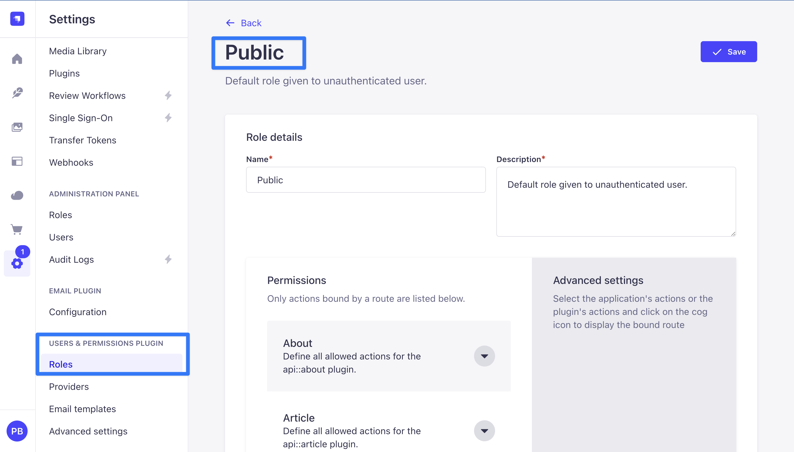

3. Expand **Note** and check `find`, `findOne`, `create`, and `update`. Leave `delete` unchecked. The frontend will use soft-delete via the `archived` flag, so no one should ever be able to hard-delete a note through the public API.

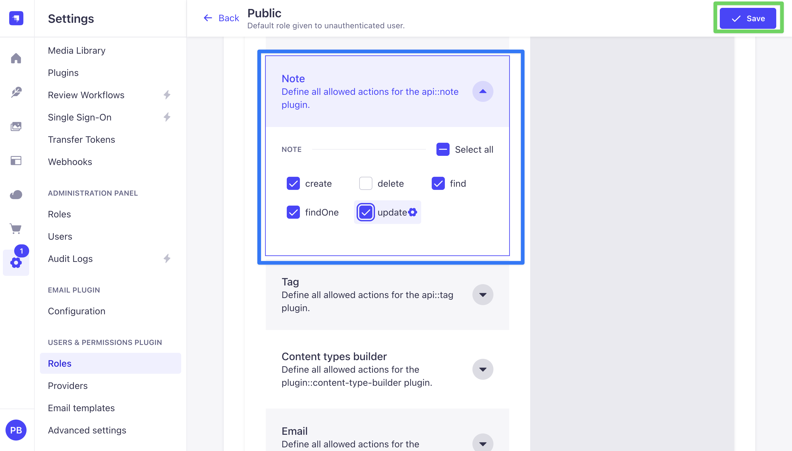

4. Expand **Tag** and check `find`, `findOne`, `create`, `update`, and `delete`.

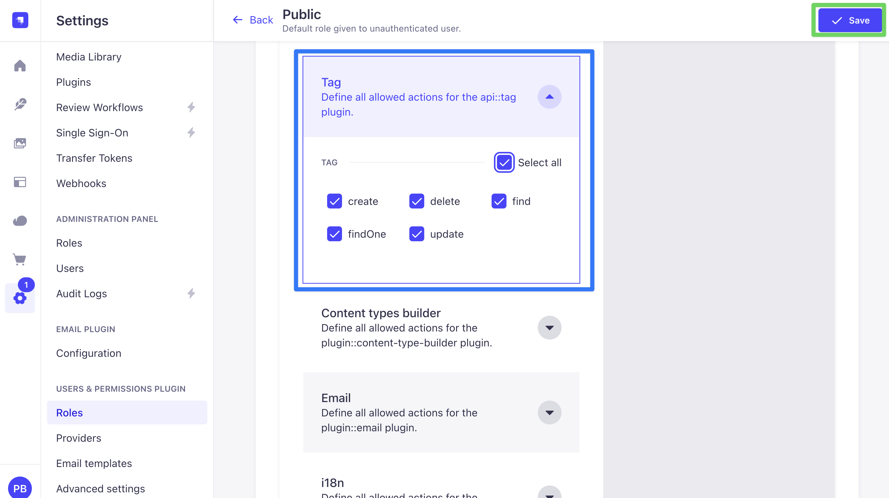

5. Click **Save**.

## Step 4: Seed a handful of entries

The queries, policies, and aggregations later in this post need something to return. Create a few entries by hand so the Sandbox has data to work against.

Create three Tag entries through **Content Manager**, **Tag**, **Create new entry**. Suggested starter values:

| name     | slug     | color  |
| -------- | -------- | ------ |
| Work     | work     | blue   |
| Personal | personal | green  |
| Ideas    | ideas    | yellow |

Strapi renders the `color` field as a dropdown with the six values from Step 1. The frontend in Part 3 will map each enum value to a Tailwind class, so the full palette does not need to be used in the seed data.

Click **Save**

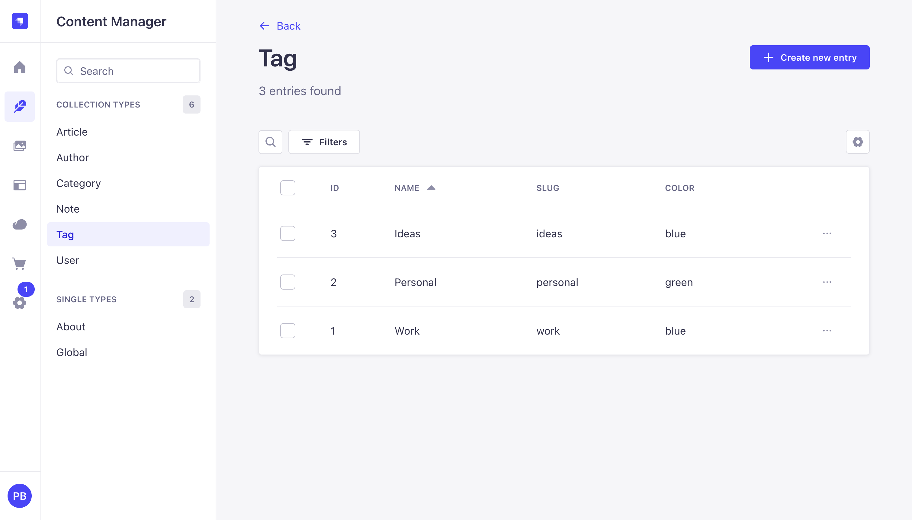

Create three Note entries through **Content Manager**, **Note**, **Create new entry**. For each note:

- Pick a title like `Weekly review`, `Gift ideas`, or `Side-project backlog`.
- In **content**, add a paragraph or two of text. The exact wording is not important, but make each note at least a sentence long so `wordCount` and `readingTime` return non-zero values in Step 7.
- Toggle `pinned` on for one of the three, leave the others off.
- Leave `archived` off for all of them. You can flip one to `archived: true` later when testing the archive policy.
- Fill `internalNotes` with anything, for example `moderator flag: low priority`. This field will be hidden from public GraphQL in Step 5, so whatever you put here will only appear in the admin UI.
- Under **Tags**, add one or two tags from the dropdown.
- Click **Save**.

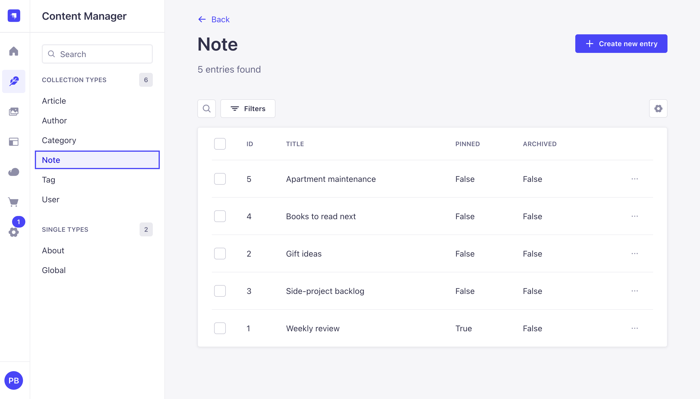

Three notes are enough to exercise every resolver in the rest of the post. Add more if you like.

## Step 5: Shadow CRUD, what it is and why you rarely customize it

Shadow CRUD is how Strapi auto-generates your GraphQL schema from content-type schemas at boot. At startup, [the GraphQL plugin](https://docs.strapi.io/cms/plugins/graphql#shadow-crud) reads every registered content type and emits matching queries, mutations, input types, and filter types. Everything you explored in Part 1, the full `notes` / `note` / `createNote` / `updateNote` surface, came out of Shadow CRUD.

The plugin does expose an extension API for selectively disabling parts of what gets generated:

```typescript
strapi
  .plugin("graphql")
  .service("extension")
  .shadowCRUD("api::note.note")
  .disable() // remove the whole content type
  .disableQueries() // remove find/findOne
  .disableMutations() // remove create/update/delete
  .disableAction("delete");

strapi
  .plugin("graphql")
  .service("extension")
  .shadowCRUD("api::note.note")
  .field("internalNotes")
  .disable() // remove the field entirely
  .disableOutput() // remove from the Note output type
  .disableInput() // remove from create/update inputs
  .disableFilters(); // remove from NoteFiltersInput
```

The full vocabulary, for reference:

| Content-type level                     | Field level         |
| -------------------------------------- | ------------------- |
| `.disable()`                           | `.disable()`        |
| `.disableQueries()`                    | `.disableOutput()`  |
| `.disableMutations()`                  | `.disableInput()`   |
| `.disableAction('delete')`             | `.disableFilters()` |
| `.disableActions(['create','update'])` |                     |

Documented in full on [the GraphQL plugin docs page](https://docs.strapi.io/cms/plugins/graphql).

### In practice, you rarely reach for this

The extension API exists, but day-to-day Strapi projects almost never use it. Two reasons:

1. **Permissions already gate access.** If you do not want the public role calling `deleteNote`, uncheck `delete` for the Public role in Step 3. Both the REST endpoint and the GraphQL resolver refuse the call. That is the Strapi-idiomatic way and it is what every codebase uses.
2. **`private: true` already hides sensitive fields.** Step 2 put `private: true` on `internalNotes` and the GraphQL plugin strips it from the output type, filter input type, AND mutation input type in one move. No extension file needed.

For real access control, reach for **permissions** (Step 3) and **`private: true`** (Step 2) first, then **middlewares and policies** (Step 6) for anything those cannot express. Shadow CRUD customization is for narrow cosmetic cases only, so this tutorial does not add a `shadow-crud.ts` file.

## Step 6: `resolversConfig`, middlewares and policies

`resolversConfig` is how you attach middlewares, policies, and auth rules to any resolver, Shadow-CRUD-generated or custom. The wiring is a map from a fully-qualified resolver name (`Query.notes`, `Mutation.createNote`, `Note.wordCount`) to a configuration object.

### Middleware vs. policy, and when to use each

Both are functions that run around a resolver, but they answer different questions.

**Policies answer "should this request even proceed?"** Per [the Strapi docs](https://docs.strapi.io/cms/backend-customization/policies), policies are "functions that execute specific logic on each request before it reaches the controller. They are mostly used for securing business logic." A policy returns `true` to allow the request through or `false` to reject it, and nothing else happens — the resolver never runs on rejection. Policies are the Strapi-idiomatic home for authorization checks like "is the user logged in", "does this user own this row", "is the requested operation permitted from this IP." Policies for the GraphQL plugin live in `src/policies/` (global) or `src/api/<api>/policies/` (API-scoped) and are registered by name: `global::<filename>` or `api::<api>.<filename>`.

**Middlewares answer "what should happen before and after?"** Per [the Strapi docs](https://docs.strapi.io/cms/backend-customization/middlewares), middlewares "alter the request or response flow at application or API levels." A middleware wraps the resolver call: it can run code before, call `next(...)` to proceed, and run code after with the result in hand. Middlewares are for observability (timing, logging, tracing), response augmentation (cache hints, CORS headers, injected fields), and transformation. They are not the right tool for rejecting unauthorized requests (that is what policies are for).

The GraphQL plugin exposes both through the same `resolversConfig` key, described in [the plugin docs](https://docs.strapi.io/cms/plugins/graphql): `middlewares` is an array of functions or registered references, and `policies` is the same shape. The two arrays run in sequence per request: policies first (any `false` return short-circuits the request), then middlewares (each wraps the chain), then the resolver.

### What this step builds

The file below attaches two things to `Query.notes`:

1. A **logger middleware** that times every call and prints the filter arguments. Observability, not authorization, so a middleware is the right fit.
2. A **named policy** (`global::include-archived-requires-header`) that rejects any `Query.notes` call that asks for `archived: true` unless an `x-include-archived` header is present. This is a pure allow/block decision on authorization grounds, so it belongs in a policy, not a middleware.

Create the file:

```typescript
// src/extensions/graphql/middlewares-and-policies.ts
import type { GraphQLResolveInfo } from "graphql";

type NotesArgs = {
  filters?: Record<string, unknown>;
  pagination?: Record<string, unknown>;
  sort?: string | string[];
};

type ResolverNext = (
  parent: unknown,
  args: NotesArgs,
  context: unknown,
  info: GraphQLResolveInfo,
) => Promise<unknown>;

export default function middlewaresAndPolicies() {
  return {
    resolversConfig: {
      "Query.notes": {
        middlewares: [
          async (
            next: ResolverNext,
            parent: unknown,
            args: NotesArgs,
            context: unknown,
            info: GraphQLResolveInfo,
          ) => {
            const label = `[graphql] Query.notes (${JSON.stringify(args?.filters ?? {})})`;
            console.time(label);
            try {
              return await next(parent, args, context, info);
            } finally {
              console.timeEnd(label);
            }
          },
        ],
        policies: ["global::include-archived-requires-header"],
      },
    },
  };
}
```

The two call signatures to memorize:

- **Middleware**: `async (next, parent, args, context, info) => next(parent, args, context, info)`. Call `next(...)` to continue the chain. Wrap before and after with whatever you need (timing, logging, cache hints, result transformation).
- **Policy**: `(policyContext, config, { strapi }) => boolean`. Return `false` to reject. Policies run **before** the resolver; middlewares run **around** it.

Inline policy functions do not work inside `resolversConfig` in Strapi v5. The configuration expects a registered policy name of the form `global::<filename>` (for policies in `src/policies/`) or `api::<api>.<filename>` (for API-scoped policies).

Before writing the policy, note what the first argument looks like. Per [the GraphQL plugin docs](https://docs.strapi.io/cms/plugins/graphql), when a policy runs from `resolversConfig`:

> Policies directly implemented in resolversConfig are functions that take a context object and the strapi instance as arguments. The context object gives access to:
>
> - the parent, args, context and info arguments of the GraphQL resolver,
> - Koa's context with context.http and state with context.state.

So `policyContext.args` gives you the GraphQL resolver arguments (including `filters`), and `policyContext.http` gives you Koa's request (for reading headers). The `PolicyContext` type below models exactly that shape, narrowed to the fields this specific policy reads.

Create the policy file:

```typescript
// src/policies/include-archived-requires-header.ts
import type { Core } from "@strapi/strapi";

type ArchivedFilter = boolean | { eq?: boolean; $eq?: boolean };

type PolicyContext = {
  args?: { filters?: { archived?: ArchivedFilter } };
  context?: {
    http?: {
      request: { headers: Record<string, string | string[] | undefined> };
    };
  };
  http?: {
    request: { headers: Record<string, string | string[] | undefined> };
  };
};

const includeArchivedRequiresHeader = (
  policyContext: PolicyContext,
  _config: unknown,
  { strapi }: { strapi: Core.Strapi },
): boolean => {
  const filter = policyContext?.args?.filters?.archived;
  const wantsArchived =
    filter === true ||
    (typeof filter === "object" &&
      (filter?.eq === true || filter?.$eq === true));

  if (!wantsArchived) return true;

  const headers =
    policyContext?.context?.http?.request?.headers ??
    policyContext?.http?.request?.headers;
  const header = headers?.["x-include-archived"];

  if (header === "yes") return true;
  strapi.log.warn(
    "Query.notes with archived filter blocked, missing x-include-archived header.",
  );
  return false;
};

export default includeArchivedRequiresHeader;
```

The policy short-circuits with `true` when the query is not asking for archived rows, so it has zero effect on ordinary reads. Only queries that explicitly filter on `archived: true` are gated behind the header.

Register the factory in the aggregator:

```typescript
// src/extensions/graphql/index.ts
import type { Core } from "@strapi/strapi";
import computedFields from "./computed-fields";
import queries from "./queries";
import middlewaresAndPolicies from "./middlewares-and-policies";

export default function registerGraphQLExtensions(strapi: Core.Strapi) {
  const extensionService = strapi.plugin("graphql").service("extension");

  extensionService.use(middlewaresAndPolicies);
  extensionService.use(computedFields);
  extensionService.use(function extendQueries({ nexus }: any) {
    return queries({ nexus, strapi });
  });
}
```

Restart. From a terminal, confirm the policy is active by sending the same request with and without the required header:

```bash
curl -s -X POST http://localhost:1337/graphql \
  -H 'Content-Type: application/json' \
  -d '{"query":"{ notes(filters:{ archived:{ eq: true } }){ title } }"}'
# -> {"errors":[{"message":"Policy Failed", ... }]}

curl -s -X POST http://localhost:1337/graphql \
  -H 'Content-Type: application/json' \
  -H 'X-Include-Archived: yes' \
  -d '{"query":"{ notes(filters:{ archived:{ eq: true } }){ title archived } }"}'
# -> {"data":{"notes":[ ... ]}}
```

You should also see the timing log line (`[graphql] Query.notes (...): <n>ms`) in the Strapi process output for every call to `notes`.

### GraphQL-only vs. both APIs

The same caveat from Step 5 applies here: everything in `resolversConfig` only runs for GraphQL. The archived-header policy gates `Query.notes` on `/graphql`, it does nothing for `GET /api/notes?filters[archived][$eq]=true`. A caller that hits REST bypasses the header check entirely.

Confirm it from the terminal. The same archived filter that GraphQL rejects without the header comes back 200 on REST:

```bash
# GraphQL without header: Policy Failed
curl -s -X POST http://localhost:1337/graphql \
  -H 'Content-Type: application/json' \
  -d '{"query":"{ notes(filters:{ archived:{ eq: true } }){ title } }"}'
# -> {"errors":[{"message":"Policy Failed", ... }],"data":null}

# REST with the same intent, no header: 200 OK, returns archived rows
curl -s "http://localhost:1337/api/notes?filters\[archived\]\[\$eq\]=true"
# -> {"data":[ ... archived notes here ... ],"meta":{ ... }}
```

If the rule is genuinely "no one can read archived rows without the header, regardless of API," there are two ways to cover REST as well:

1. **Register the same policy on the REST route.** Because [`policyContext` is designed to work for both REST and GraphQL](https://docs.strapi.io/cms/backend-customization/policies), the function in `src/policies/include-archived-requires-header.ts` can be reused verbatim. Edit `src/api/note/routes/note.ts`:

   ```typescript
   import { factories } from "@strapi/strapi";

   export default factories.createCoreRouter("api::note.note", {
     config: {
       find: { policies: ["global::include-archived-requires-header"] },
       findOne: { policies: ["global::include-archived-requires-header"] },
     },
   });
   ```

   Now REST calls go through the same policy.

2. **Move the rule into a global middleware** at `config/middlewares.ts` that inspects the request URL / body for archived filters and rejects before any router runs. This is heavier (you have to parse both the REST querystring syntax and the GraphQL document) but guarantees both paths are covered from one place.

The per-resolver policy in `resolversConfig` is the right fit for rules that are **inherently GraphQL-shaped** (e.g. "reject this query if the selection set is too deep"). For rules that are really data-access rules, pair them with REST either through the route config above or through a global middleware. The same logic applies to the middlewares in this file: the timing log and cache hint are GraphQL-specific by design, so they live here and nowhere else.

> **Looking ahead to Part 4.** When authentication lands and we add a per-user ownership check so one user cannot edit another user's notes, that check absolutely must cover both REST and GraphQL: missing the REST side means every authenticated user can `PUT /api/notes/:id` against anyone else's row. Part 4 builds `is-owner` as a **global middleware** in `config/middlewares.ts`, not as a `resolversConfig` policy, for exactly the reason this subsection describes. Global middleware is the right home for any rule that has to hold across both APIs, and ownership is the textbook case.

## Step 7: Add computed fields to Note

Part 1 introduced computed fields on Article with a single-line `description` field. Note's main body lives in `content`, a markdown string. Word counting and excerpting run directly on that string; a small helper strips common markdown syntax so the results reflect rendered text rather than raw source.

Extend the existing `computed-fields.ts` so that Article's `wordCount` from Part 1 stays put and three new fields appear on Note:

````typescript
// src/extensions/graphql/computed-fields.ts
const WORDS_PER_MINUTE = 200;
const DEFAULT_EXCERPT_LENGTH = 180;

type ArticleSource = { description?: string | null };
type NoteSource = { content?: string | null };

/** Remove common markdown syntax so counts and excerpts reflect rendered text. */
function stripMarkdown(md: string): string {
  return (md ?? "")
    .replace(/```[\s\S]*?```/g, " ") // code fences
    .replace(/`[^`]*`/g, " ") // inline code
    .replace(/!\[([^\]]*)\]\([^)]*\)/g, "$1") // images  -> alt
    .replace(/\[([^\]]*)\]\([^)]*\)/g, "$1") // links   -> text
    .replace(/^#+\s+|^>\s+|^[-*+]\s+|^\d+\.\s+/gm, "") // headings, quotes, list markers
    .replace(/\*\*([^*]*)\*\*|__([^_]*)__/g, (_, a, b) => a ?? b) // **bold** / __bold__
    .replace(/\*([^*]*)\*|_([^_]*)_/g, (_, a, b) => a ?? b) // *italic* / _italic_
    .replace(/\s+/g, " ")
    .trim();
}

function countWords(text: string): number {
  const trimmed = text.trim();
  return trimmed ? trimmed.split(/\s+/).length : 0;
}

function truncateAt(text: string, maxLength: number): string {
  return text.length <= maxLength
    ? text
    : text.slice(0, maxLength).trimEnd() + "...";
}

export default function computedFields({
  nexus,
}: {
  nexus: typeof import("nexus");
}) {
  return {
    types: [
      nexus.extendType({
        type: "Article",
        definition(t) {
          t.nonNull.int("wordCount", {
            description: "Word count of the article description.",
            resolve: (parent: ArticleSource) =>
              countWords(parent?.description ?? ""),
          });
        },
      }),

      nexus.extendType({
        type: "Note",
        definition(t) {
          t.nonNull.int("wordCount", {
            description: "Word count of the note body (markdown stripped).",
            resolve: (parent: NoteSource) =>
              countWords(stripMarkdown(parent?.content ?? "")),
          });

          t.nonNull.int("readingTime", {
            description: `Estimated reading time in minutes (${WORDS_PER_MINUTE} wpm).`,
            resolve: (parent: NoteSource) => {
              const words = countWords(stripMarkdown(parent?.content ?? ""));
              return Math.max(1, Math.ceil(words / WORDS_PER_MINUTE));
            },
          });

          t.nonNull.string("excerpt", {
            description: "First N characters of the note, markdown stripped.",
            args: { length: nexus.intArg({ default: DEFAULT_EXCERPT_LENGTH }) },
            resolve: (parent: NoteSource, { length }: { length: number }) =>
              truncateAt(stripMarkdown(parent?.content ?? ""), length),
          });
        },
      }),
    ],
    resolversConfig: {
      "Article.wordCount": { auth: false },
      "Note.wordCount": { auth: false },
      "Note.readingTime": { auth: false },
      "Note.excerpt": { auth: false },
    },
  };
}
````

### Reading the factory

A computed-fields factory returns an object with two keys:

- **`types`** is an array of Nexus type definitions that get merged into the generated schema. `nexus.extendType({ type: "Note", definition(t) { ... } })` reads "find the existing `Note` type and add these fields to it." The same pattern works on any type Shadow CRUD produced.
- **`resolversConfig`** attaches per-resolver configuration. For computed fields this is almost always just `auth: false` on each added field (explained below).

Inside `definition(t)`, each field is declared with `t.nonNull.<scalar>("fieldName", { ... })`. `nonNull` marks the field as required in the schema (no `null` values possible), so clients can select it without null checks. Every field takes a `description` that shows up in the Sandbox schema panel and in generated client types.

The two `nexus.extendType` calls are independent. Article's `wordCount` still resolves against the `description` string; Note's three fields derive from the markdown string in `content`. `stripMarkdown` removes code fences, inline code, images, links, headings, list bullets, blockquote markers, and bold / italic markers so the counts and excerpts reflect readable text, not raw markdown syntax.

### Why `auth: false` is needed here

The `resolversConfig` block at the bottom of the file marks every computed field as `auth: false`. Unlike `Query.notes` in Step 6 (where we removed `auth: false` because the Public role already grants `find` on Note), computed fields are a different case.

When a resolver runs, the GraphQL plugin asks the Users & Permissions plugin whether the current role has the matching action permission. For `Query.notes` the match is `api::note.note.find`, a real entry in the permission matrix. For `Note.wordCount` or `Article.wordCount`, **the plugin tries to look up a permission that does not exist** — `wordCount` is not one of the five core CRUD actions (`find`, `findOne`, `create`, `update`, `delete`), so there is no matching checkbox in the admin UI to grant it. The lookup returns "no matching permission" and the resolver is rejected with `Forbidden access`.

`auth: false` tells the GraphQL plugin to skip the permission lookup entirely for these fields. The computed field then runs whenever the containing object's own resolver succeeds — which is the correct semantics: if a client is allowed to read a `Note`, it should be allowed to read `Note.wordCount` too; a separate permission for every computed field would be both noisy and meaningless.

Rule of thumb: any field you add through `nexus.extendType` on an existing content-type needs `auth: false` in `resolversConfig`, unless you are intentionally guarding the field behind a custom policy or middleware that handles authorization itself.

From the Sandbox, the new fields are selectable on any Note:

```graphql
query ComputedNoteFields {
  notes(pagination: { pageSize: 3 }) {
    title
    wordCount
    readingTime
    excerpt(length: 60)
  }
}
```

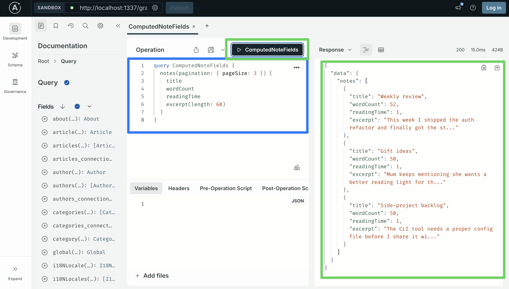

Every note should return non-zero values. If `wordCount` is `0` across the board, the resolver is being called but `content` is empty or null. Open a note in the admin UI and confirm there is actual text in the markdown editor, or query `notes { content }` and inspect the raw string.

## Step 8: Create new object types for aggregate responses

Step 7 used `nexus.extendType` to add fields to types Shadow CRUD already generated. But not every response shape is an existing content type. Aggregate results (`{ total: 42, published: 30, draft: 12 }`), per-group breakdowns (`[{ tagName: "Work", count: 7 }, ...]`), operation envelopes (`{ success: true, conflicts: [...] }`), and any other return shape that is not one-to-one with a row in a table all need their own object types. `nexus.objectType` is the API for declaring those.

The rule of thumb:

- **`nexus.extendType`** — add a field to an existing type. Used in Step 7 for `Note.wordCount`, `Note.readingTime`, `Note.excerpt`.
- **`nexus.objectType`** — declare a new type from scratch. Used here for `TagCount` and `NoteStats`.

The `noteStats` query in the next step returns totals across the note table plus a per-tag breakdown. Neither shape matches a content type, so both are new object types declared alongside the content-type-derived ones.

Open `src/extensions/graphql/queries.ts`, which Part 1 created with a single `searchArticles` query. You will add two `nexus.objectType` entries and three new `Query` fields alongside it. First the two object types, then the query resolvers in Step 9.

### Nexus and SDL, briefly

Before the recap, two terms worth defining since they appear throughout this step.

**SDL** (Schema Definition Language) is GraphQL's native, language-agnostic syntax for describing a schema. It looks like this:

```graphql
type TagCount {
  slug: String!
  name: String!
  count: Int!
}
```

SDL is what clients see when they introspect the schema, and it is what tools like Apollo Sandbox, GraphQL Code Generator, and IDE plugins read to give you autocomplete and type information. Every GraphQL server, regardless of how it builds its schema, ultimately exposes it as SDL.

**Nexus** is the TypeScript library Strapi's GraphQL plugin uses to build that SDL programmatically rather than writing it as a string. Instead of typing the SDL above directly, you write:

```typescript
nexus.objectType({
  name: "TagCount",
  definition(t) {
    t.nonNull.string("slug");
    t.nonNull.string("name");
    t.nonNull.int("count");
  },
});
```

At build time, Nexus compiles every `objectType` / `extendType` / etc. call into one big SDL schema and hands it to Apollo Server. The wire format is identical; the authoring format differs.

**Why Strapi picked Nexus (code-first) over SDL strings:**

- **Type inference.** When you write `resolve: (parent: NoteSource) => ...`, TypeScript knows the return type must match the field type declared by `t.nonNull.int(...)`. SDL-first approaches rely on a code-generation step to produce equivalent types, which is another piece to wire up.
- **Cross-file composition.** Plugins, extensions, and user code all need to contribute to the same schema without stepping on each other. Each factory (`computed-fields.ts`, `queries.ts`, `mutations.ts`) returns its own Nexus types, and the plugin merges them at startup. A string-SDL approach would need some form of stitching or template literal wrangling to achieve the same.
- **Dynamic generation.** Shadow CRUD is itself code-first: the plugin iterates over your content types and produces `objectType` / `extendType` calls from them. Keeping user-written extensions in the same format means Shadow CRUD and your code speak the same language.

The tradeoff: Nexus is slightly more verbose than raw SDL, and the "what the final schema looks like" view requires reading several files instead of one. That is why each new type in this step is followed by its SDL equivalent as a comment or callout — it keeps the visual map of the schema honest.

### Nexus recap

Part 1 introduced the minimum Nexus vocabulary needed for `searchArticles`. Two more features show up in this post.

**Defining a new object type with `nexus.objectType`.** The `definition(t)` callback declares each field on the type. Every `objectType` call lives inside the `types` array returned by your factory (the same `types` array you saw in `computed-fields.ts` in Step 7). The pattern is always the same:

```typescript
export default function queries({ nexus, strapi }: { ... }) {
  return {
    types: [
      // nexus.objectType({ ... })   <- new types go here
      // nexus.extendType({ ... })   <- field extensions go here too
    ],
    resolversConfig: { /* ... */ },
  };
}
```

Step 9 shows the full `queries.ts` with both `TagCount` and `NoteStats` declared in the `types` array alongside the existing `searchArticles` extension. For now, focus on one object type in isolation:

```typescript
nexus.objectType({
  name: "TagCount",
  definition(t) {
    t.nonNull.string("slug");
    t.nonNull.string("name");
    t.nonNull.int("count");
  },
});
```

The resulting SDL equivalent:

```graphql
type TagCount {
  slug: String!
  name: String!
  count: Int!
}
```

**Modifiers stack left-to-right.** Nullability and list modifiers chain in front of the field type, mirroring the SDL shape:

| Nexus call                           | GraphQL type    |
| ------------------------------------ | --------------- |
| `t.string('a')`                      | `a: String`     |
| `t.nonNull.string('a')`              | `a: String!`    |
| `t.list.string('a')`                 | `a: [String]`   |
| `t.list.nonNull.string('a')`         | `a: [String!]`  |
| `t.nonNull.list.nonNull.string('a')` | `a: [String!]!` |

For object-typed fields, use `t.field(name, { type })` or the chained forms (`t.list.field`, `t.nonNull.field`):

```typescript
t.nonNull.list.nonNull.field("byTag", { type: "TagCount" });
// byTag: [TagCount!]!
```

**Type references by name.** When a field's type is declared as a string (`type: 'Note'`, `type: 'NoteStats'`), Nexus resolves the reference at build time against all registered types. This is what makes cross-file composition work: `queries.ts` can reference `'Note'` without importing anything, because the type is already in the schema by the time Nexus composes everything together. A misspelled type name produces a build-time error in strict mode, or a silent `null` at query time in lax mode.

### Add TagCount to queries.ts

Time to apply the concepts concretely. Open `src/extensions/graphql/queries.ts` — Part 1 left it looking like this:

```typescript
// src/extensions/graphql/queries.ts (BEFORE)
import type { Core } from "@strapi/strapi";

export default function queries({
  nexus,
  strapi,
}: {
  nexus: typeof import("nexus");
  strapi: Core.Strapi;
}) {
  return {
    types: [
      nexus.extendType({
        type: "Query",
        definition(t) {
          t.list.field("searchArticles", {
            type: nexus.nonNull("Article"),
            args: { q: nexus.nonNull(nexus.stringArg()) },
            async resolve(_parent: unknown, args: { q: string }) {
              return strapi.documents("api::article.article").findMany({
                filters: { title: { $containsi: args.q } },
                sort: ["publishedAt:desc"],
                status: "published",
              });
            },
          });
        },
      }),
    ],
    resolversConfig: {
      "Query.searchArticles": { auth: false },
    },
  };
}
```

Add `TagCount` as a **sibling entry** at the top of the `types` array, in front of the existing `nexus.extendType({ type: "Query", ... })`. Nothing else changes yet, not the `resolversConfig`, not the existing `searchArticles` block, not the factory signature:

```typescript
// src/extensions/graphql/queries.ts (AFTER adding TagCount)
import type { Core } from "@strapi/strapi";

export default function queries({
  nexus,
  strapi,
}: {
  nexus: typeof import("nexus");
  strapi: Core.Strapi;
}) {
  return {
    types: [
      // NEW: standalone object type for the per-tag breakdown in noteStats (Step 9).
      nexus.objectType({
        name: "TagCount",
        definition(t) {
          t.nonNull.string("slug");
          t.nonNull.string("name");
          t.nonNull.int("count");
        },
      }),

      // Existing from Part 1.
      nexus.extendType({
        type: "Query",
        definition(t) {
          t.list.field("searchArticles", {
            type: nexus.nonNull("Article"),
            args: { q: nexus.nonNull(nexus.stringArg()) },
            async resolve(_parent: unknown, args: { q: string }) {
              return strapi.documents("api::article.article").findMany({
                filters: { title: { $containsi: args.q } },
                sort: ["publishedAt:desc"],
                status: "published",
              });
            },
          });
        },
      }),
    ],
    resolversConfig: {
      "Query.searchArticles": { auth: false },
    },
  };
}
```

Three things to notice about the edit:

1. **`TagCount` is a sibling in `types`**, not nested inside the `extendType`. Nexus flattens the array and registers each entry as its own schema contribution at build time.
2. **Order does not matter for correctness.** Nexus resolves type references by name across all entries after collection, so `TagCount` could come before or after the `Query` extension and the schema would be identical. Putting new object types first is a readability convention, not a requirement.
3. **`resolversConfig` stays untouched.** `TagCount` is a pure type declaration with no resolver of its own — the fields on it will be populated by whatever resolver returns a `TagCount` value (that is `noteStats` in Step 9). Object types do not need entries in `resolversConfig` the way custom `Query` fields and computed fields do.

Save the file. Now for a real Nexus quirk worth knowing: **if you introspect the schema for `TagCount` at this point, you will get `null`.**

```bash
curl -s -X POST http://localhost:1337/graphql \
  -H 'Content-Type: application/json' \
  -d '{"query":"{ __type(name: \"TagCount\") { name } }"}'
# -> {"data":{"__type":null}}
```

That is not a bug in your edit. Nexus strips object types that nothing in the schema references — no field uses `type: "TagCount"` anywhere yet, so Nexus treats the declaration as dead code and omits it from the final schema. This is Nexus's default unused-type elimination behavior.

`TagCount` will appear in the schema the moment something references it. That happens in Step 9 when `NoteStats.byTag: [TagCount!]!` goes in and `noteStats` becomes a real query. Until then, the declaration sits in the file waiting for a consumer, which is fine — you can build the schema incrementally without every intermediate state being introspectable.

If you want to verify the `TagCount` declaration compiled correctly right now (even though it is absent from the schema), the proof is that the dev server restarted without a TypeScript error after the save. If a name or modifier was wrong, Strapi would have crashed on reload. Everything else is confirmed at the end of Step 9.

## Step 9: Custom queries

Step 9 adds three query resolvers to the same `queries.ts` file and one more object type (`NoteStats`). The resolvers demonstrate the two data-access APIs you will use day-to-day in a Strapi project, plus a raw-SQL escape hatch for the one query that neither of them can express:

| API                                | When to use                                                                                                                                                                                                                              |
| ---------------------------------- | ---------------------------------------------------------------------------------------------------------------------------------------------------------------------------------------------------------------------------------------- |
| `strapi.documents('api::foo.foo')` | **Default.** High-level API. Used for reads, writes, and filtered counts. Respects Draft & Publish, locales, and lifecycle hooks.                                                                                                        |
| `strapi.db.query('api::foo.foo')`  | Lower-level Query Engine. Reach for it only when you want to bypass what the Document Service does for you (skipping lifecycle hooks in a bulk seed, ignoring draft/publish, using DB operators the Document Service has not lifted).    |
| `strapi.db.connection.raw`         | Direct SQL via Knex. Use when the Document Service cannot express the query: grouped aggregates, window functions, multi-table joins, DB-specific features.                                                                              |

For almost everything, use the Document Service. The Query Engine is a specialist tool, not a default. Raw SQL is the last-resort escape hatch. The four sub-steps below each make one concrete edit to `queries.ts`; by the end, the file matches the complete snapshot at the bottom of Step 9.

### Step 9.1: Declare the `NoteStats` object type

`NoteStats` is the return shape for the `noteStats` query. It holds three scalar counts plus a list of per-tag breakdowns — so it references the `TagCount` type you declared in Step 8. This reference is what finally makes `TagCount` reachable in the schema.

Open `src/extensions/graphql/queries.ts`. Paste this `nexus.objectType` call as a **sibling entry in the `types` array, right after the existing `TagCount` declaration**:

```typescript
nexus.objectType({
  name: "NoteStats",
  definition(t) {
    t.nonNull.int("total");
    t.nonNull.int("pinned");
    t.nonNull.int("archived");
    t.nonNull.list.nonNull.field("byTag", { type: "TagCount" });
  },
}),
```

The one notable line is `t.nonNull.list.nonNull.field("byTag", { type: "TagCount" })`. The modifier stack reads left to right: "non-null list of non-null TagCount". SDL equivalent: `byTag: [TagCount!]!`. See the table in Step 8 if you need the modifier stack as a reference.

`NoteStats` references `TagCount` by name. Nexus resolves that reference at build time by looking at every other registered type. Because `TagCount` is declared in the same `types` array, the lookup succeeds and both types now have at least one consumer (`NoteStats` for `TagCount`, and the soon-to-be-added `noteStats` resolver for `NoteStats`). Neither will still be stripped by the unused-type elimination.

### Step 9.2: Add `searchNotes` (Document Service API)

`searchNotes` filters notes by a title substring and optionally includes archived rows. It uses the Document Service, `strapi.documents("api::note.note")`, which is the highest-level API Strapi ships and the right default for most read resolvers.

Add one new field (`searchNotes`) to the `Query` extendType, immediately below the existing `searchArticles` field. After the edit, the whole `Query` extendType block in `queries.ts` should look like this:

```typescript
nexus.extendType({
  type: "Query",
  definition(t) {
    t.list.field("searchArticles", {
      type: nexus.nonNull("Article"),
      args: { q: nexus.nonNull(nexus.stringArg()) },
      async resolve(_parent: unknown, args: { q: string }) {
        return strapi.documents("api::article.article").findMany({
          filters: { title: { $containsi: args.q } },
          sort: ["publishedAt:desc"],
          status: "published",
        });
      },
    });

    // NEW below, everything above stays exactly as-is.
    t.list.field("searchNotes", {
      type: nexus.nonNull("Note"),
      args: {
        query: nexus.nonNull(nexus.stringArg()),
        includeArchived: nexus.booleanArg({ default: false }),
      },
      async resolve(
        _parent: unknown,
        { query, includeArchived }: { query: string; includeArchived: boolean },
      ) {
        const where: any = { title: { $containsi: query } };
        if (!includeArchived) where.archived = false;
        return strapi.documents("api::note.note").findMany({
          filters: where,
          populate: ["tags"],
          sort: ["pinned:desc", "updatedAt:desc"],
        });
      },
    });
  },
}),
```

Three things to notice about the new field:

- **`includeArchived` defaults to `false`** so the safe behavior (hide archived notes) happens without the client having to opt out. Dangerous defaults cause real production bugs; this is the Strapi-idiomatic shape for an optional "show me the hidden stuff" flag.
- **`populate: ["tags"]`** tells the Document Service to hydrate the m2m relation in the response. Without this the `tags` field is undefined on each row, so clients that select `tags { name }` would get empty arrays even though the relation exists.
- **`sort: ["pinned:desc", "updatedAt:desc"]`** places pinned notes first, then the most recently edited. Same sort syntax as Strapi's REST API.

Then add the `resolversConfig` entry. Your `resolversConfig` object at the bottom of the file now has two keys instead of one:

```typescript
resolversConfig: {
  "Query.searchArticles": { auth: false },
  "Query.searchNotes": { auth: false }, // NEW
},
```

### Step 9.3: Add `noteStats` (Document Service, with a raw-SQL aside)

`noteStats` returns counts across the notes table plus a per-tag breakdown. Both pieces use the Document Service. The three top-level counts are `count({ filters })` calls; the per-tag breakdown fetches every Tag with its linked notes populated and counts the array length per tag in JavaScript. At the end of this sub-step, we show the same per-tag breakdown as raw SQL for readers who need the micro-optimization.

Add one more field (`noteStats`) to the `Query` extendType, immediately below `searchNotes`. Your `Query` extendType now has three fields:

```typescript
nexus.extendType({
  type: "Query",
  definition(t) {
    t.list.field("searchArticles", {
      /* ... same as before ... */
    });

    t.list.field("searchNotes", {
      /* ... same as Step 9.2 ... */
    });

    // NEW below, everything above stays exactly as-is.
    t.nonNull.field("noteStats", {
      type: "NoteStats",
      async resolve() {
        const [total, pinned, archived, tags] = await Promise.all([
          strapi.documents("api::note.note").count({}),
          strapi.documents("api::note.note").count({
            filters: { pinned: true },
          }),
          strapi.documents("api::note.note").count({
            filters: { archived: true },
          }),
          strapi.documents("api::tag.tag").findMany({
            populate: ["notes"],
            sort: ["name:asc"],
          }),
        ]);

        const byTag = tags
          .map((tag: any) => ({
            slug: tag.slug,
            name: tag.name,
            count: Array.isArray(tag.notes) ? tag.notes.length : 0,
          }))
          .sort(
            (a, b) => b.count - a.count || a.name.localeCompare(b.name),
          );

        return { total, pinned, archived, byTag };
      },
    });
  },
}),
```

How each piece maps to the Document Service:

- **`strapi.documents(...).count({ filters: ... })`** — three top-level counts. [The Document Service docs](https://docs.strapi.io/cms/api/document-service) confirm `count` accepts the same `filters` shape as `findMany`. Using the Document Service also means the counts respect Draft & Publish semantics if you ever re-enable that flag on Note.
- **`strapi.documents("api::tag.tag").findMany({ populate: ["notes"] })`** — fetches every Tag with its linked notes, so `tag.notes.length` gives the per-tag count. `.sort()` on the resulting array reproduces the "most-used tag first, then alphabetical" order.
- **`Promise.all`** around all four calls so they run in parallel rather than sequentially. The totals and the tag list do not depend on each other, so there is no reason to wait.

> **When would you actually reach for `strapi.db.query(...)`?** The lower-level Query Engine is useful when you want to bypass what the Document Service does for you, for example: skipping lifecycle hooks during a bulk seed script, ignoring draft/publish and locale resolution, or running a `where` filter that uses a database-specific operator the Document Service has not lifted. For a plain filtered count on a normal content type, use the Document Service.

#### Aside: the same per-tag count as raw SQL

The populate-based approach above fetches every Tag row with its linked Notes, then counts in JavaScript. That is fine for a tag table of any reasonable size, but if you end up with thousands of tags and millions of notes the data transfer cost becomes real. In that case, dropping to raw SQL is the right call. For reference, here is what the per-tag count looks like as a single SQL query:

```typescript
// Replace the `tags` fetch and the `byTag` mapping above with this, if the
// populate-based approach becomes measurably slow on your dataset.
const rows = await strapi.db.connection.raw(`
  SELECT tags.slug AS slug, tags.name AS name, COUNT(link.note_id) AS count
  FROM tags
  LEFT JOIN notes_tags_lnk link ON link.tag_id = tags.id
  GROUP BY tags.id
  ORDER BY count DESC, tags.name ASC
`);

const byTag = (Array.isArray(rows) ? rows : []).map((r: any) => ({
  slug: r.slug,
  name: r.name,
  count: Number(r.count ?? 0),
}));
```

Don't copy this into the resolver unless you have measured a problem. Raw SQL costs you validation, lifecycle hooks, Draft & Publish awareness, and forward-compatibility with Strapi's abstractions. The link-table name (`notes_tags_lnk`) is a Strapi internal, not a public API, and could change. Reach for it when the Document Service provably cannot express the query you need, not when typing SQL feels faster.

Your `resolversConfig` object now has three keys:

```typescript
resolversConfig: {
  "Query.searchArticles": { auth: false },
  "Query.searchNotes": { auth: false },
  "Query.noteStats": { auth: false }, // NEW
},
```

### Step 9.4: Add `notesByTag` (nested relation filter)

`notesByTag` returns every non-archived note that has a given tag, sorted with pinned notes first. It is a pure Document Service call. The interesting part is the filter syntax for relations.

Add the final field (`notesByTag`) to the `Query` extendType, below `noteStats`. All four `Query` fields are in place now:

```typescript
nexus.extendType({
  type: "Query",
  definition(t) {
    t.list.field("searchArticles", {
      /* ... same as before ... */
    });

    t.list.field("searchNotes", {
      /* ... same as Step 9.2 ... */
    });

    t.nonNull.field("noteStats", {
      /* ... same as Step 9.3 ... */
    });

    // NEW below, everything above stays exactly as-is.
    t.list.field("notesByTag", {
      type: nexus.nonNull("Note"),
      args: { slug: nexus.nonNull(nexus.stringArg()) },
      async resolve(_parent: unknown, { slug }: { slug: string }) {
        return strapi.documents("api::note.note").findMany({
          filters: { archived: false, tags: { slug: { $eq: slug } } },
          populate: ["tags"],
          sort: ["pinned:desc", "updatedAt:desc"],
        });
      },
    });
  },
}),
```

The filter `tags: { slug: { $eq: slug } }` navigates the m2m relation: "notes whose related `tags` collection contains at least one row where `slug` equals the argument." This is the same nested filter syntax Shadow CRUD exposes on the auto-generated `notes(filters: ...)` query. The Document Service and Shadow CRUD share a common filter grammar.

Final shape of `resolversConfig`:

```typescript
resolversConfig: {
  "Query.searchArticles": { auth: false },
  "Query.searchNotes": { auth: false },
  "Query.noteStats": { auth: false },
  "Query.notesByTag": { auth: false }, // NEW
},
```

### Complete file, for verification

After all four sub-steps, `src/extensions/graphql/queries.ts` should look like this end-to-end:

```typescript
// src/extensions/graphql/queries.ts
import type { Core } from "@strapi/strapi";

export default function queries({
  nexus,
  strapi,
}: {
  nexus: typeof import("nexus");
  strapi: Core.Strapi;
}) {
  return {
    types: [
      nexus.objectType({
        name: "TagCount",
        definition(t) {
          t.nonNull.string("slug");
          t.nonNull.string("name");
          t.nonNull.int("count");
        },
      }),
      nexus.objectType({
        name: "NoteStats",
        definition(t) {
          t.nonNull.int("total");
          t.nonNull.int("pinned");
          t.nonNull.int("archived");
          t.nonNull.list.nonNull.field("byTag", { type: "TagCount" });
        },
      }),
      nexus.extendType({
        type: "Query",
        definition(t) {
          t.list.field("searchArticles", {
            type: nexus.nonNull("Article"),
            args: { q: nexus.nonNull(nexus.stringArg()) },
            async resolve(_parent: unknown, args: { q: string }) {
              return strapi.documents("api::article.article").findMany({
                filters: { title: { $containsi: args.q } },
                sort: ["publishedAt:desc"],
                status: "published",
              });
            },
          });

          t.list.field("searchNotes", {
            type: nexus.nonNull("Note"),
            args: {
              query: nexus.nonNull(nexus.stringArg()),
              includeArchived: nexus.booleanArg({ default: false }),
            },
            async resolve(
              _parent: unknown,
              {
                query,
                includeArchived,
              }: { query: string; includeArchived: boolean },
            ) {
              const where: any = { title: { $containsi: query } };
              if (!includeArchived) where.archived = false;
              return strapi.documents("api::note.note").findMany({
                filters: where,
                populate: ["tags"],
                sort: ["pinned:desc", "updatedAt:desc"],
              });
            },
          });

          t.nonNull.field("noteStats", {
            type: "NoteStats",
            async resolve() {
              const [total, pinned, archived, tags] = await Promise.all([
                strapi.documents("api::note.note").count({}),
                strapi.documents("api::note.note").count({
                  filters: { pinned: true },
                }),
                strapi.documents("api::note.note").count({
                  filters: { archived: true },
                }),
                strapi.documents("api::tag.tag").findMany({
                  populate: ["notes"],
                  sort: ["name:asc"],
                }),
              ]);

              const byTag = tags
                .map((tag: any) => ({
                  slug: tag.slug,
                  name: tag.name,
                  count: Array.isArray(tag.notes) ? tag.notes.length : 0,
                }))
                .sort(
                  (a, b) => b.count - a.count || a.name.localeCompare(b.name),
                );

              return { total, pinned, archived, byTag };
            },
          });

          t.list.field("notesByTag", {
            type: nexus.nonNull("Note"),
            args: { slug: nexus.nonNull(nexus.stringArg()) },
            async resolve(_parent: unknown, { slug }: { slug: string }) {
              return strapi.documents("api::note.note").findMany({
                filters: { archived: false, tags: { slug: { $eq: slug } } },
                populate: ["tags"],
                sort: ["pinned:desc", "updatedAt:desc"],
              });
            },
          });
        },
      }),
    ],
    resolversConfig: {
      "Query.searchArticles": { auth: false },
      "Query.searchNotes": { auth: false },
      "Query.noteStats": { auth: false },
      "Query.notesByTag": { auth: false },
    },
  };
}
```

Restart the dev server. The Sandbox's left-hand Schema panel should now show `TagCount`, `NoteStats`, `searchNotes`, `noteStats`, and `notesByTag`. A quick smoke test:

```bash
curl -s -X POST http://localhost:1337/graphql \
  -H 'Content-Type: application/json' \
  -d '{"query":"{ noteStats { total pinned archived byTag { slug name count } } }"}'
```

The response should include the three counts and a non-empty `byTag` array (assuming the seed data from Step 4 tagged some notes).

### Scaling beyond one file

This tutorial keeps every custom query in `queries.ts`, every custom mutation in `mutations.ts`, and every computed field in `computed-fields.ts`. That is a **role-based** split: one file per kind of contribution. It works well while each file stays under ~200 lines and the project has only a handful of content types with custom logic.

Once a file passes that threshold or a project grows to many content types, the idiomatic refactor is to switch to a **feature-based** split, one folder per content type:

```
src/extensions/graphql/
├── index.ts                       # aggregator
├── note/
│   ├── index.ts                   # barrel combining everything below
│   ├── types.ts                   # TagCount, NoteStats
│   ├── queries.ts                 # searchNotes, noteStats, notesByTag
│   ├── mutations.ts               # togglePin, archiveNote, duplicateNote
│   └── computed-fields.ts         # Note.wordCount, readingTime, excerpt
├── article/
│   └── ...
└── shared/
    └── types.ts                   # types used across multiple features
```

Each feature file exports a factory returning its own `nexus.extendType({ type: "Query" })` (or `"Mutation"`, or whatever). Nexus merges multiple extensions of the same type at build time, so feature files do not need to coordinate. The barrel in each feature folder combines types, resolversConfig, and nested factories, and the top-level aggregator stitches all features together.

Four principles to keep in mind whichever layout you pick:

1. **One factory per file, aggregated at the top.** Each file exports a factory returning `{ types, resolversConfig }`, or calls `extensionService.use(...)` directly. The aggregator composes them.
2. **Keep object types close to their first consumer.** `TagCount` is only used by `NoteStats.byTag` and only returned by `noteStats`. It belongs in the Notes feature. Promote to `shared/` only when a type is genuinely reused across features.
3. **Do not build a resolver registry.** Nexus is already the abstraction. `t.list.field("searchNotes", { ... })` is framework-idiomatic; wrapping it in your own `registerQuery(config)` helper costs you inline type inference and saves nothing.
4. **Resist splitting prematurely.** A single 150-line `queries.ts` is easier to reason about than a six-file feature folder with cross-imports. Split when the file slows you down to read, not before.

For this tutorial (three content types, four custom queries, three custom mutations), the role-folder structure is right. Reach for feature folders once a single resolver file crosses ~200 lines or the project grows past three or four content types with substantial per-type logic.

## Step 10: Custom mutations

Custom mutations follow the same pattern as custom queries: `extendType` on `Mutation` with new fields, each one declaring its args and resolver. Create a new file:

```typescript
// src/extensions/graphql/mutations.ts
import type { Core } from "@strapi/strapi";

export default function mutations({
  nexus,
  strapi,
}: {
  nexus: typeof import("nexus");
  strapi: Core.Strapi;
}) {
  return {
    types: [
      nexus.extendType({
        type: "Mutation",
        definition(t) {
          t.field("togglePin", {
            type: "Note",
            args: { documentId: nexus.nonNull(nexus.idArg()) },
            async resolve(
              _parent: unknown,
              { documentId }: { documentId: string },
            ) {
              const current = await strapi
                .documents("api::note.note")
                .findOne({ documentId });
              if (!current) throw new Error(`Note ${documentId} not found`);
              return strapi.documents("api::note.note").update({
                documentId,
                data: { pinned: !current.pinned },
                populate: ["tags"],
              });
            },
          });

          t.field("archiveNote", {
            type: "Note",
            args: { documentId: nexus.nonNull(nexus.idArg()) },
            async resolve(
              _parent: unknown,
              { documentId }: { documentId: string },
            ) {
              return strapi.documents("api::note.note").update({
                documentId,
                data: { archived: true, pinned: false },
                populate: ["tags"],
              });
            },
          });

          t.field("duplicateNote", {
            type: "Note",
            args: { documentId: nexus.nonNull(nexus.idArg()) },
            async resolve(
              _parent: unknown,
              { documentId }: { documentId: string },
            ) {
              const original = await strapi
                .documents("api::note.note")
                .findOne({
                  documentId,
                  populate: ["tags"],
                });
              if (!original) throw new Error(`Note ${documentId} not found`);
              const tagIds = ((original as any).tags ?? [])
                .map((tag: any) => tag.documentId)
                .filter(Boolean);
              return strapi.documents("api::note.note").create({
                data: {
                  title: `${(original as any).title} (copy)`,
                  content: (original as any).content,
                  pinned: false,
                  archived: false,
                  tags: tagIds,
                },
                populate: ["tags"],
              });
            },
          });
        },
      }),
    ],
    resolversConfig: {
      "Mutation.togglePin": { auth: false },
      "Mutation.archiveNote": { auth: false },
      "Mutation.duplicateNote": { auth: false },
    },
  };
}
```

Register the new factory in the aggregator:

```typescript
// src/extensions/graphql/index.ts
import type { Core } from "@strapi/strapi";
import computedFields from "./computed-fields";
import queries from "./queries";
import mutations from "./mutations";
import middlewaresAndPolicies from "./middlewares-and-policies";

export default function registerGraphQLExtensions(strapi: Core.Strapi) {
  const extensionService = strapi.plugin("graphql").service("extension");

  extensionService.use(middlewaresAndPolicies);
  extensionService.use(computedFields);
  extensionService.use(function extendQueries({ nexus }: any) {
    return queries({ nexus, strapi });
  });
  extensionService.use(function extendMutations({ nexus }: any) {
    return mutations({ nexus, strapi });
  });
}
```

Two things worth calling out about the three mutations:

1. **Return the mutated entity.** Clients expect a mutation to return the affected object so they can update their cache without a separate fetch. Every resolver above returns the `Note` the mutation produced.
2. **Always `populate` relations that the client might select.** Without `populate: ['tags']`, the resolver would return the Note with `tags: null` even if tags exist. Apollo would then cache `null` and subsequent reads would render the note as if it had no tags.

## Step 11: Validate everything in the Apollo Sandbox

Open the Sandbox at `http://localhost:1337/graphql`. The operations below cover every Shadow CRUD surface, every custom type, every custom query, every custom mutation, and the policy. Paste each into the **Operation** editor; paste any variables into the **Variables** panel (including the outer `{ ... }` braces).

> **Prefer automation?** The same set of checks is available as a single Node script at [`server/scripts/test-graphql.mjs`](./server/scripts/test-graphql.mjs). Run `node scripts/test-graphql.mjs` from the `server/` directory and you get a pass/fail summary for all 20 checks in about a second. Each manual walkthrough below still teaches something specific to the Sandbox UI, so skim them even if you rely on the script for validation.

### Shadow CRUD queries on Note and Tag

**List active notes, sorted by pinned then recency.**

```graphql
query ActiveNotes {
  notes(
    filters: { archived: { eq: false } }
    sort: ["pinned:desc", "updatedAt:desc"]
  ) {
    documentId
    title
    pinned
    tags {
      name
      slug
      color
    }
  }
}
```

**Fetch a single note by `documentId`.**

```graphql
query Note($documentId: ID!) {
  note(documentId: $documentId) {
    documentId
    title
    content
    tags {
      name
      slug
    }
  }
}
```

Variables:

```json
{ "documentId": "paste-a-real-documentId-here" }
```

Grab a `documentId` from the previous query's response and paste it into the Variables panel.

**List tags.**

```graphql
query Tags {
  tags(sort: "name:asc") {
    documentId
    name
    slug
    color
  }
}
```

### Shadow CRUD mutations

**Create a note.** `data` uses the generated `NoteInput` type. Tags are referenced by their `documentId`.

```graphql
mutation CreateNote($data: NoteInput!) {
  createNote(data: $data) {
    documentId
    title
  }
}
```

Variables:

```json
{
  "data": {
    "title": "Testing from the Sandbox",
    "content": [
      {
        "type": "paragraph",
        "children": [{ "type": "text", "text": "Hello from Apollo Sandbox." }]
      }
    ],
    "pinned": false,
    "archived": false,
    "tags": []
  }
}
```

**Update a note.**

```graphql
mutation UpdateNote($documentId: ID!, $data: NoteInput!) {
  updateNote(documentId: $documentId, data: $data) {
    documentId
    title
  }
}
```

Variables:

```json
{
  "documentId": "paste-a-real-documentId-here",
  "data": { "title": "Updated title" }
}
```

**Note on `deleteNote`.** `Mutation.deleteNote` still exists in the schema — we did not apply any Shadow CRUD customization, following Step 5's argument that permissions (not schema-level deletion) are the Strapi-idiomatic way to prevent unwanted actions. Because Step 3 left `delete` unchecked on the Public role, calling `mutation { deleteNote(documentId: "...") { documentId } }` from the Sandbox returns `Forbidden access` at runtime, not a schema error. If you want the mutation gone from introspection as well, add it back as a single `disableAction('delete')` call in a `shadow-crud.ts` factory.

### Hidden-field confirmation

Querying `internalNotes` on a note should fail validation:

```graphql
query {
  notes {
    documentId
    internalNotes
  }
}
```

Expected error: `Cannot query field "internalNotes" on type "Note".`. If the field were still selectable, the `disableOutput()` call from Step 5 would not be taking effect.

Similarly, trying to filter on it should fail:

```graphql
query { notes(filters: { internalNotes: { $containsi: "probe" } }) { documentId } }
```

Expected error: `Field "internalNotes" is not defined by type "NoteFiltersInput".`. This confirms `disableFilters()`.

### Custom computed fields

```graphql
query ComputedFields {
  notes(pagination: { pageSize: 3 }) {
    title
    wordCount
    readingTime
    excerpt(length: 60)
  }
}
```

Every note should return non-null values for all three fields.

### Custom queries

**`searchNotes`, title search across active notes.**

```graphql
query SearchNotes($q: String!) {
  searchNotes(query: $q) {
    documentId
    title
    excerpt(length: 80)
  }
}
```

Variables:

```json
{ "q": "review" }
```

Substitute a word that matches the titles you created in Step 4.

**`noteStats`, aggregate counts with per-tag breakdown.**

```graphql
query NoteStats {
  noteStats {
    total
    pinned
    archived
    byTag {
      slug
      name
      count
    }
  }
}
```

**`notesByTag`, notes for a given tag slug.**

```graphql
query NotesByTag($slug: String!) {
  notesByTag(slug: $slug) {
    documentId
    title
    pinned
  }
}
```

Variables:

```json
{ "slug": "work" }
```

### Custom mutations

**`togglePin`.** Flips the `pinned` flag and returns the updated note.

```graphql
mutation TogglePin($documentId: ID!) {
  togglePin(documentId: $documentId) {
    documentId
    pinned
  }
}
```

**`archiveNote`.** Sets `archived: true` and `pinned: false`.

```graphql
mutation ArchiveNote($documentId: ID!) {
  archiveNote(documentId: $documentId) {
    documentId
    archived
    pinned
  }
}
```

**`duplicateNote`.** Creates a new row with the same content and tags, title suffixed with ` (copy)`.

```graphql
mutation DuplicateNote($documentId: ID!) {
  duplicateNote(documentId: $documentId) {
    documentId
    title
    tags {
      name
    }
  }
}
```

All three take the same variable shape:

```json
{ "documentId": "paste-a-real-documentId-here" }
```

### Policy test with the Headers panel

The `include-archived-requires-header` policy rejects any `notes` query that asks for archived rows unless `X-Include-Archived: yes` is set. The Sandbox exposes this via its **Headers** tab at the bottom of the Operation editor.

**Without the header**, run:

```graphql
query {
  notes(filters: { archived: { eq: true } }) {
    title
  }
}
```

The response contains `Policy Failed`.

**With the header**, open the **Headers** tab and add:

| Key                  | Value |
| -------------------- | ----- |
| `X-Include-Archived` | `yes` |

Re-run the same query. The response now contains the archived notes. (If you did not archive any notes in Step 4, flip one to `archived: true` in the admin UI first.)

### Introspection in the Sandbox

The Sandbox's left panel is populated by the same introspection query any GraphQL tool would use. Expand it to confirm the schema matches what we built:

- Under `Query`, the custom fields `searchNotes`, `noteStats`, and `notesByTag` appear alongside the Shadow-CRUD-generated `notes`, `note`, `tags`, `tag`, and `searchArticles`.
- Under `Mutation`, the custom mutations `togglePin`, `archiveNote`, and `duplicateNote` appear alongside the Shadow-CRUD-generated `createNote`, `updateNote`, and `deleteNote`.
- Under types, `NoteStats` and `TagCount` appear as standalone object types.
- Expand `Note`, and `internalNotes` is absent from the fields list because of the `private: true` flag from Step 2.
- Expand `NoteFiltersInput`, and `internalNotes` is likewise absent from the filter fields.

If any of the above does not match, the corresponding Step 2, 7, 8, 9, or 10 change did not take effect. Restart the dev server and re-check; the server needs to rebuild the Nexus schema after every change in `src/extensions/graphql/` or the content-type `schema.json` files.

## What you just built

- A Note + Tag content model added through the Content-Type Builder with a many-to-many relation, with `internalNotes` flagged as `private: true` so Strapi hides it from both REST and GraphQL.
- A `middlewares-and-policies.ts` factory that wraps `Query.notes` with a timing log and a cache hint, plus a named policy in `src/policies/include-archived-requires-header.ts` that blocks archived queries without a header.
- Three computed fields on `Note` (`wordCount`, `readingTime`, `excerpt`) added to the existing `computed-fields.ts`.
- Two new object types (`TagCount`, `NoteStats`) and three custom queries (`searchNotes`, `noteStats`, `notesByTag`) added to the existing `queries.ts`. The three resolvers exercise all three Strapi data-access APIs.
- A new `mutations.ts` factory with three mutations (`togglePin`, `archiveNote`, `duplicateNote`).
- An updated aggregator that registers all three new customization factories.

The final file layout under `server/`:

```
server/
├── config/
│   └── plugins.ts
└── src/
    ├── index.ts
    ├── policies/
    │   └── include-archived-requires-header.ts
    └── extensions/
        └── graphql/
            ├── index.ts                   # aggregator
            ├── middlewares-and-policies.ts
            ├── computed-fields.ts         # Article.wordCount + Note fields
            ├── queries.ts                 # searchArticles + Note queries
            └── mutations.ts
```

Every real customization API the GraphQL plugin is likely to need in a production project has now been exercised at least once: `resolversConfig` with both middlewares and policies, new object types, computed fields, custom queries at three levels of data-access abstraction, and custom mutations. Shadow CRUD customization was covered conceptually in Step 5 but not wired into the code, because in practice permissions and `private: true` cover that ground.

## What's next

This is **Part 2** of a four-part series.

- **Part 3, Consuming the schema from a Next.js frontend.** Wires the backend to a Next.js 16 App Router application using Apollo Client. Covers RSC-based reads, Server Actions for writes, fragment composition, filter syntax on the client, and the create / update / inline-action flows for the mutations defined in this post.

- **Part 4, Users, permissions, and per-user content.** The project in Parts 1 and 2 is intentionally single-user. Part 4 adds Strapi's `users-permissions` plugin, an `owner` relation on `Note`, cookie-stored JWTs for the Next.js frontend, and a two-layer authorization model: a resolver middleware that injects `owner: { id: { $eq: me.id } }` into read filters, and resolver policies on every write mutation that reject requests targeting someone else's notes. The custom queries, mutations, and computed fields from this post continue to work unchanged; they just run in the context of an authenticated user.

**Citations**

- Strapi GraphQL plugin (v5 docs): https://docs.strapi.io/cms/plugins/graphql
- Strapi Document Service API: https://docs.strapi.io/cms/api/document-service
- Strapi Database Query Engine: https://docs.strapi.io/cms/api/query-engine
- Strapi Policies: https://docs.strapi.io/cms/backend-customization/policies
- Nexus schema documentation: https://nexusjs.org/
