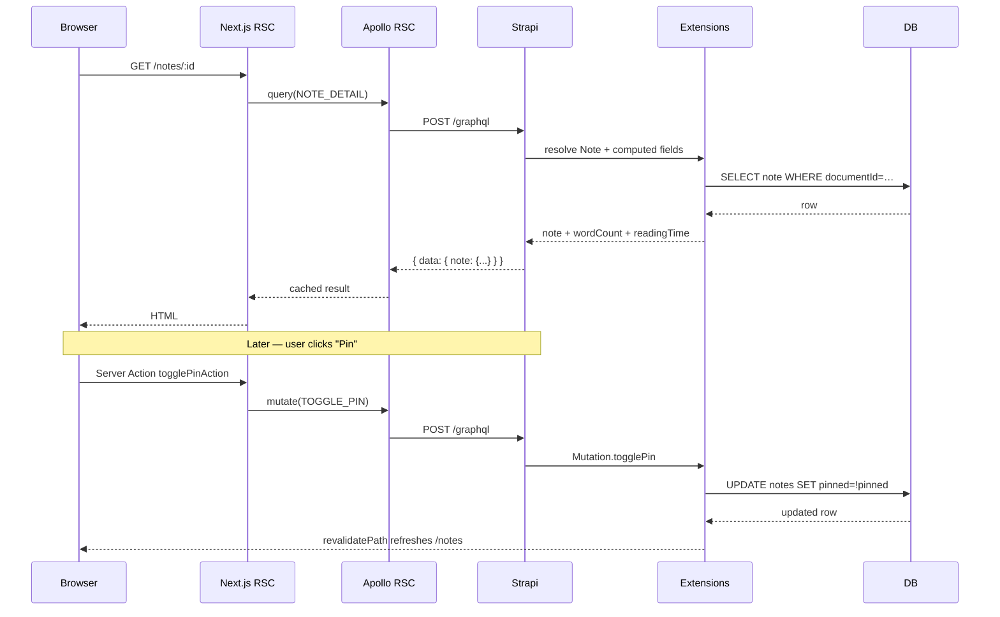

**TL;DR**

- This post wires a Next.js 16 App Router frontend to the Strapi GraphQL schema built in Part 2. Every read runs in a React Server Component; every write runs as a Server Action; no Apollo Client instance ever ships to the browser.
- The frontend uses `@apollo/client` v4 together with `@apollo/client-integration-nextjs` to produce a single RSC-compatible Apollo client, with a `typePolicies` override that keys Strapi entities by `documentId` instead of numeric `id`.
- Covers the shape of GraphQL operations on the client (a single `lib/graphql.ts` file, fragments for reuse, filter / sort / pagination syntax), how `searchParams` flow into GraphQL variables with zero client-side JavaScript, and three distinct mutation flows: inline action buttons, a create form, and an update form.
- Also covers debounced search on the client: `router.replace(...)` inside `startTransition` re-renders the RSC with new variables, no Apollo subscription required.
- Target audience: developers who have completed Part 2 (or have an equivalent Strapi + GraphQL backend running locally) and want to consume it from a Next.js frontend with server-first rendering.

## Prerequisites

- **The backend from Part 2** running on `http://localhost:1338/graphql`. The examples below assume the note-taking schema from that post: `Note`, `Tag`, the computed fields (`wordCount`, `readingTime`, `excerpt`), the custom queries (`searchNotes`, `noteStats`, `notesByTag`), and the custom mutations (`togglePin`, `archiveNote`, `duplicateNote`). If you skipped Part 2, you can still read this as a general guide to consuming any Strapi GraphQL schema; substitute your own types and operations.
- Node.js 20 or newer and a terminal.
- Basic familiarity with React and the App Router.

## Scope

This post covers the frontend only. Specifically: **reading and writing data**. Authentication, cookie-stored JWTs, ownership enforcement, and route protection all live in Part 4.

What you will end up with:

- `/notes` — list view with debounced search and a "New note" button
- `/notes/[documentId]` — detail view with pin / duplicate / archive action buttons
- `/notes/[documentId]/edit` — update form, pre-filled with the current values
- `/notes/new` — create form
- `/archive` — archived notes list, demonstrates sending a custom header to pass the policy from Part 2
- `/stats` — aggregate dashboard fed by the custom `noteStats` query

## Step 1: Scaffold the Next.js project

In the monorepo root (the same directory that holds `graphql-server/` from Part 2), run:

```bash
npx create-next-app@latest frontend \
  --typescript --app --tailwind --eslint \
  --no-src-dir --use-npm --import-alias "@/*"
```

This creates a `frontend/` directory with App Router, TypeScript, Tailwind v4, and an `@/` import alias.

Install the dependencies used in the rest of this post:

```bash
npm --prefix frontend install \
  @apollo/client@^4.0.0 \
  @apollo/client-integration-nextjs \
  graphql \
  class-variance-authority \
  clsx \
  tailwind-merge \
  lucide-react \
  tw-animate-css
```

`@apollo/client-integration-nextjs` is the RSC-compatible integration for Apollo v4. The other four packages are the minimum needed for a small shadcn-style component set (Button, Card, Badge).

Set the backend URL in `frontend/.env.local`:

```bash
STRAPI_GRAPHQL_URL=http://localhost:1338/graphql
```

And pin the dev port so it does not collide with Strapi on 1338:

```json
// frontend/package.json (scripts)
{
  "dev": "next dev -p 3001",
  "build": "next build",
  "start": "next start -p 3001"
}
```

## Step 2: Apollo Client for React Server Components

The RSC client is configured once and reused across every Server Component and Server Action:

```typescript
// frontend/lib/apollo-client.ts
import { HttpLink } from '@apollo/client';
import {
  registerApolloClient,
  ApolloClient,
  InMemoryCache,
} from '@apollo/client-integration-nextjs';

const STRAPI_GRAPHQL_URL =
  process.env.STRAPI_GRAPHQL_URL ?? 'http://localhost:1338/graphql';

export const { getClient, query, PreloadQuery } = registerApolloClient(() => {
  return new ApolloClient({
    cache: new InMemoryCache({
      typePolicies: {
        Note: { keyFields: ['documentId'] },
        Tag: { keyFields: ['documentId'] },
      },
    }),
    link: new HttpLink({
      uri: STRAPI_GRAPHQL_URL,
      fetchOptions: { cache: 'no-store' },
    }),
  });
});
```

Two configuration choices are worth understanding:

**The `typePolicies` override.** Apollo's cache keys entities by `id` by default. Strapi v5 uses `documentId` as the stable identifier for a content entry — the numeric `id` is not guaranteed to be stable across operations. Without this override, cache reads and optimistic updates can become inconsistent. Every content type you care about needs an entry here.

**`fetchOptions: { cache: 'no-store' }`.** This opts out of Next.js's `fetch` cache for the GraphQL request. For a dashboard-style application this is the right default: the UI should reflect the current state of the data after a mutation. If you want to enable Next.js caching for specific queries, pass `context: { fetchOptions: { cache: 'force-cache', next: { revalidate: 60 } } }` on the individual `query()` call instead of at the link level.

The `registerApolloClient` helper returns three exports:

- `query({ query, variables })` — shorthand for `getClient().query(...)`. Use it in Server Components.
- `getClient()` — the raw client. Use it in Server Actions when you need to call `.mutate()`.
- `PreloadQuery` — for streaming query initiation ahead of rendering; not used in this post.

## Step 3: One operations file

Every GraphQL document used by the frontend lives in a single file. Co-locating the operations makes them easy to grep, lint, and later generate TypeScript types for (with tools such as GraphQL Code Generator).

```typescript
// frontend/lib/graphql.ts
import { gql } from '@apollo/client';

export const NOTE_FIELDS = gql`
  fragment NoteFields on Note {
    documentId
    title
    pinned
    archived
    updatedAt
    wordCount
    readingTime
    excerpt(length: 180)
    tags {
      documentId
      name
      slug
      color
    }
  }
`;

export const ACTIVE_NOTES = gql`
  ${NOTE_FIELDS}
  query ActiveNotes {
    notes(
      filters: { archived: { eq: false } }
      sort: ["pinned:desc", "updatedAt:desc"]
    ) {
      ...NoteFields
    }
  }
`;

export const ARCHIVED_NOTES = gql`
  ${NOTE_FIELDS}
  query ArchivedNotes {
    notes(
      filters: { archived: { eq: true } }
      sort: ["updatedAt:desc"]
    ) {
      ...NoteFields
    }
  }
`;

export const NOTE_DETAIL = gql`
  ${NOTE_FIELDS}
  query Note($documentId: ID!) {
    note(documentId: $documentId) {
      ...NoteFields
      content
    }
  }
`;

export const SEARCH_NOTES = gql`
  ${NOTE_FIELDS}
  query SearchNotes($q: String!) {
    searchNotes(query: $q) {
      ...NoteFields
    }
  }
`;

export const NOTE_STATS = gql`
  query NoteStats {
    noteStats {
      total
      pinned
      archived
      byTag {
        slug
        name
        count
      }
    }
  }
`;

export const TAGS = gql`
  query Tags {
    tags(sort: "name:asc") {
      documentId
      name
      slug
      color
    }
  }
`;

export const CREATE_NOTE = gql`
  mutation CreateNote($data: NoteInput!) {
    createNote(data: $data) {
      documentId
    }
  }
`;

export const UPDATE_NOTE = gql`
  mutation UpdateNote($documentId: ID!, $data: NoteInput!) {
    updateNote(documentId: $documentId, data: $data) {
      documentId
    }
  }
`;

export const TOGGLE_PIN = gql`
  mutation TogglePin($documentId: ID!) {
    togglePin(documentId: $documentId) {
      documentId
      pinned
    }
  }
`;

export const ARCHIVE_NOTE = gql`
  mutation ArchiveNote($documentId: ID!) {
    archiveNote(documentId: $documentId) {
      documentId
      archived
    }
  }
`;

export const DUPLICATE_NOTE = gql`
  mutation DuplicateNote($documentId: ID!) {
    duplicateNote(documentId: $documentId) {
      documentId
      title
    }
  }
`;
```

### Fragments for reuse

Every list view and every detail view needs the same core fields on a `Note`. Rather than repeat them in each query, they are declared once as the `NoteFields` fragment and composed into each query that needs them. `NOTE_DETAIL` extends the fragment with an additional `content` field that only the detail view needs. Apollo's cache handles the composition transparently: once a list query populates the shared fields for a `Note` with a given `documentId`, a later detail query only fetches what the list did not cover.

## Step 4: Filter, sort, and pagination syntax

Strapi's Shadow CRUD resolvers generate a `NoteFiltersInput` (and an equivalent for every content type) with an entry per scalar field. The operators available on each scalar follow Strapi's Document Service conventions:

| Operator                       | Meaning                                                |
| ------------------------------ | ------------------------------------------------------ |
| `eq` / `ne`                    | Equals / not equals                                    |
| `lt` / `lte` / `gt` / `gte`    | Less / less or equal / greater / greater or equal      |
| `in` / `notIn`                 | Membership in a list                                   |
| `contains` / `containsi`       | Substring match (case-sensitive / case-insensitive)    |
| `startsWith` / `endsWith`      | Prefix / suffix match                                  |
| `null` / `notNull`             | Boolean null check                                     |
| `and` / `or` / `not`           | Logical logical operators taking a list of sub-filters       |

Filters on relations are nested. To find notes whose tag has a given slug, write `tags: { slug: { eq: "work" } }`. Multiple conditions within the same object are combined with logical AND:

```graphql
{
  notes(
    filters: {
      archived: { eq: false }
      pinned: { eq: true }
      tags: { slug: { eq: "work" } }
    }
  ) {
    documentId
    title
  }
}
```

For explicit OR or NOT, use the logical operators:

```graphql
filters: {
  or: [
    { title: { containsi: "meeting" } }
    { tags: { slug: { eq: "work" } } }
  ]
}
```

**Sort** accepts either a single string or an array of strings, each in the form `field:asc` or `field:desc`. Array order determines precedence:

```graphql
notes(sort: ["pinned:desc", "updatedAt:desc"]) { ... }
# pinned first, then most-recent within each group
```

**Pagination** is exposed via `pagination: { page, pageSize }` or `pagination: { start, limit }`. For cursor-style pagination with page metadata, use the `_connection` suffix query that Shadow CRUD generates automatically:

```graphql
notes_connection(pagination: { page: 1, pageSize: 20 }) {
  nodes { ...NoteFields }
  pageInfo { page pageSize pageCount total }
}
```

## Step 5: Reading in Server Components

In an App Router route, the URL search parameters arrive as a prop. They become GraphQL variables with no additional plumbing:

```tsx
// frontend/app/notes/page.tsx
import { query } from '@/lib/apollo-client';
import { ACTIVE_NOTES, SEARCH_NOTES } from '@/lib/graphql';

type Note = { documentId: string; title: string; /* ... */ };

export const dynamic = 'force-dynamic';

export default async function NotesPage({
  searchParams,
}: {
  searchParams: Promise<{ q?: string }>;
}) {
  const { q } = await searchParams;
  const term = (q ?? '').trim();

  const { data } = term
    ? await query<{ searchNotes: Note[] }>({
        query: SEARCH_NOTES,
        variables: { q: term },
      })
    : await query<{ notes: Note[] }>({ query: ACTIVE_NOTES });

  const notes = term
    ? (data as { searchNotes: Note[] })?.searchNotes ?? []
    : (data as { notes: Note[] })?.notes ?? [];

  // render list...
}
```

### Full request flow for a filtered list

When a user types into the debounced search box (Step 7), the sequence is:

1. The client-side input updates `router.replace('/notes?q=…')` inside `startTransition`.
2. Next.js re-renders `app/notes/page.tsx` as an RSC.
3. The RSC reads `searchParams` and calls `query({ query: SEARCH_NOTES, variables: { q: term } })`.
4. The Apollo RSC client serializes the query and variables into a single POST `/graphql` request to Strapi.
5. Strapi's plugin dispatches to the `searchNotes` custom resolver, which calls the Document Service with a `$containsi` filter.
6. Matching rows are returned, each populated with the fields selected in the fragment (including computed fields like `wordCount`).
7. The RSC receives the data and renders the list; the HTML streams to the browser.

No client-side JavaScript is involved in steps 3 through 7. The browser only ever sees the final HTML.

### Detail view

Same pattern — a Server Component, one `query()` call, template the result:

```tsx
// frontend/app/notes/[documentId]/page.tsx
import { notFound } from 'next/navigation';
import { query } from '@/lib/apollo-client';
import { NOTE_DETAIL } from '@/lib/graphql';

export const dynamic = 'force-dynamic';

export default async function NoteDetailPage({
  params,
}: {
  params: Promise<{ documentId: string }>;
}) {
  const { documentId } = await params;
  const { data } = await query({
    query: NOTE_DETAIL,
    variables: { documentId },
  });
  const note = data?.note;
  if (!note) notFound();

  // render title, content, computed fields, tags, action buttons...
}
```

## Step 6: Writing with Server Actions

Mutations run as **Server Actions**. No Apollo Client instance is shipped to the browser; the mutation executes on the Next.js server, which calls Strapi directly. There are three distinct mutation flows in this application:

1. **Inline action buttons** (Pin, Duplicate, Archive) — small state changes triggered from the detail page with no form. Used for the custom mutations from Part 2.
2. **A full form flow for create** (`/notes/new`) — a Server Component page with a `<form>` that submits to a Server Action. Used for the auto-generated `createNote` mutation.
3. **A full form flow for update** (`/notes/[documentId]/edit`) — same shape as create, but preloads the current values. Used for the auto-generated `updateNote` mutation.

There is no separate **delete** flow because the backend schema has no `deleteNote` mutation: Part 2's `disableAction('delete')` removed it from the schema entirely. Soft delete is exposed through the custom `archiveNote` mutation instead, which sets `archived: true` and is surfaced through the same inline button as Pin and Duplicate.

### Inline actions

```typescript
// frontend/app/notes/[documentId]/actions.ts
'use server';

import { revalidatePath } from 'next/cache';
import { redirect } from 'next/navigation';
import { getClient } from '@/lib/apollo-client';
import { TOGGLE_PIN, ARCHIVE_NOTE, DUPLICATE_NOTE } from '@/lib/graphql';

export async function togglePinAction(documentId: string) {
  await getClient().mutate({ mutation: TOGGLE_PIN, variables: { documentId } });
  revalidatePath(`/notes/${documentId}`);
  revalidatePath('/notes');
}

export async function archiveNoteAction(documentId: string) {
  await getClient().mutate({ mutation: ARCHIVE_NOTE, variables: { documentId } });
  revalidatePath('/notes');
  redirect('/notes');
}

export async function duplicateNoteAction(documentId: string) {
  const { data } = await getClient().mutate<{
    duplicateNote: { documentId: string };
  }>({
    mutation: DUPLICATE_NOTE,
    variables: { documentId },
  });
  revalidatePath('/notes');
  const newId = data?.duplicateNote?.documentId;
  if (newId) redirect(`/notes/${newId}`);
}
```

The buttons themselves are a small Client Component that calls each action inside `useTransition` so the UI can show a pending state during the server round trip:

```tsx
// frontend/components/note-actions.tsx
'use client';

import { useTransition } from 'react';
import { togglePinAction } from '@/app/notes/[documentId]/actions';

export function PinButton({ documentId, pinned }: { documentId: string; pinned: boolean }) {
  const [isPending, startTransition] = useTransition();
  return (
    <button
      disabled={isPending}
      onClick={() => startTransition(() => togglePinAction(documentId))}
    >
      {pinned ? 'Unpin' : 'Pin'}
    </button>
  );
}
```

### Create: `/notes/new`

The create page is a Server Component that fetches the list of tags (so the user can select some) and renders a native `<form>` whose `action` attribute points to a Server Action:

```tsx
// frontend/app/notes/new/page.tsx (excerpt)
import { query } from '@/lib/apollo-client';
import { TAGS } from '@/lib/graphql';
import { createNoteAction } from './actions';

export default async function NewNotePage() {
  const { data } = await query({ query: TAGS });
  const tags = data?.tags ?? [];

  return (
    <form action={createNoteAction}>
      <input name="title" required />
      <textarea name="content" rows={10} />
      {tags.map((t) => (
        <label key={t.documentId}>
          <input type="checkbox" name="tagIds" value={t.documentId} />
          {t.name}
        </label>
      ))}
      <button type="submit">Create note</button>
    </form>
  );
}
```

The Server Action parses the `FormData`, converts the plain-text textarea into Strapi blocks, and calls `createNote`:

```typescript
// frontend/app/notes/new/actions.ts
'use server';

import { revalidatePath } from 'next/cache';
import { redirect } from 'next/navigation';
import { getClient } from '@/lib/apollo-client';
import { CREATE_NOTE } from '@/lib/graphql';
import { textToBlocks } from '@/lib/blocks';

export async function createNoteAction(formData: FormData) {
  const title = String(formData.get('title') ?? '').trim();
  const content = String(formData.get('content') ?? '');
  const tagIds = formData.getAll('tagIds').map(String).filter(Boolean);

  if (!title) return { error: 'Title is required.' };

  const { data } = await getClient().mutate<{
    createNote: { documentId: string };
  }>({
    mutation: CREATE_NOTE,
    variables: {
      data: {
        title,
        content: textToBlocks(content),
        pinned: false,
        archived: false,
        tags: tagIds,
      },
    },
  });

  revalidatePath('/notes');
  const newId = data?.createNote?.documentId;
  if (newId) redirect(`/notes/${newId}`);
}
```

Two small helpers live in `frontend/lib/blocks.ts`: `textToBlocks` (used here) turns user-typed text into Strapi's blocks format by splitting on blank lines; `blocksToText` (used by the edit page below) does the inverse.

### Update: `/notes/[documentId]/edit`

Update is structurally similar to create — same form, same `FormData` parsing — with two differences: the page preloads the current note so the form is prefilled, and the Server Action is pre-bound to the note's `documentId` via `Function.prototype.bind`.

```tsx
// frontend/app/notes/[documentId]/edit/page.tsx (excerpt)
import { notFound } from 'next/navigation';
import { query } from '@/lib/apollo-client';
import { NOTE_DETAIL, TAGS } from '@/lib/graphql';
import { blocksToText } from '@/lib/blocks';
import { updateNoteAction } from './actions';

export default async function EditNotePage({
  params,
}: {
  params: Promise<{ documentId: string }>;
}) {
  const { documentId } = await params;

  const [noteRes, tagsRes] = await Promise.all([
    query({ query: NOTE_DETAIL, variables: { documentId } }),
    query({ query: TAGS }),
  ]);

  const note = noteRes.data?.note;
  if (!note) notFound();

  const allTags = tagsRes.data?.tags ?? [];
  const selectedTagIds = new Set(note.tags.map((t) => t.documentId));
  const defaultContent = blocksToText(note.content);

  // Bind documentId into the action so the form handler only receives FormData
  const boundAction = updateNoteAction.bind(null, documentId);

  return (
    <form action={boundAction}>
      <input name="title" defaultValue={note.title} required />
      <textarea name="content" defaultValue={defaultContent} rows={12} />
      {allTags.map((t) => (
        <label key={t.documentId}>
          <input
            type="checkbox"
            name="tagIds"
            value={t.documentId}
            defaultChecked={selectedTagIds.has(t.documentId)}
          />
          {t.name}
        </label>
      ))}
      <button type="submit">Save changes</button>
    </form>
  );
}
```

The `.bind(null, documentId)` pattern is how a Server Action receives arguments beyond the `FormData` payload. The browser only sends the form data; the `documentId` is captured on the server and injected into the action call.

The action itself uses the `updateNote` Shadow CRUD mutation:

```typescript
// frontend/app/notes/[documentId]/edit/actions.ts
'use server';

import { revalidatePath } from 'next/cache';
import { redirect } from 'next/navigation';
import { getClient } from '@/lib/apollo-client';
import { UPDATE_NOTE } from '@/lib/graphql';
import { textToBlocks } from '@/lib/blocks';

export async function updateNoteAction(documentId: string, formData: FormData) {
  const title = String(formData.get('title') ?? '').trim();
  const content = String(formData.get('content') ?? '');
  const tagIds = formData.getAll('tagIds').map(String).filter(Boolean);

  if (!title) return { error: 'Title is required.' };

  await getClient().mutate({
    mutation: UPDATE_NOTE,
    variables: {
      documentId,
      data: {
        title,
        content: textToBlocks(content),
        tags: tagIds,
      },
    },
  });

  revalidatePath('/notes');
  revalidatePath(`/notes/${documentId}`);
  redirect(`/notes/${documentId}`);
}
```

A few points worth noting about updates against Strapi:

- `NoteInput` is the same type `createNote` uses. For an update, every field is optional at the application level — any attribute not included in the `data` object is left unchanged on the server.
- Replacing a relation (`tags`) by passing a new array of `documentId`s overwrites the relation. To add or remove individual tags without touching the others, Strapi exposes `tags: { connect: [...], disconnect: [...] }` input objects instead.
- The Server Action uses `revalidatePath` for both `/notes` and `/notes/[documentId]` before redirecting so both the list and the detail page reflect the change immediately after navigation.

## Step 7: Debounced search on the client

The `/notes?q=...` route runs the `searchNotes` custom query server-side, and the input debounces client-side to avoid issuing a request on every keystroke:

```tsx
// frontend/components/notes-search.tsx
'use client';

import { useEffect, useRef, useState, useTransition } from 'react';
import { usePathname, useRouter, useSearchParams } from 'next/navigation';

const DEBOUNCE_MS = 300;

export function NotesSearch({ initialQuery }: { initialQuery: string }) {
  const router = useRouter();
  const pathname = usePathname();
  const searchParams = useSearchParams();
  const [value, setValue] = useState(initialQuery);
  const [isPending, startTransition] = useTransition();
  const timerRef = useRef<ReturnType<typeof setTimeout> | null>(null);

  useEffect(() => {
    setValue(initialQuery);
  }, [initialQuery]);

  function pushQuery(next: string) {
    const params = new URLSearchParams(searchParams.toString());
    const trimmed = next.trim();
    if (trimmed) params.set('q', trimmed);
    else params.delete('q');
    const qs = params.toString();
    startTransition(() => {
      router.replace(qs ? `${pathname}?${qs}` : pathname, { scroll: false });
    });
  }

  function onChange(e: React.ChangeEvent<HTMLInputElement>) {
    const next = e.target.value;
    setValue(next);
    if (timerRef.current) clearTimeout(timerRef.current);
    timerRef.current = setTimeout(() => pushQuery(next), DEBOUNCE_MS);
  }

  return (
    <input
      type="search"
      value={value}
      onChange={onChange}
      placeholder="Search notes…"
      /* spinner while isPending, clear button when value is non-empty... */
    />
  );
}
```

`router.replace(...)` inside `startTransition` re-renders the `/notes` route as an RSC with the new `q` search parameter. No new network code runs on the client, no Apollo subscription is required, and there is no `useEffect` chaining a `fetch`. The full pattern — 300 ms debounce, `startTransition`, and a pending indicator — is approximately 40 lines of code.

## Step 8: Passing custom headers (the archive page)

Part 2 added a policy on `Query.notes` that rejects any filter for archived notes unless the request includes `X-Include-Archived: yes`. The archive page demonstrates how to send custom headers from a Server Component.

For a single page with a specific header requirement, create a one-off Apollo client rather than threading the header through the shared one:

```tsx
// frontend/app/archive/page.tsx
import { HttpLink } from '@apollo/client';
import {
  ApolloClient,
  InMemoryCache,
} from '@apollo/client-integration-nextjs';
import { ARCHIVED_NOTES } from '@/lib/graphql';

const STRAPI_GRAPHQL_URL =
  process.env.STRAPI_GRAPHQL_URL ?? 'http://localhost:1338/graphql';

export const dynamic = 'force-dynamic';

export default async function ArchivePage() {
  const client = new ApolloClient({
    cache: new InMemoryCache(),
    link: new HttpLink({
      uri: STRAPI_GRAPHQL_URL,
      fetch: (url, init) =>
        fetch(url, {
          ...init,
          headers: {
            ...(init?.headers as Record<string, string>),
            'X-Include-Archived': 'yes',
          },
          cache: 'no-store',
        }),
    }),
  });

  const { data } = await client.query({ query: ARCHIVED_NOTES });
  const notes = data?.notes ?? [];

  // render list...
}
```

Overriding `fetch` on the `HttpLink` is how you inject per-request headers. Apollo's `context` API (`context: { headers: { ... } }`) is designed for use with a link that reads those headers — here we bypass that indirection and set them in `fetch` directly.

## The full request flow



## Summary

The Strapi GraphQL schema from Part 2 is consumed from a Next.js 16 App Router frontend with the following shape:

1. **One Apollo RSC client** with a `typePolicies` override that keys entities by `documentId`.
2. **One operations file** with `gql` documents and a shared `NoteFields` fragment.
3. **Reads in Server Components** via the `query()` helper; `searchParams` flow directly into GraphQL variables.
4. **Writes in Server Actions** via `getClient().mutate(...)`; `revalidatePath` invalidates the RSC render cache after each write.
5. **Three mutation shapes** — inline action buttons, a create form, an update form — plus the custom `archiveNote` mutation standing in for hard delete.
6. **Debounced client-side input** via `router.replace(...)` inside `startTransition`, with the RSC re-fetching on every committed URL change.

No Apollo Client instance ships to the browser. No `useEffect` is ever needed for data fetching. The browser receives HTML and, for mutations, posts `FormData` to Server Actions.

## What's next in this series

- **Part 1 — Strapi v5 GraphQL for Beginners.** Fresh install, example data, Shadow CRUD tour. (`part-1.md` in this repository.)
- **Part 2 — Advanced backend customization.** The note-taking backend this post consumes. (`part-2.md` in this repository.)
- **Part 3 — Consuming the schema from a Next.js frontend** (this post).
- **Part 4 — Users, permissions, and per-user content.** Adds authentication via the users-permissions plugin and a per-user ownership model. The frontend gains `/login` and `/register` pages, cookie-stored JWTs, and a route-protection middleware; the backend gains an `owner` relation on `Note`, a read-side ownership middleware, and write-side ownership policies. The design and implementation plan lives at `part-4-plan.md`.

**Citations**

- Apollo Client — Next.js App Router integration: https://www.apollographql.com/docs/react/integrations/next-js/
- Next.js — Server Actions (`use server`): https://nextjs.org/docs/app/api-reference/directives/use-server
- Next.js — `revalidatePath`: https://nextjs.org/docs/app/api-reference/functions/revalidatePath
- Strapi — GraphQL plugin: https://docs.strapi.io/cms/plugins/graphql
- Strapi — Document Service API: https://docs.strapi.io/cms/api/document-service
