> **Part 4 of a 4-part series on building with GraphQL, Strapi v5, and Next.js 16.** Each part builds directly on the project from the previous post.

- **Part 1**, GraphQL basics with Strapi v5. Fresh install, a full Shadow CRUD tour, and your first custom resolvers.
- **Part 2**, Advanced backend customization. A `Note` + `Tag` model, middlewares and policies, custom queries, and custom mutations.
- **Part 3**, Next.js 16 frontend. Apollo Client on the App Router: Server Component reads, Server Action writes, one page per GraphQL operation.
- **Part 4 (this post)**, Users and per-user content. Sign-in, automatic ownership on every note, an `is-note-owner` policy for GraphQL writes, the gap that policy leaves on REST, and a Document Service middleware that closes both APIs from one file.

After Part 3 you have a note-taking app that anyone can use. In Part 4 every user signs in, sees only their own notes, and cannot read or change anyone else's, no matter which API they call.

**TL;DR**

- Strapi's [`users-permissions` plugin](https://docs.strapi.io/cms/plugins/users-permissions) gives us JWT sign-in, a `User` content type, and the `register`, `login`, and `me` GraphQL operations. We turn it on and grant the right permissions. We do not write auth code ourselves.
- Notes get an `owner` relation to `User`. A **Document Service middleware** in `src/index.ts` `register()` writes `owner` automatically on every new note, taking the value from `ctx.state.user` (the signed-in user). The client cannot pass someone else's id; the middleware overwrites the field at the data layer. The same code path covers REST, GraphQL, custom resolvers, and the seed script.
- Reads work the same way. A second clause in the same middleware adds `owner = ctx.state.user.id` to the filter of every `findMany` and `findOne` on Note. REST `GET /api/notes` and GraphQL `Query.notes` both go through the Document Service, so one rule limits each user to their own notes on both APIs.
- Writes get two layers of protection. The read filter above means a non-owner cannot even load the target note, so any update or delete attempt against someone else's note misses. On top of that, an `is-note-owner` policy on the four GraphQL write mutations gives us a worked policy example and a second check before the resolver runs.
- The custom queries from Part 2 (`searchNotes`, `noteStats`, `notesByTag`) build their own filter object or query a different content type, so the Document Service middleware does not cover them. Each one gets an inline `owner` check. Part 4's Step 6.3 covers that.
- The frontend gets three small things: `/login` and `/register` pages backed by Server Actions that set an HTTP-only cookie, an Apollo link that adds `Authorization: Bearer <jwt>` to every request, and a Next.js `middleware.ts` that sends signed-out users to `/login`.

Backend authorization at a glance:

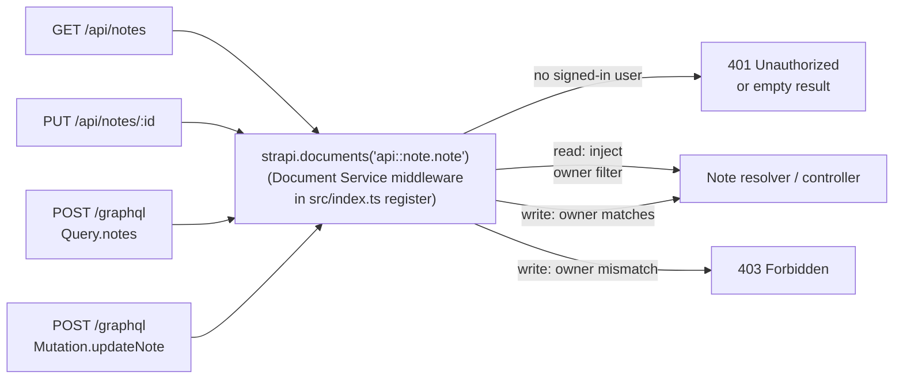

REST and GraphQL both end up calling `strapi.documents("api::note.note").<action>(...)`, so a rule placed there fires for both APIs.

## Prerequisites

- The Part 2 backend running on `http://localhost:1337/graphql`, with the `Note` + `Tag` schema, the soft-delete middlewares, the `cap-page-size` policy, and the test script (`scripts/test-graphql.mjs`) all green.
- The Part 3 frontend cloned and working against that backend, including the seeded notes and the home page rendering them. If you skipped Part 3, clone the [starter template](https://github.com/PaulBratslavsky/strapi-nextjs-grapql-starter-for-post) and run through Steps 1 through 5.
- Node.js 20.9+. Strapi 5 and Next.js 16 both require it.

## Scope

Part 4 covers backend authorization end-to-end and the minimum frontend wiring to test it. Skipped:

- **Social login (OAuth providers).** Email + password only.
- **Password reset and email verification.** Not part of the authorization story. See the [users-permissions docs](https://docs.strapi.io/cms/plugins/users-permissions#configuration) when you need them.
- **Roles beyond owner / not-owner.** No admin, no read-only viewer, no sharing. The pattern below is the foundation; richer roles use the same machinery.
- **Note sharing or public links.** Same reason.
- **Refresh tokens.** The default 30-day JWT is fine for a tutorial. Production apps would issue a short-lived access token plus a refresh flow.

## How auth fits together

Three pieces work together so each user only sees their own notes:

**Sign-in (who you are).** Strapi's [`users-permissions`](https://docs.strapi.io/cms/plugins/users-permissions) plugin handles this for free. It ships a `User` content type, the `register` and `login` mutations, and a JWT issuer. Logging in returns `{ jwt, user }`. Every later request sends `Authorization: Bearer <jwt>`, the plugin verifies the signature, and the user object is available as `ctx.state.user` for the rest of the request.

**Authorization (what you can do).** Sign-in tells the server who the caller is. Authorization decides what they can see or change. The rule across Part 4 is simple: only the owner. Reads filter to `owner = ctx.state.user.id`. Writes only succeed if the target note's `owner.id` matches the caller's id.

**Ownership (the data that makes the check possible).** We add `owner` as a `manyToOne` relation from `Note` to `User`. The server assigns it automatically when a note is created. From then on, the authorization check is just `note.owner.id === user.id`.

The diagram in the TL;DR shows the request path. The Document Service middleware does most of the work: it writes `owner` on create, and it adds an `owner` filter on read. The `is-note-owner` policy on the four GraphQL write mutations is the worked policy example for Part 4 and a second check before the resolver runs. After Step 6 the policy is technically redundant on the GraphQL side (the Document Service middleware already keeps a non-owner from loading the target note when `Mutation.updateNote` runs), but we keep it on purpose so you end up with a working policy file in your codebase to compare.

## Step 1: Turn on sign-in and set the right permissions

`users-permissions` ships with every fresh Strapi project. Check that it is in `package.json`:

```json
"@strapi/plugin-users-permissions": "^5.x"
```

### 1.1 Check the JWT secret

The plugin signs JWTs with a value from the `JWT_SECRET` environment variable. Open `.env` and make sure it has a real value:

```bash
JWT_SECRET=<a-long-random-string>
```

If it is missing, generate one with `openssl rand -hex 32` and paste it in. Anything 32 bytes or longer works. Keep it secret in production.

### 1.2 Lock down the Public role

After Part 2, anyone who can hit your server can read and write Notes and Tags. We need to close that. From now on, signed-out users can only **register** and **log in**. Everything else (listing notes, creating notes, updating notes) requires sign-in, and the rules in Steps 3 through 6 make sure each signed-in user only sees and edits their own data.

Open the admin UI at `http://localhost:1337/admin` → **Settings** → **Users & Permissions Plugin** → **Roles** → **Public**.

- Expand **Note** and **uncheck everything**. The Public role has no access to Notes.
- Expand **Tag** and leave `find` / `findOne` checked (tags are reference data, fine to expose). Uncheck `create`, `update`, `delete`.
  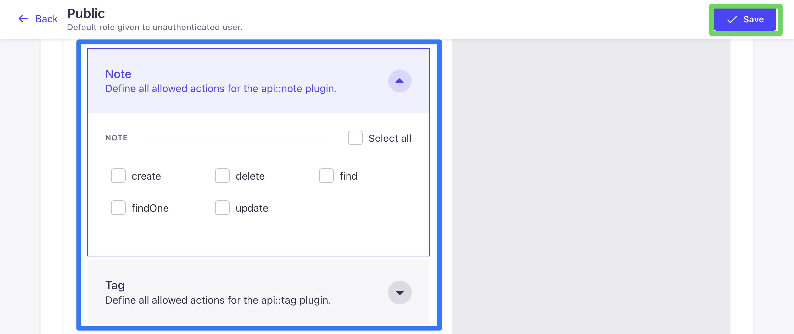
- Expand **Users-permissions** → **Auth** and confirm `register` and `callback` are checked. They are usually enabled by default on the Public role; if either is unchecked, tick it now.
  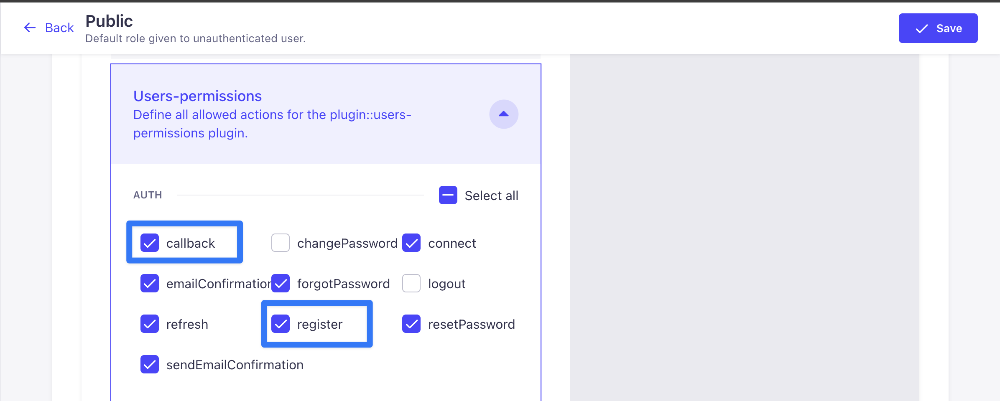

The other auth actions in that list (`forgotPassword`, `resetPassword`, `emailConfirmation`, `sendEmailConfirmation`, `refresh`, `connect`) are unused in this tutorial and can stay at whatever default Strapi shipped them with.

- Click **Save**.

Now go to **Roles** → **Authenticated**.

- Expand **Note** and check `find`, `findOne`, `create`, `update`. Leave `delete` unchecked.
  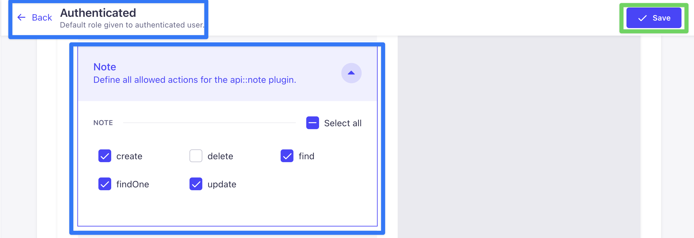
- Expand **Tag** and check `find` and `findOne`. Anything else stays unchecked.
  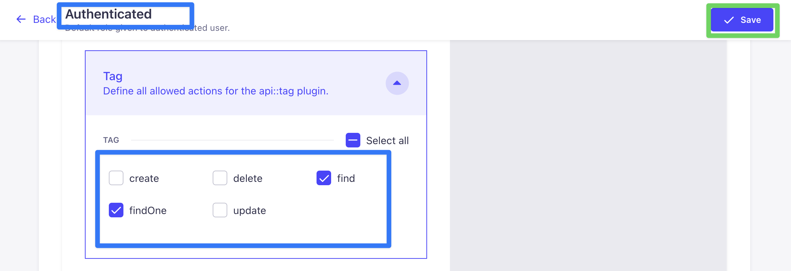
- Expand **Users-permissions** → **User** and confirm `me` is checked. It is enabled by default on the Authenticated role; the frontend will read it to display the signed-in user's name.
- Click **Save**.

### 1.3 Lock down the custom GraphQL mutations

In Part 2 we set `auth: false` on the three custom mutations (`togglePin`, `archiveNote`, `duplicateNote`) so they could be called without sign-in. That was fine while we had no users. Now we want them to require the same Authenticated role permissions you just set.

A bit of context on how the GraphQL plugin checks permissions:

- **Shadow CRUD operations** (`Query.notes`, `Mutation.createNote`, etc.) come pre-wired to a permission name. `Query.notes` checks for `api::note.note.find`. `Mutation.createNote` checks for `api::note.note.create`. Those names match the checkboxes in the admin UI's Roles screen, so ticking `find` or `update` on the Authenticated role in 1.2 is enough.
- **Custom mutations** (the three from Part 2) are not pre-wired to anything. The plugin has no way to guess `togglePin` is "really an update". Without a setting that tells it which permission to check, the only check left is "must be signed in", and any signed-in user passes.

If you only deleted the `auth: false` lines, anonymous calls would still be blocked, but any signed-in user could call those mutations. The role checkboxes would not gate them. That is inconsistent with the Shadow CRUD behavior we just relied on.

The fix is to tell each custom mutation which permission to check, using the `auth.scope` setting in `resolversConfig`. Pinning and archiving are kinds of update, so they reuse `api::note.note.update`. Duplicating creates a new row, so it reuses `api::note.note.create`.

Open `src/extensions/graphql/mutations.ts`, scroll to the `resolversConfig` block at the bottom, and swap the three `auth: false` entries:

```typescript
// before
"Mutation.togglePin":     { auth: false },
"Mutation.archiveNote":   { auth: false },
"Mutation.duplicateNote": { auth: false },

// after
"Mutation.togglePin":     { auth: { scope: ["api::note.note.update"] } },
"Mutation.archiveNote":   { auth: { scope: ["api::note.note.update"] } },
"Mutation.duplicateNote": { auth: { scope: ["api::note.note.create"] } },
```

What this gives us:

- **Anonymous requests** are rejected before the resolver runs. No JWT, no entry.
- **Signed-in users without the `update` permission** are also rejected. If you ever add a read-only "Viewer" role, those users cannot call `togglePin` or `archiveNote`. The role checkbox decides.
- **Signed-in users with `update`** get through, then run into the `is-note-owner` policy from Step 4, which checks that the user actually owns the row they are touching.

Three checks before the resolver runs: signed in, has the right permission, owns the row. The first two come from `auth.scope`. The third is the policy in Step 4.

**Same fix for the three custom queries.** Part 2 also added `searchNotes`, `noteStats`, and `notesByTag`, and they have the same `auth: false` entries in `src/extensions/graphql/queries.ts`. Open that file, scroll to the `resolversConfig` block at the bottom, and swap:

```typescript
// before
// "Query.searchArticles": { auth: false },
"Query.searchNotes": { auth: false },
"Query.noteStats":   { auth: false },
"Query.notesByTag":  { auth: false },

// after
// "Query.searchArticles": { auth: false },
"Query.searchNotes": { auth: { scope: ["api::note.note.find"] } },
"Query.noteStats":   { auth: { scope: ["api::note.note.find"] } },
"Query.notesByTag":  { auth: { scope: ["api::note.note.find"] } },
```

`find` is the right scope because all three are reads. Signed-out calls are now rejected; signed-in calls go through.

Leave `Query.searchArticles` alone — it is a Part 1 holdover for the Article content type and is not part of the Note ownership story.

> **What about scoping these to the current user?** Right now `searchNotes`, `noteStats`, and `notesByTag` still return _every_ user's notes once a caller is signed in, because each resolver builds its own filter and ignores `ctx.state.user`. Sign-in works; ownership does not. Step 6 fixes this. The Document Service middleware introduced in Step 6 covers `Query.notes`, `Query.note`, and the REST find/findOne automatically, but the three custom queries here build their own filters (and `noteStats` queries the Tag content type as well), so each one needs an explicit `owner` filter at the resolver level. We do that in Step 6.3 alongside the rest of the ownership work.

> **Why reuse `update` instead of giving each mutation its own permission?** You could add a custom controller method for each mutation so it shows up as a separate checkbox in the admin UI. That would let an "Editor" role toggle pin without being able to do a full update. We do not need that level of detail here. There is one Authenticated role, every signed-in user has the same permissions, so reusing `update` and `create` keeps the file count down. The [Strapi GraphQL plugin docs](https://docs.strapi.io/cms/plugins/graphql#resolversconfig) cover the custom-permission variant if you need it.

### 1.4 Test in the Sandbox

Open the Apollo Sandbox at `http://localhost:1337/graphql`. Same Sandbox you used in Parts 1 and 2.

**Check that the Public role cannot list notes.** Paste this and run it (no headers):

```graphql
query {
  notes {
    documentId
    title
  }
}
```

The response is `Forbidden access`. Good — signed-out reads are blocked before any middleware runs.

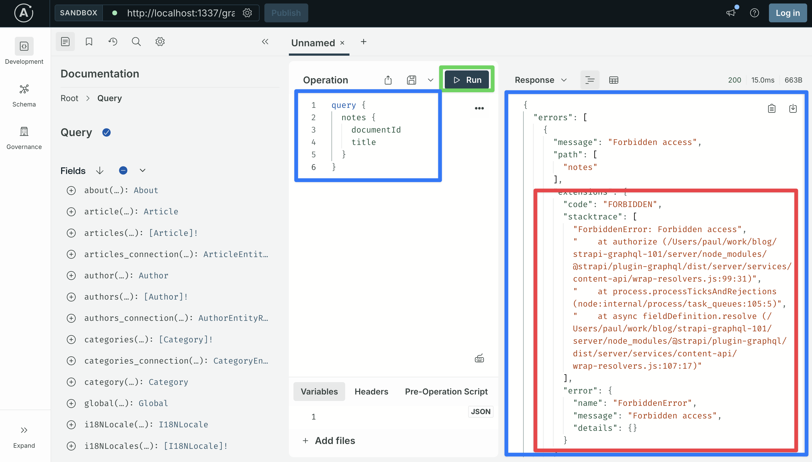

**Register a user.** We need an account to test with. Paste the mutation into the Operation editor first so the Sandbox knows the `$input` variable's type before you fill it in:

```graphql
mutation Register($input: UsersPermissionsRegisterInput!) {
  register(input: $input) {
    jwt
    user {
      username
      email
    }
  }
}
```

Then open the **Variables** panel at the bottom of the Sandbox and paste:

```json
{
  "input": {
    "username": "testuser",
    "email": "testuser@example.com",
    "password": "testuser"
  }
}
```

Click **Register**. The response has a JWT. Copy it — we will use it as a header in a moment.

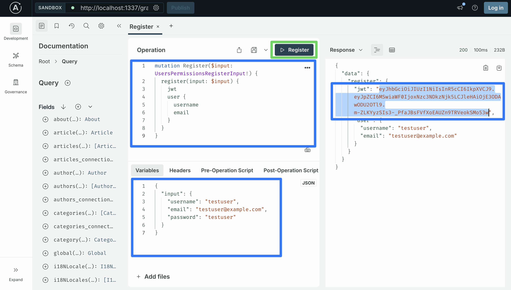

**Logging in.** The JWT from `register` lasts 30 days, so you only register once per user. Every later session uses the `login` mutation. It takes `identifier` (username or email) and `password` and returns the same `{ jwt, user }` shape:

```graphql
mutation Login($input: UsersPermissionsLoginInput!) {
  login(input: $input) {
    jwt
    user {
      username
      email
    }
  }
}
```

And the Variables panel with:

```json
{
  "input": {
    "identifier": "testuser",
    "password": "testuser",
    "provider": "local"
  }
}
```

`provider: "local"` is the built-in email-and-password provider. The input type requires it even though most apps never pass anything else. (OAuth flows would use `"google"`, `"github"`, etc.) Click **Login** and you get back a fresh JWT. The frontend in Step 8 calls this mutation when a returning user signs in.

**List notes as testuser.** Open the **Headers** panel and add a row. Header name is `Authorization`; value is the word `Bearer`, a space, and the JWT you copied earlier. No quotes, no backticks:

| Key (header name) | Value                                                                          |
| ----------------- | ------------------------------------------------------------------------------ |
| Authorization     | Bearer eyJhbGciOiJIUzI1NiIsInR5cCI6IkpXVCJ9.eyJpZCI6MSwiaWF0Ijox...rest-of-jwt |

- Type the literal word **Authorization** into the Key field — eight letters, no surrounding characters. The backticks you see in inline-code formatting elsewhere in this post are markdown styling on a rendered page, not part of the value.
- In the Value field, type **Bearer**, then a single space, then paste the JWT.
- No quotes, no backticks, no leading or trailing whitespace.
- Make sure the checkbox on the left of the row is ticked. Sandbox keeps unticked rows around but does not send them.

Now re-run the `notes` query:

```graphql
query {
  notes {
    documentId
    title
  }
}
```

This time the response is _every note in the database_.

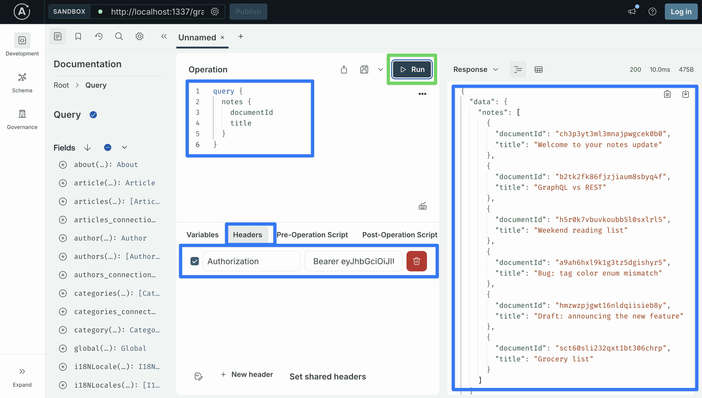

That is the problem Part 4 fixes. testuser is signed in, but the API does not know about ownership yet, so they see everyone's notes. Steps 3 through 6 close that gap.

If you would rather use the terminal, the same three checks via curl:

```bash
# 1. Public role: Forbidden
curl -s -X POST http://localhost:1337/graphql \
  -H 'Content-Type: application/json' \
  -d '{"query":"{ notes { documentId title } }"}'
# -> {"errors":[{"message":"Forbidden access", ... }],"data":null}

# 2. Register testuser
curl -s -X POST http://localhost:1337/graphql \
  -H 'Content-Type: application/json' \
  -d '{"query":"mutation R($input: UsersPermissionsRegisterInput!) { register(input: $input) { jwt user { username email } } }","variables":{"input":{"username":"testuser","email":"testuser@example.com","password":"testuser"}}}'
# -> {"data":{"register":{"jwt":"<JWT>", ... }}}

# 3. Signed-in read: every note in the database
JWT="<paste-the-token>"
curl -s -X POST http://localhost:1337/graphql \
  -H 'Content-Type: application/json' \
  -H "Authorization: Bearer $JWT" \
  -d '{"query":"{ notes { documentId title } }"}'
# -> {"data":{"notes":[ ... every note in the database ... ]}}
```

## Step 2: Add the `owner` relation to Note

Open the admin UI → **Content-Type Builder** → **Note** → **Add another field**:

1. Pick **Relation**.
2. Leave **Note** on the left.
3. On the right, pick **User (from: users-permissions)**.
4. Choose **manyToOne**: one user has many notes, each note has one owner.
5. Name the field **owner** on the Note side and **notes** on the User side.
6. Click **Finish**, then **Save**. Strapi restarts.

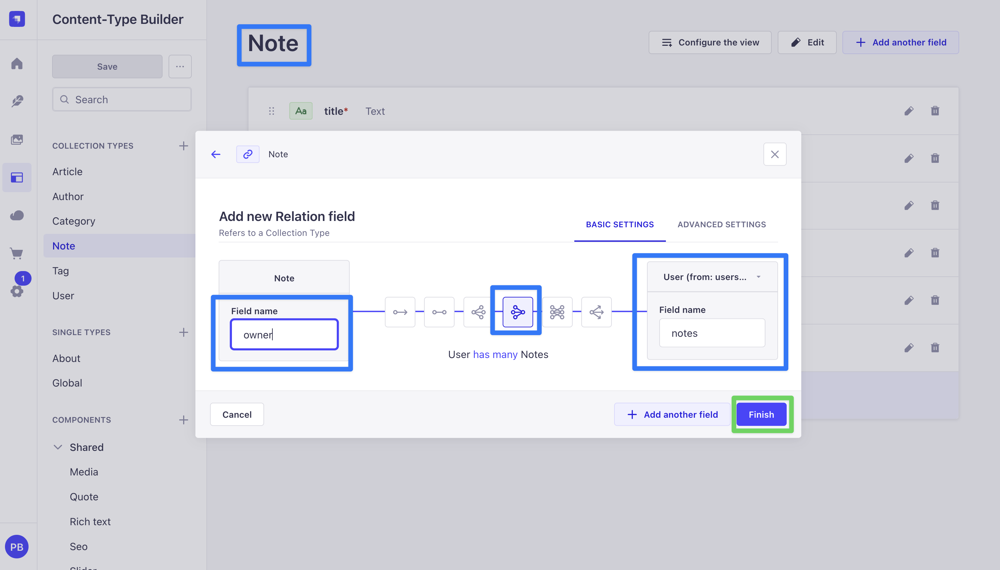

After restart, the Note schema has:

```json
{
  "owner": {
    "type": "relation",
    "relation": "manyToOne",
    "target": "plugin::users-permissions.user",
    "inversedBy": "notes"
  }
}
```

The relation is nullable by default. Step 3 fixes that by stamping an owner automatically on every new note.

### 2.1 Backfill existing notes

The notes you seeded in Part 3 do not have an owner yet. The cleanest fix is a one-shot script that bootstraps Strapi, assigns every existing note to testuser, and exits. From `server/`, create `scripts/backfill-owner.js`:

```javascript
// server/scripts/backfill-owner.js
"use strict";

async function main() {
  const { createStrapi, compileStrapi } = require("@strapi/strapi");
  const app = await createStrapi(await compileStrapi()).load();
  app.log.level = "error";

  const testuser = await strapi
    .documents("plugin::users-permissions.user")
    .findFirst({ filters: { username: "testuser" } });
  if (!testuser) {
    throw new Error('No user with username "testuser". Register one first.');
  }

  const notes = await strapi
    .documents("api::note.note")
    .findMany({ pagination: { pageSize: 100 } });

  for (const note of notes) {
    await strapi.documents("api::note.note").update({
      documentId: note.documentId,
      data: { owner: testuser.id },
    });
  }

  console.log(
    `Backfilled ${notes.length} notes to owner ${testuser.username}.`,
  );

  await app.destroy();
  process.exit(0);
}

main().catch((err) => {
  console.error(err);
  process.exit(1);
});
```

Run it with `node scripts/backfill-owner.js`. The script boots a Strapi instance, runs the backfill against the Document Service, and exits. Or, if you prefer a GUI-based approach, open the admin UI's Content Manager and assign the owner relation on each note by hand.

Every existing note now has testuser as its owner. New notes get one automatically once Step 3 is in place.

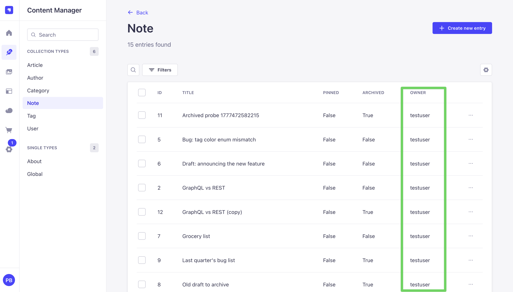

## Step 3: Set the owner automatically on every new note

Clients should not be able to pick an owner. Every signed-in request has the user available as `ctx.state.user`; we want to use that to set `owner` on a new note no matter how the request comes in.

Strapi gives you four reasonable places to do this. Pick once and the same answer works for any "set this field on create" rule you hit later (createdBy, tenantId, defaults).

### Option A: Content-type lifecycle hook

A `lifecycles.ts` file in `src/api/note/content-types/note/` exporting a `beforeCreate` function that modifies `event.params.data` before the row is written. This was the standard answer in Strapi v4.

Strapi v5 still supports it, but [Content lifecycle management](https://strapi.io/blog/content-lifecycle-management) and [When to use lifecycle hooks in Strapi](https://strapi.io/blog/when-to-use-lifecycle-hooks-in-strapi) explain why it is no longer the recommended option:

- It is buried inside a content-type folder, so a new developer has to know to look for it.
- It runs inside the database transaction, which makes error handling harder.
- There is no way to opt a single call out of the rule.

Skipping.

### Option B: GraphQL middleware on `Mutation.createNote`

A `resolversConfig` middleware that reads `context.state.user` and writes `args.data.owner` before the resolver runs. Same setup as the `cap-page-size` policy from Part 2:

```typescript
// hypothetical entry in src/extensions/graphql/middlewares-and-policies.ts
"Mutation.createNote": {
  middlewares: [
    async (next, parent, args, context, info) => {
      const user = context?.state?.user;
      if (user?.id) {
        args.data = { ...(args.data ?? {}), owner: user.id };
      }
      return next(parent, args, context, info);
    },
  ],
},
```

Clean for GraphQL. But REST `POST /api/notes` does not run through this middleware. A client that sends `{"data": {"owner": 99, "title": "..."}}` to the REST endpoint writes `owner: 99` straight to the database. Same half-coverage problem we hit in Part 2.

### Option C: REST route middleware on the Note router

The mirror of Option B. A Koa middleware on `src/api/note/routes/note.ts` that writes `ctx.request.body.data.owner` before the controller runs. Covers `POST /api/notes`, does nothing for GraphQL. The gap is now on the other side.

You can do Options B and C together and cover both APIs, but then the rule lives in two files with two different argument names (`args.data.owner` vs `ctx.request.body.data.owner`). One side gets updated, the other does not, and the two slowly drift apart.

### Option D: Document Service middleware (what we use)

A [Document Service middleware](https://docs.strapi.io/cms/api/document-service/middlewares) registered in `register()` runs whenever any code calls `strapi.documents("api::note.note").create(...)`. The Document Service sits below both REST and GraphQL: every controller and every GraphQL resolver eventually calls into it. So a rule here covers REST, GraphQL, custom resolvers (including `Mutation.duplicateNote`, which calls `strapi.documents("api::note.note").create(...)` directly), the seed script, and the admin UI, all from one file.

### Coverage

| Code path                                                | Lifecycle hook | GraphQL middleware | Route middleware | Document Service middleware |
| -------------------------------------------------------- | -------------- | ------------------ | ---------------- | --------------------------- |
| REST `POST /api/notes`                                   | ✓              | ✗                  | ✓                | ✓                           |
| GraphQL `Mutation.createNote`                            | ✓              | ✓                  | ✗                | ✓                           |
| Custom resolver calling `strapi.documents(...).create()` | ✓              | ✗                  | ✗                | ✓                           |
| Seed script                                              | ✓              | ✗                  | ✗                | ✓                           |
| Admin UI                                                 | ✓              | ✗                  | ✗                | ✓                           |
| Type-checked, visible at boot, opt-out-able per call     | ✗              | ✓                  | ✓                | ✓                           |
| Idiomatic Strapi v5                                      | ✗              | ✓                  | ✓                | ✓                           |

### Why Option D

Two reasons.

**REST is always on in Strapi.** Even if your code only calls GraphQL, the REST routes still exist and accept requests. From the outside, every "GraphQL-only" Strapi app is also a REST API. A rule about how data gets written has to apply to both. Picking Option B and saying "we only use GraphQL" creates a hole that opens the first time a developer, a script, or an attacker sends a `POST /api/notes` request.

**Only Option D sits below both APIs.** Options B and C run inside one API's request handling: B inside the GraphQL resolver wrapper, C inside the Koa router. Option D runs inside the Document Service, which both APIs call into for every read and every write. A rule placed there cannot be bypassed by a new code path, because anything that touches Note data has to go through `strapi.documents("api::note.note").<action>(...)`.

So data rules (like "set this field automatically on create") go in Document Service middlewares. Step 3 puts owner-stamping there. Step 6 will add a second clause to the same middleware for read-scoping. One file holds both.

Open `server/src/index.ts` and register the middleware in `register()`. The [Document Service middlewares docs](https://docs.strapi.io/cms/api/document-service/middlewares) say middlewares should be registered in the `register()` lifecycle, not `bootstrap()`, so the rule is in place before any plugin's bootstrap runs.

```typescript
// server/src/index.ts
import type { Core } from "@strapi/strapi";
import registerGraphQLExtensions from "./extensions/graphql";

export default {
  register({ strapi }: { strapi: Core.Strapi }) {
    registerGraphQLExtensions(strapi);

    // Stamp the authenticated user as `owner` on every new Note. Runs at
    // the Document Service layer, so it applies to REST, GraphQL, custom
    // resolvers, and seed scripts uniformly.
    strapi.documents.use(async (context, next) => {
      if (context.uid !== "api::note.note") return next();
      if (context.action !== "create") return next();

      const requestCtx = strapi.requestContext.get();
      const user = requestCtx?.state?.user;
      if (user?.id) {
        context.params.data = {
          ...(context.params.data ?? {}),
          owner: user.id,
        } as typeof context.params.data;
      }

      return next();
    });
  },

  bootstrap() {
    // Bootstrap intentionally empty for now. Step 6 leaves it that way too.
  },
};
```

Three things to notice:

- **The middleware overwrites whatever the client sent.** Even if a client sends `data: { owner: 99 }` to `createNote` or `POST /api/notes`, the middleware runs at the data layer and writes `owner: <signed-in user's id>` instead. The client's `99` is dropped. The "I'll claim to be user 99" hole closes here, below the place either API hands the data off.
- **A signed-out create produces a note with no owner.** That is the right outcome, and Step 1 already blocks signed-out create through the role permissions before we ever reach the middleware. Two checks, one after the other.
- **Reads are unaffected.** The early `return next()` when `context.action !== "create"` makes the middleware skip on every other action (`findMany`, `findOne`, `update`, `delete`). Step 6 adds a second clause to the same middleware for read-scoping.

Restart Strapi and test in the Sandbox.

In the Sandbox at `http://localhost:1337/graphql`, make sure the `Authorization` header from Step 1.4 is still ticked. The two operations below show the middleware did its job without us having to read the `owner` field back through GraphQL.

Paste both into the Operation editor at once. The Sandbox supports multiple named operations in one document and shows a dropdown next to the run button:

```graphql
query Me {
  me {
    id
    username
  }
}

mutation CreateNote {
  createNote(
    data: { title: "testuser owns me", content: "yo", pinned: false }
  ) {
    documentId
    title
  }
}
```

**Run `Me` first.** The response shows `username: "testuser"`. That is who the next mutation will be authenticated as, and the value the upcoming `MyNotes` query will filter by.

**Then run `CreateNote`.** The response contains a `documentId` and the `title` you sent. The `data` input did not include an `owner` field anywhere; the Document Service middleware stamped it server-side before the resolver wrote the row.

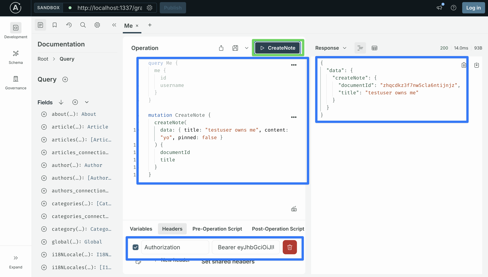

### List the current user's notes

We need one more verification: read back the notes belonging to the signed-in user and confirm the new note shows up.

**Try this query first.** Add this to the Sandbox document and run it (Authorization header still set):

```graphql
query BrokenMyNotes($username: String!) {
  notes(filters: { owner: { username: { eq: $username } } }) {
    documentId
    title
  }
}
```

Variables:

```json
{ "username": "testuser" }
```

The response will be an error:

```json
{
  "errors": [
    {
      "message": "Invalid key owner",
      "path": ["notes"],
      "extensions": {
        "code": "BAD_USER_INPUT",
        "error": {
          "name": "ValidationError",
          "details": {
            "key": "owner",
            "path": "owner",
            "source": "query",
            "param": "filters"
          }
        }
      }
    }
  ],
  "data": null
}
```

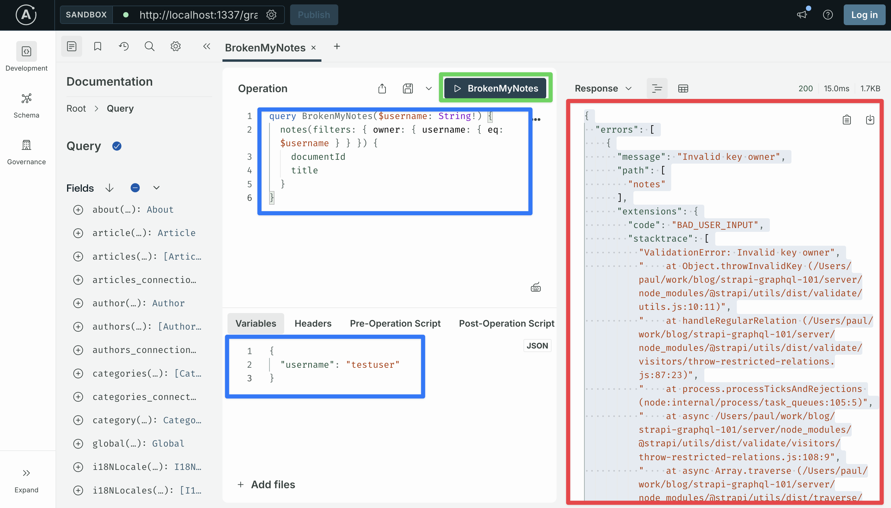

Reading the stack trace from top to bottom tells you exactly what happened:

- **`ValidationError: Invalid key owner`**: Strapi rejects `owner` as a key the caller is not allowed to use _in this position_ (the `filters` argument).
- **`handleRegularRelation` in `@strapi/utils/.../throw-restricted-relations.js:87`**: this function walks every relation named in `filters` and checks whether the caller has read permission on the related content type. `owner` points at User. The Authenticated role has no permissions on User. The check fails.
- **`validateFilters` → `validateQuery` → `findMany`** in the GraphQL plugin: the rejection happens _inside_ the resolver. The Part 2 soft-delete middleware has already run by this point, and the database query has not yet been built.
- **`resolversConfig.Query.notes.middlewares`** at the bottom: our Part 2 soft-delete middleware. It is innocent here; the error fires after it.

The takeaway: **filtering on a relation requires read permission on the related content type, even if the response never selects any field from that relation.** Strapi enforces this during query validation, before the resolver runs the database query.

**The first instinct: grant the permission and move on.** It is right there in the admin UI. Open `http://localhost:1337/admin` → **Settings** → **Users & Permissions Plugin** → **Roles** → **Authenticated** → expand **Users-permissions** → **User** → tick `find`. Save.

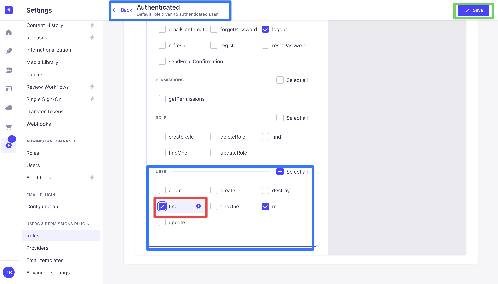

Re-run `BrokenMyNotes` in the Sandbox. The error is gone; the response is the array of notes whose `owner.username` equals `testuser`. Filter validated, query succeeded.

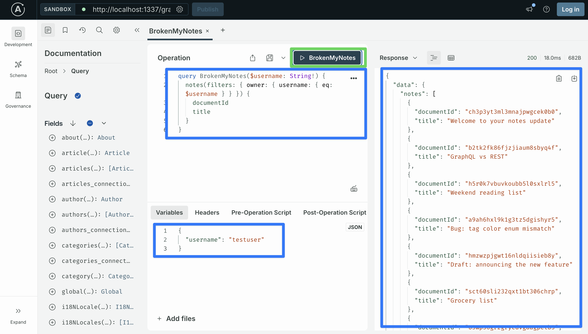

**Why this is the wrong fix.** That same `find` permission also unblocks the standard list endpoint for the User content type. With testuser still authenticated, run this in the Sandbox:

> **Heads-up before running this.** If `testuser` is the only account you have registered so far, the response below will only contain one row and the privacy leak will not be obvious. Register a second user first (any username and email; reuse the `Register` mutation block from Step 1.4 with new variables, or sign in to the Sandbox with `testuser2 / testuser2 / testuser2@example.com`) so the query has more than one row to leak.

```graphql
query AllUsers {
  usersPermissionsUsers {
    documentId
    username
    email
  }
}
```

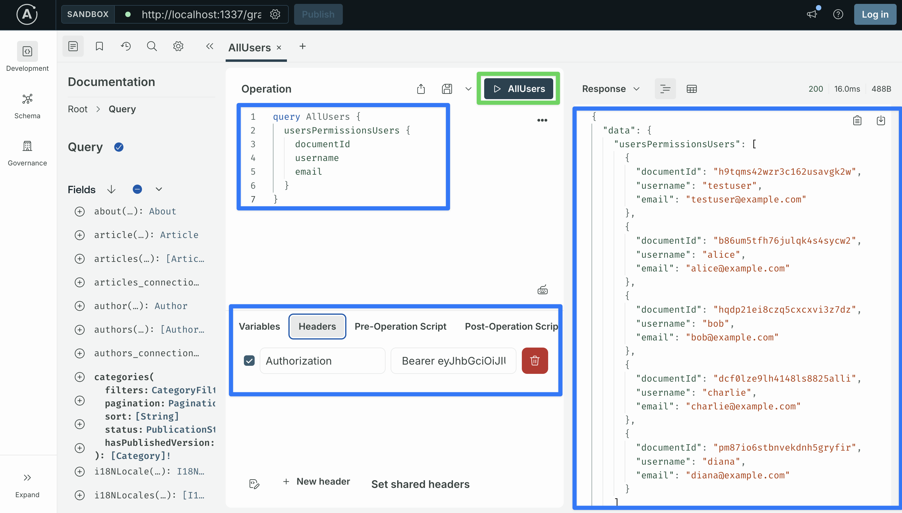

The response is **every user in the database**: testuser, testuser2, anyone else who registered, all their usernames and emails handed to any signed-in caller. The admin UI does not have a "let me filter by user, but don't let me list users" toggle. The `find` permission covers both. That is a real privacy leak.

**Go back to the admin UI and uncheck `find` on User for the Authenticated role.** Save. We need an approach that does not require the permission at all.

**The right approach: a custom `Query.myNotes` resolver.** It reads the user id from the JWT server-side, then filters using the Document Service. The Document Service builds the query directly against the database, so it does not run through the GraphQL validation that rejected our `owner` filter above. The client never names `owner` (the query takes no arguments), so the validation has nothing to reject. The User content type stays fully closed; signed-in callers cannot list users.

**Step 1: define a payload type and add the field.** Open `server/src/extensions/graphql/queries.ts`. We want `myNotes` to return _both_ the signed-in user (so the frontend can render "logged in as <username>") and the list of notes, in one round trip.

Add two new object types as siblings to the existing `TagCount` and `NoteStats` declarations at the top of the `types` array. The first, `MyNotesUser`, is a deliberately small view of the user that only exposes `id` and `username` (the only two fields a list page actually needs). The second, `MyNotesPayload`, wraps that user with the notes array:

```typescript
nexus.objectType({
  name: "MyNotesUser",
  definition(t) {
    t.nonNull.id("id");
    t.nonNull.string("username");
  },
}),
nexus.objectType({
  name: "MyNotesPayload",
  definition(t) {
    t.nonNull.field("user", { type: "MyNotesUser" });
    t.nonNull.list.nonNull.field("notes", { type: "Note" });
  },
}),
```

Why a custom `MyNotesUser` instead of reusing the built-in `UsersPermissionsMe` type? `UsersPermissionsMe` exposes `id`, `documentId`, `username`, `email`, `confirmed`, `blocked`, and `role`. If we returned that type from `myNotes`, a client could ask for any of those fields by writing them in their query (for example `myNotes { user { email role { name } } }`), and the server would return them. Since this query is only meant to power a list page that needs `username` and nothing else, we say so in the schema itself. `MyNotesUser` has two fields, and those are the only two fields a client of `myNotes` can ever ask for. The schema is the contract; relying on the client to "select less" is not.

If a page genuinely needs `email`, `role`, or other user fields (think a profile or settings page), it calls `Query.me` directly on that page. Two queries, two purposes, each one returning only the fields its page actually renders.

Then inside the existing `nexus.extendType({ type: "Query", definition(t) { ... } })` block, after the `notesByTag` field, add the resolver:

```typescript
t.field("myNotes", {
  type: nexus.nonNull("MyNotesPayload"),
  async resolve(_parent: unknown, _args: unknown, ctx: any) {
    const user = ctx?.state?.user;
    if (!user?.id) {
      // Should never reach here because of the `auth.scope` config below,
      // but a tutorial-grade fallback. Return an empty payload shape that
      // the frontend can render without special cases.
      return { user: { id: 0, username: "" }, notes: [] };
    }
    const notes = await strapi.documents("api::note.note").findMany({
      filters: { owner: { id: user.id } },
      sort: ["pinned:desc", "updatedAt:desc"],
      populate: ["tags"],
    });
    return {
      user: { id: user.id, username: user.username },
      notes,
    };
  },
});
```

The resolver explicitly picks only `id` and `username` off `ctx.state.user` and assembles the slim payload. Even if a future change adds new fields to `MyNotesUser`, the resolver only sends what it explicitly chooses to.

**Step 2: tie it to the role permission.** In the same file's `resolversConfig` block at the bottom, add:

```typescript
"Query.myNotes": { auth: { scope: ["api::note.note.find"] } },
```

This requires the caller to have `find` on Note (which the Authenticated role already has from Step 1.2). Anonymous calls are rejected before the resolver runs.

**Step 3: save and let Strapi restart.** The dev server picks up the change automatically.

**Step 4: run the working query.** Replace the broken `BrokenMyNotes` operation in the Sandbox with:

```graphql
query MyNotes {
  myNotes {
    user {
      id
      username
    }
    notes {
      documentId
      title
      pinned
    }
  }
}
```

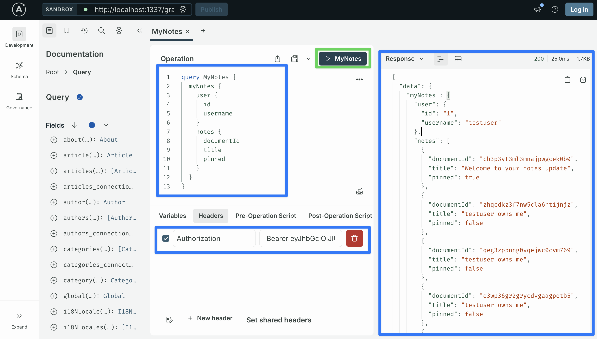

The response contains the current user's `id` and `username` plus the array of notes owned by them, including the one `CreateNote` just created. Run it as testuser2 (different JWT) and the `user` block changes to testuser2 and the `notes` array contains only their notes.

**What this resolver gets right:**

- **The user id stays on the server.** The client never sees, stores, or passes it. The JWT is the source of truth, and the server is the only thing that reads it.
- **No new role permissions needed.** The User content type stays closed, and no usernames or emails leak to other signed-in users.
- **The schema only exposes two fields on the user.** A client of `myNotes` can only ever ask for `id` and `username`. There is no way to write a query that pulls back `email` or `role` from this endpoint, even if a future change to the resolver accidentally returns more.
- **One endpoint, zero client logic.** A page that wants "the signed-in user's notes" calls `myNotes` and is done. There is no path where the client could pass a wrong id, because the client does not pass an id at all.

> **Looking ahead: Document Service middleware vs custom resolver.** A custom resolver like `myNotes` is the right tool when you want a _named_ endpoint that the schema makes obvious (a query called `myNotes` is a clear contract: "the current user's notes"). A Document Service middleware is the right tool when you want the _existing_ endpoint to behave correctly without any per-call work from the caller (the bare `notes` query should always be scoped, no matter who calls it from where). Step 6 adds a Document Service middleware so the bare `notes` query also returns only the caller's notes, on both REST and GraphQL. Neither approach replaces the other; we use both in the final design.

## Step 4: A first cut at the `is-note-owner` policy

In Part 2 we said the real authorization example would land in Part 4. Here it is.

Only the note's owner should be able to update it. That means gating these four mutations, all of which take a note's `documentId` as input:

- `Mutation.updateNote`
- `Mutation.togglePin`
- `Mutation.archiveNote`
- `Mutation.duplicateNote`

`Mutation.createNote` is intentionally excluded; ownership is _set_ there by the Document Service middleware from Step 3, not _checked_.

Create `server/src/policies/is-note-owner.ts`:

```typescript
// server/src/policies/is-note-owner.ts
import type { Core } from "@strapi/strapi";

type PolicyContext = {
  args?: { documentId?: string };
  state?: { user?: { id?: number | string } };
  context?: { state?: { user?: { id?: number | string } } };
};

const isNoteOwner = async (
  policyContext: PolicyContext,
  _config: unknown,
  { strapi }: { strapi: Core.Strapi },
): Promise<boolean> => {
  const user =
    policyContext?.state?.user ?? policyContext?.context?.state?.user;
  if (!user?.id) {
    strapi.log.warn("is-note-owner: rejected, no authenticated user.");
    return false;
  }

  const documentId = policyContext?.args?.documentId;
  if (!documentId) {
    strapi.log.warn("is-note-owner: rejected, no documentId in args.");
    return false;
  }

  const note = await strapi
    .documents("api::note.note")
    .findOne({ documentId, populate: ["owner"] });

  if (!note) return false;
  if (note.owner?.id === user.id) return true;

  strapi.log.warn(
    `is-note-owner: rejected, user ${user.id} is not the owner of note ${documentId}.`,
  );
  return false;
};

export default isNoteOwner;
```

Now wire the policy onto the four write mutations.

Open `server/src/extensions/graphql/middlewares-and-policies.ts` and find the `resolversConfig` block. It already has entries for `Query.notes` and `Query.note` from Part 2. Add four new sibling keys inside the same object, right after the `Query.note` block:

```typescript
return {
  resolversConfig: {
    "Query.notes": {
      // ... unchanged from Part 2 ...
    },
    "Query.note": {
      // ... unchanged from Part 2 ...
    },

    // NEW: per-row ownership check on every Note write
    "Mutation.updateNote": { policies: ["global::is-note-owner"] },
    "Mutation.togglePin": { policies: ["global::is-note-owner"] },
    "Mutation.archiveNote": { policies: ["global::is-note-owner"] },
    "Mutation.duplicateNote": { policies: ["global::is-note-owner"] },
  },
};
```

A few things to know:

- The four new keys go inside the same `resolversConfig` object as `Query.notes` and `Query.note`. Same indentation, separated by commas.
- `Mutation.createNote` is **not** in the list. Ownership is _set_ on create by the Document Service middleware from Step 3, not _checked_.
- All four mutations take `documentId` as an argument. That is what the policy reads to load the target row.
- The string `"global::is-note-owner"` matches the filename `src/policies/is-note-owner.ts` you wrote above. Strapi auto-registers files in `src/policies/` under that prefix; if the file is missing or misnamed, Strapi will fail to start with `Cannot find policy is-note-owner`.

### Test the policy in the Sandbox

We need a second user to play the part of "not the owner." If you already registered one earlier (for the privacy-leak demonstration in Step 3), reuse the `Login` mutation block from Step 1.4 to grab a fresh JWT for that account, then jump down to the `TogglePin` test. Otherwise, register `testuser2` now in the Sandbox:

```graphql
mutation Register($input: UsersPermissionsRegisterInput!) {
  register(input: $input) {
    jwt
    user {
      username
    }
  }
}
```

Variables:

```json
{
  "input": {
    "username": "testuser2",
    "email": "testuser2@example.com",
    "password": "testuser2"
  }
}
```

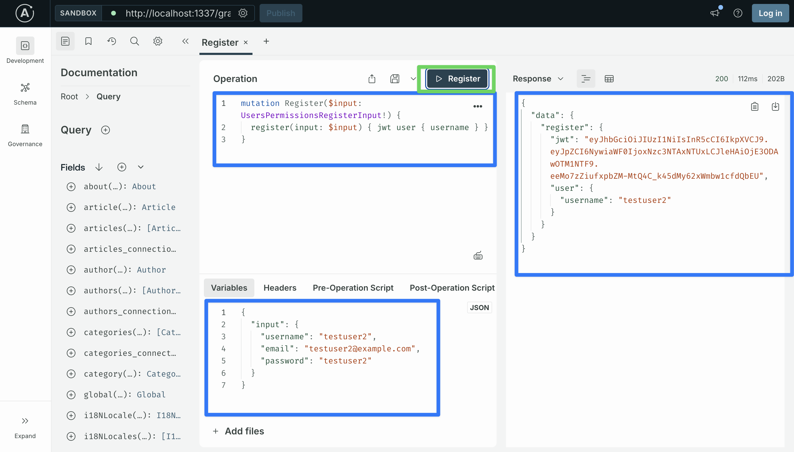

Copy testuser2's JWT.

Now grab any existing note's `documentId` (they all belong to testuser after the backfill in Step 2.1). Swap the Authorization header in the Sandbox to `Bearer <testuser2-jwt>` and try to pin testuser's note:

```graphql
mutation TogglePin($id: ID!) {
  togglePin(documentId: $id) {
    documentId
    pinned
  }
}
```

Variables:

```json
{ "id": "<paste-note-documentId>" }
```

The response is `Policy Failed`.

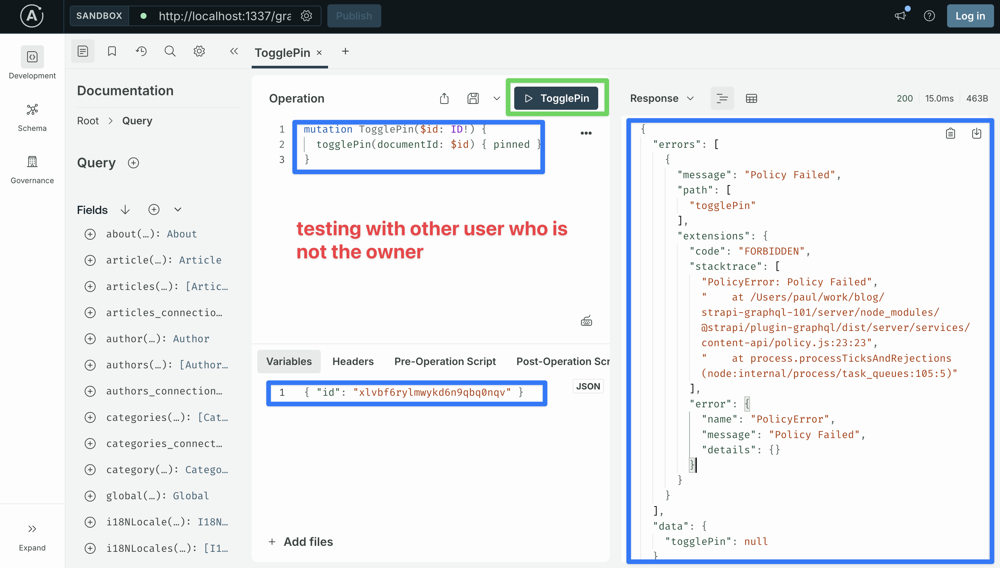

Swap the header back to testuser's JWT and run the same mutation. Now it succeeds and the note flips between pinned and unpinned.

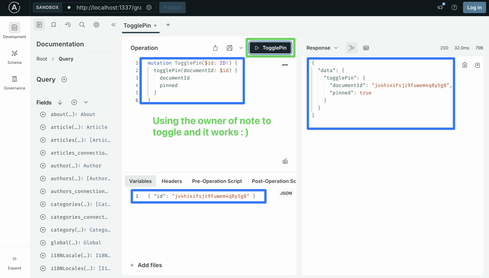

## Step 5: The REST leak

Anything in `resolversConfig` only runs for GraphQL. The same gap we hit in Part 2 with the soft-delete and page-cap rules. The `is-note-owner` policy does nothing for REST, and testuser2 can prove it by editing testuser's note over REST:

```bash
TESTUSER2_JWT="<testuser2-jwt>"
NOTE_ID="<a-note-documentId>"
curl -s -X PUT "http://localhost:1337/api/notes/$NOTE_ID" \
  -H 'Content-Type: application/json' \
  -H "Authorization: Bearer $TESTUSER2_JWT" \
  -d '{"data":{"title":"testuser2 was here"}}'
# -> 200 OK, title updated.
```

That is a real bug. The policy gates GraphQL but not REST. One rule, half-covered.

Restore the title before moving on:

```bash
TESTUSER_JWT="<testuser-jwt>"
curl -s -X PUT "http://localhost:1337/api/notes/$NOTE_ID" \
  -H 'Content-Type: application/json' \
  -H "Authorization: Bearer $TESTUSER_JWT" \
  -d '{"data":{"title":"<original title>"}}'
```

Two reasonable ways to close the gap:

1. **Mirror the rule on REST.** Add a route-level middleware on `src/api/note/routes/note.ts` (same setup Part 2 used for soft-delete) plus a small policy on the route's `find`, `findOne`, `update`, and `delete` actions that loads the target note and rejects when the owner does not match. The rule now lives in two files: a `resolversConfig` policy for GraphQL and a route middleware/policy for REST. Both have to be kept in sync.
2. **Move the rule below both APIs into a Document Service middleware.** Step 3 already uses one to write `owner` on create. We extend that same middleware with a second clause: it watches every `findMany` and `findOne` on `api::note.note` and adds `owner = ctx.state.user.id` to `params.filters`. REST controllers and GraphQL Shadow CRUD resolvers both eventually call `strapi.documents("api::note.note").<action>(...)`, so a rule placed there fires for both. One file, both APIs.

The next step builds option 2.

> **Why not option 1?** It works, but it puts the same rule in two files. A future change updates the GraphQL side and forgets the REST side, and the same kind of leak we just demonstrated comes back. Option 2 puts the rule one layer deeper, where REST and GraphQL share the same code path: any caller that ends up at `strapi.documents("api::note.note").findOne(...)` goes through the rule, with no extra wiring. We took a similar position in Part 2's "GraphQL-only vs. both APIs" section. Part 4's ownership rule is the case where that one-rule-one-file approach earns its keep, because the rule has to read `ctx.state.user` and behave the same way for REST and GraphQL.

## Step 6: A Document Service middleware for both APIs

The owner-stamping middleware from Step 3 already lives in `src/index.ts` `register()`. We add two more `strapi.documents.use(...)` clauses in the same file, sitting right after it.

The three clauses together do three things:

1. **Stamp `owner` on every new note** (the existing Step 3 clause).
2. **Filter `findMany` and `findOne` to the signed-in user.** Both REST `GET /api/notes` / `/:id` and GraphQL `Query.notes` / `Query.note` go through the Document Service, so one rule covers both.
3. **Block `update` and `delete` for non-owners.** A pre-flight `findOne` (which inherits the read filter from clause 2) returns null for non-owners; we throw `NotFoundError`. REST `PUT` / `DELETE /api/notes/:id` is covered the same way GraphQL `updateNote` / `deleteNote` is.

The rules live at the Document Service layer, so REST and GraphQL share them. There is no per-resolver attachment on the GraphQL side and no route-level middleware on the REST side. One file, both APIs, both verbs.

### 6.1 Extend the Document Service middleware

Open `server/src/index.ts` and replace its contents:

```typescript
// server/src/index.ts
import type { Core } from "@strapi/strapi";
import { errors } from "@strapi/utils";
import registerGraphQLExtensions from "./extensions/graphql";

export default {
  register({ strapi }: { strapi: Core.Strapi }) {
    registerGraphQLExtensions(strapi);

    // From Step 3: stamp `owner` on every new note.
    strapi.documents.use(async (context, next) => {
      if (context.uid !== "api::note.note") return next();
      if (context.action !== "create") return next();

      const requestCtx = strapi.requestContext.get();
      const user = requestCtx?.state?.user;
      if (user?.id) {
        context.params.data = {
          ...(context.params.data ?? {}),
          owner: user.id,
        } as typeof context.params.data;
      }

      return next();
    });

    // Scope every Note read to the signed-in user.
    strapi.documents.use(async (context, next) => {
      if (context.uid !== "api::note.note") return next();
      if (context.action !== "findMany" && context.action !== "findOne") {
        return next();
      }

      const requestCtx = strapi.requestContext.get();
      const user = requestCtx?.state?.user;
      const existingFilters = (context.params.filters ?? {}) as Record<
        string,
        unknown
      >;

      if (!user?.id) {
        // No signed-in user: force the filter to match nothing.
        // -1 is never a valid User id, so the query returns zero rows
        // instead of falling through to "return everything."
        context.params.filters = {
          ...existingFilters,
          owner: { id: { $eq: -1 } },
        } as typeof context.params.filters;
        return next();
      }

      context.params.filters = {
        ...existingFilters,
        owner: { id: { $eq: user.id } },
      } as typeof context.params.filters;
      return next();
    });

    // Gate every Note write (update, delete) for non-owners.
    // The pre-flight findOne goes back through the Document Service
    // and inherits the read filter above, so a non-owner sees null
    // for the lookup. We throw NotFoundError to match the read
    // posture (no existence leak via 403).
    strapi.documents.use(async (context, next) => {
      if (context.uid !== "api::note.note") return next();
      if (context.action !== "update" && context.action !== "delete") {
        return next();
      }

      const documentId = (context.params as { documentId?: string })
        .documentId;
      if (!documentId) return next();

      const existing = await strapi
        .documents("api::note.note")
        .findOne({ documentId });
      if (!existing) {
        throw new errors.NotFoundError("Note not found.");
      }

      return next();
    });
  },

  bootstrap() {},
};
```

What this code does.

**On reads (`findMany` and `findOne`):**

- **It looks up who is signed in.** Inside this middleware we do not get the request directly, so we ask Strapi for it with `strapi.requestContext.get()`. If testuser is signed in, `user.id` is testuser's id. If nobody is signed in, `user` is `undefined`.
- **If nobody is signed in, the query returns zero notes.** We add the filter `owner.id = -1` to the query. No user has id `-1`, so the database finds nothing. We do not throw an error here because the route in Step 1 already rejects requests without a JWT. This is just a backstop in case anything slips past it.
- **The caller cannot ask for someone else's notes.** If a caller sends `notes(filters: { owner: { id: { eq: 99 } } })` hoping to read user 99's notes, we copy their filter into ours, then write our own `owner` value on top. Our value wins, so the database only returns notes owned by the signed-in user.

**On writes (`update` and `delete`):**

- **It checks ownership by looking the note up first.** Before the update or delete runs, we call `strapi.documents("api::note.note").findOne({ documentId })`. That lookup goes through the same middleware, so the read code above runs on it and adds `owner = signed-in user` to the query. If testuser2 tries to update one of testuser's notes, the lookup returns `null`, and we throw. We never write the ownership check twice; the write code borrows it from the read code.
- **It throws `NotFoundError`, not `ForbiddenError`.** When testuser2 reads testuser's note, the read code above already returns nothing, as if the note does not exist. We want the write to look the same. `ForbiddenError` would tell testuser2 "this note exists, you just cannot touch it," which tells them something they should not know.
- **It only runs on `update` and `delete`.** `create` is already handled by the owner-stamping code at the top of the file. Plain reads are handled by the read code above. `count` is handled inside `noteStats` in Step 6.3.

### 6.2 Test it

Restart Strapi, then exercise reads and writes on both APIs.

**GraphQL reads.** With testuser's JWT in the Authorization header, run:

```graphql
query {
  notes {
    documentId
  }
}
```

You see the notes testuser owns. Swap the Authorization header to testuser2's JWT and re-run. testuser2 sees an empty list (or only the notes they created themselves).

**GraphQL writes.** Try to update one of testuser's notes as testuser2:

```graphql
mutation UpdateNote($id: ID!, $data: NoteInput!) {
  updateNote(documentId: $id, data: $data) {
    documentId
    title
  }
}
```

Variables:

```json
{
  "id": "<testuser-note-documentId>",
  "data": { "title": "testuser2 was here" }
}
```

The response is `Policy Failed`. The `is-note-owner` policy from Step 4 rejects the call before the resolver runs. Even if the policy were absent, the write-gate clause would now throw `NotFoundError` from the same lookup.

**REST reads.** Same shape, different surface:

```bash
TESTUSER_JWT="<testuser-jwt>"
TESTUSER2_JWT="<testuser2-jwt>"

curl -s -H "Authorization: Bearer $TESTUSER_JWT" "http://localhost:1337/api/notes" | jq '.data | length'
# -> 9

curl -s -H "Authorization: Bearer $TESTUSER2_JWT" "http://localhost:1337/api/notes" | jq '.data | length'
# -> 0
```

**REST writes.** This is what the write-gate clause is for. Pick any of testuser's note `documentId`s and try to PUT to it as testuser2:

```bash
NOTE_ID="<testuser-note-documentId>"
curl -s -X PUT "http://localhost:1337/api/notes/$NOTE_ID" \
  -H 'Content-Type: application/json' \
  -H "Authorization: Bearer $TESTUSER2_JWT" \
  -d '{"data":{"title":"testuser2 was here"}}'
# -> {"data":null,"error":{"status":404,"name":"NotFoundError", ... }}
```

testuser2's PUT returns 404. testuser's own PUT on the same note returns 200 and updates the title.

```bash
curl -s -X PUT "http://localhost:1337/api/notes/$NOTE_ID" \
  -H 'Content-Type: application/json' \
  -H "Authorization: Bearer $TESTUSER_JWT" \
  -d '{"data":{"title":"testuser updated this"}}'
# -> 200, title now "testuser updated this"
```

One file (`src/index.ts`), three clauses, both APIs, both verbs. Reads scoped, writes gated, ownership stamped on create. The intro promise — *a Document Service middleware that closes both APIs from one file* — holds.

### 6.3 Scope the three custom queries to the owner

The Document Service middleware covers `Query.notes`, `Query.note`, and the REST find/findOne, because all four end up calling `strapi.documents("api::note.note").findMany(...)` or `findOne(...)`. The three custom queries from Part 2 (`searchNotes`, `noteStats`, `notesByTag`) are different:

- `searchNotes` and `notesByTag` call `strapi.documents("api::note.note").findMany(...)` themselves, with their own filter object. The middleware's `owner` clause does merge in, but it is harder to read what the final filter is from inside the resolver, and any future change to the resolver could clobber it. Adding the `owner` clause inline makes the rule visible at the call site.
- `noteStats` calls `count()` three times (which the middleware does not match because the early return only allows `findMany` and `findOne`) and then `findMany` on `api::tag.tag` (which is a different content type, so the middleware's `uid` check skips it entirely).

Step 1.3 already made all three queries require sign-in. We now add an explicit `owner` filter inside each resolver so each signed-in user only sees their own data.

The same pattern in all three: read `ctx.state.user.id` and add `owner: { id: user.id }` to the filter. Each resolver now takes `ctx` as its third argument.

Open `server/src/extensions/graphql/queries.ts`.

**`searchNotes`.** Replace the resolver with:

```typescript
t.list.field("searchNotes", {
  type: nexus.nonNull("Note"),
  args: {
    query: nexus.nonNull(nexus.stringArg()),
    includeArchived: nexus.booleanArg({ default: false }),
  },
  async resolve(
    _parent: unknown,
    { query, includeArchived }: { query: string; includeArchived: boolean },
    ctx: any,
  ) {
    const user = ctx?.state?.user;
    if (!user?.id) return [];
    const where: any = {
      title: { $containsi: query },
      owner: { id: user.id },
    };
    if (!includeArchived) where.archived = false;
    return strapi.documents("api::note.note").findMany({
      filters: where,
      populate: ["tags"],
      sort: ["pinned:desc", "updatedAt:desc"],
    });
  },
});
```

**`noteStats`.** Each `count` and `findMany` call gets the owner filter:

```typescript
t.nonNull.field("noteStats", {
  type: "NoteStats",
  async resolve(_parent: unknown, _args: unknown, ctx: any) {
    const user = ctx?.state?.user;
    if (!user?.id) return { total: 0, pinned: 0, archived: 0, byTag: [] };
    const owner = { id: user.id };
    const [total, pinned, archived, tags] = await Promise.all([
      strapi.documents("api::note.note").count({ filters: { owner } }),
      strapi.documents("api::note.note").count({
        filters: { pinned: true, owner },
      }),
      strapi.documents("api::note.note").count({
        filters: { archived: true, owner },
      }),
      strapi.documents("api::tag.tag").findMany({
        populate: { notes: { filters: { owner } } },
        sort: ["name:asc"],
      }),
    ]);

    const byTag = tags
      .map((tag: any) => ({
        slug: tag.slug,
        name: tag.name,
        count: Array.isArray(tag.notes) ? tag.notes.length : 0,
      }))
      .sort((a, b) => b.count - a.count || a.name.localeCompare(b.name));

    return { total, pinned, archived, byTag };
  },
});
```

The line worth pointing at is `populate: { notes: { filters: { owner } } }`. Every user can see every tag (tags are shared), but the _number of notes_ on each tag has to be scoped to the current user. The Document Service lets us filter populated relations inline, so we add `{ owner }` to the populate. Each user sees their own per-tag counts, never anyone else's.

**`notesByTag`.** Add `owner` to the existing filter object:

```typescript
t.list.field("notesByTag", {
  type: nexus.nonNull("Note"),
  args: { slug: nexus.nonNull(nexus.stringArg()) },
  async resolve(_parent: unknown, { slug }: { slug: string }, ctx: any) {
    const user = ctx?.state?.user;
    if (!user?.id) return [];
    return strapi.documents("api::note.note").findMany({
      filters: {
        archived: false,
        tags: { slug: { $eq: slug } },
        owner: { id: user.id },
      },
      populate: ["tags"],
      sort: ["pinned:desc", "updatedAt:desc"],
    });
  },
});
```

Save. Strapi auto-restarts.

**Test in the Sandbox.** With testuser's JWT in the Authorization header, run each one:

```graphql
query {
  searchNotes(query: "GraphQL") {
    documentId
    title
  }
}
```

```graphql
query {
  noteStats {
    total
    pinned
    archived
    byTag {
      slug
      name
      count
    }
  }
}
```

```graphql
query {
  notesByTag(slug: "ideas") {
    documentId
    title
  }
}
```

You only see testuser's notes. Swap the Authorization header to testuser2's JWT and re-run the same queries. testuser2 only sees their own notes.

> **Why repeat the owner filter inline in each resolver instead of pulling it into a helper?** A `withOwner(filters, ctx)` helper looks like the obvious refactor, but each resolver here is short, and the helper would barely save any lines. Writing the `owner` filter inline also keeps the rule visible at every read site, so a future reader of the resolver does not have to know that a helper exists. With twenty custom queries the helper would pay off; with three, inline is plainer.

### 6.4 Should we keep the GraphQL policy?

After Step 6, the `is-note-owner` policy from Step 4 is technically redundant. The Document Service middleware adds an `owner` filter to every `findOne`, so when `Mutation.updateNote` (or `togglePin`, `archiveNote`, `duplicateNote`) calls `strapi.documents("api::note.note").findOne(...)` to load the target note, a non-owner gets back nothing. The mutation fails before the policy would have had a chance to reject it.

The policy is still useful as a second check and as a worked example of how policies are written. Two reasonable choices:

- **Keep it.** A second check, run before the resolver. If someone disables or breaks the Document Service middleware by accident, GraphQL writes are still gated. The cost is that the same rule lives in two places.
- **Delete it.** One source of truth. Trust the Document Service middleware to do the work.

We keep the policy in this tutorial. The file is small, the overlap is on purpose, and the codebase ends up with two patterns side by side: a Document Service middleware doing the main work, plus a `policyContext`-based policy as a worked example.

## Step 7: Test the backend contract

The starter's test script already covers Part 2. Add a section at the bottom that covers ownership. Open `starter-template/scripts/test-graphql.mjs` (and the canonical copy in `server/scripts/test-graphql.mjs`) and append:

```javascript
// 9. Ownership: two-user isolation
section("Ownership: two-user isolation");

const testuserJwt = (
  await gql(
    `mutation { register(input: { username: "testuser-${Date.now()}", email: "a-${Date.now()}@x.com", password: "testuser" }) { jwt } }`,
  )
)?.data?.register?.jwt;

const testuser2Jwt = (
  await gql(
    `mutation { register(input: { username: "testuser2-${Date.now()}", email: "b-${Date.now()}@x.com", password: "testuser2" }) { jwt } }`,
  )
)?.data?.register?.jwt;

const testuserNote = (
  await gql(
    `mutation { createNote(data: { title: "testuser-only", content: "secret" }) { documentId } }`,
    undefined,
    { Authorization: `Bearer ${testuserJwt}` },
  )
)?.data?.createNote;

const testuser2View = await gql(`{ notes { documentId } }`, undefined, {
  Authorization: `Bearer ${testuser2Jwt}`,
});
check(
  "testuser2 does not see testuser's notes in the list",
  !testuser2View?.data?.notes?.some(
    (n) => n.documentId === testuserNote.documentId,
  ),
);

const testuser2Attack = await gql(
  `mutation A($id: ID!) { togglePin(documentId: $id) { documentId } }`,
  { id: testuserNote.documentId },
  { Authorization: `Bearer ${testuser2Jwt}` },
);
check(
  "testuser2 cannot toggle pin on testuser's note (Policy Failed)",
  testuser2Attack?.errors?.some((e) =>
    /Policy Failed|Forbidden/i.test(e.message),
  ),
);
```

Run it:

```bash
npm run test:backend
```

> **Heads-up: the existing checks now need authentication.** Sections 1 through 8 of `test-graphql.mjs` make anonymous GraphQL calls (no `Authorization` header). After Step 1.2 disabled anonymous reads on `Note`, the script bails at Section 1 with `No active notes in the database` and never reaches the new ownership block. Two ways to fix the script:
>
> 1. **Register a user at the top and authenticate every request** by passing `{ Authorization: \`Bearer ${jwt}\` }`as the third argument to every`gql(...)` call.
> 2. **Skip Sections 1 through 8** if you only want to run the ownership block; comment out everything before `// 9. Ownership: two-user isolation`.
>
> The two new ownership checks themselves work correctly — they register fresh users and pass their own JWTs — so once you have `npm run test:backend` running again, those two lines will be green.

## Step 8: Wire up the frontend

Backend done. The frontend needs three things: pages to register and log in, a way to attach the JWT to every GraphQL call, and a route gate that sends signed-out users to `/login`.

### 8.1 Cookie helpers

Create `lib/auth.ts`:

```typescript
// starter-template/lib/auth.ts
import { cookies } from "next/headers";

export const JWT_COOKIE = "strapi_jwt";

export async function getJwt(): Promise<string | undefined> {
  const store = await cookies();
  return store.get(JWT_COOKIE)?.value;
}

export async function setJwt(jwt: string): Promise<void> {
  const store = await cookies();
  store.set(JWT_COOKIE, jwt, {
    httpOnly: true,
    sameSite: "lax",
    secure: process.env.NODE_ENV === "production",
    path: "/",
    maxAge: 60 * 60 * 24 * 30, // 30 days
  });
}

export async function clearJwt(): Promise<void> {
  const store = await cookies();
  store.delete(JWT_COOKIE);
}
```

`httpOnly` matters. The browser keeps the cookie but JavaScript cannot read it, so an XSS payload cannot steal the token. The cookie is only read on the server, by Server Components and Server Actions through `cookies()`.

### 8.2 Attach the JWT in Apollo Client

Open `lib/apollo-client.ts` and add a fetch wrapper that adds the token when one is present:

```typescript
// starter-template/lib/apollo-client.ts
import { HttpLink } from "@apollo/client";
import {
  registerApolloClient,
  ApolloClient,
  InMemoryCache,
} from "@apollo/client-integration-nextjs";
import { getJwt } from "./auth";

const STRAPI_GRAPHQL_URL =
  process.env.STRAPI_GRAPHQL_URL ?? "http://localhost:1337/graphql";

export const { getClient, query, PreloadQuery } = registerApolloClient(() => {
  return new ApolloClient({
    cache: new InMemoryCache({
      typePolicies: {
        Note: { keyFields: ["documentId"] },
        Tag: { keyFields: ["documentId"] },
        UsersPermissionsUser: { keyFields: ["id"] },
      },
    }),
    link: new HttpLink({
      uri: STRAPI_GRAPHQL_URL,
      fetchOptions: { cache: "no-store" },
      fetch: async (url, init = {}) => {
        const jwt = await getJwt();
        const headers = new Headers(init.headers);
        if (jwt) headers.set("Authorization", `Bearer ${jwt}`);
        return fetch(url, { ...init, headers });
      },
    }),
  });
});
```

`registerApolloClient` runs the factory once per request, so `getJwt()` runs fresh for every render and Server Action. The token never reaches the browser bundle.

### 8.3 Login, register, me operations

Append to `lib/graphql.ts`:

```typescript
export const LOGIN = gql`
  
`;

export const REGISTER = gql`
  mutation Register($input: UsersPermissionsRegisterInput!) {
    register(input: $input) {
      jwt
      user {
        id
        username
        email
      }
    }
  }
`;

export const ME = gql`
  query Me {
    me {
      id
      username
      email
    }
  }
`;
```

### 8.4 The login page

The starter already ships `app/login/page.tsx` with the form, the error banner, and a stub `loginAction` that just `console.log`s. Open the file if you want to see the JSX. To wire it up, replace the contents of `app/login/actions.ts`:

```typescript
// starter-template/app/login/actions.ts
"use server";

import { redirect } from "next/navigation";
import { getClient } from "@/lib/apollo-client";
import { LOGIN } from "@/lib/graphql";
import { setJwt } from "@/lib/auth";

const asString = (v: FormDataEntryValue | null) =>
  typeof v === "string" ? v : "";

export async function loginAction(formData: FormData) {
  const identifier = asString(formData.get("identifier")).trim();
  const password = asString(formData.get("password"));

  if (!identifier || !password) return;

  let jwt: string | undefined;
  try {
    const { data } = await getClient().mutate<{
      login: { jwt: string };
    }>({
      mutation: LOGIN,
      variables: { input: { identifier, password } },
    });
    jwt = data?.login?.jwt;
  } catch {
    // Apollo throws CombinedGraphQLErrors when Strapi returns an error
    // (e.g. "Invalid identifier or password"). Catch it and fall through
    // to the !jwt redirect below; otherwise the throw bubbles to Next's
    // runtime overlay instead of giving the user an error message.
  }

  if (!jwt) redirect("/login?error=invalid");

  await setJwt(jwt);
  redirect("/");
}
```

Two things to notice:

- **The `try/catch` matters.** Apollo's `mutate()` throws on Strapi errors, it does not return `{ data: null }`. Without the catch, a wrong password produces a runtime error overlay in dev (and a 500 in production) instead of redirecting back to `/login?error=invalid`.
- **The page already handles `searchParams.error`.** The starter's `app/login/page.tsx` reads `error` from `searchParams` and renders a red banner when it equals `"invalid"` — that pairs with the redirect above.

The register page has the same shape with three inputs and the `REGISTER` mutation. The starter ships `app/register/page.tsx` and a stub `app/register/actions.ts` already; replace the action contents:

```typescript
// starter-template/app/register/actions.ts
"use server";

import { redirect } from "next/navigation";
import { getClient } from "@/lib/apollo-client";
import { REGISTER } from "@/lib/graphql";
import { setJwt } from "@/lib/auth";

const asString = (v: FormDataEntryValue | null) =>
  typeof v === "string" ? v : "";

export async function registerAction(formData: FormData) {
  const username = asString(formData.get("username")).trim();
  const email = asString(formData.get("email")).trim();
  const password = asString(formData.get("password"));

  if (!username || !email || !password) return;

  let jwt: string | undefined;
  try {
    const { data } = await getClient().mutate<{
      register: { jwt: string };
    }>({
      mutation: REGISTER,
      variables: { input: { username, email, password } },
    });
    jwt = data?.register?.jwt;
  } catch {
    // Same try/catch shape as the login action: Apollo throws on Strapi
    // validation errors (duplicate username/email, password too short),
    // so we catch and fall through to the redirect below.
  }

  if (!jwt) redirect("/register?error=invalid");

  await setJwt(jwt);
  redirect("/");
}
```

### 8.5 Logout

The starter has `app/logout/actions.ts` as a stub. Replace its contents:

```typescript
// starter-template/app/logout/actions.ts
"use server";

import { redirect } from "next/navigation";
import { clearJwt } from "@/lib/auth";

export async function logoutAction() {
  await clearJwt();
  redirect("/login");
}
```

Replace `components/nav.tsx` with a version that reads the signed-in user via the `me` query and shows their username plus a sign-out button when authenticated. When anonymous (e.g. on `/login` or `/register`), it falls back to a "Sign in" link.

```tsx
// components/nav.tsx
import Link from "next/link";
import { query } from "@/lib/apollo-client";
import { ME } from "@/lib/graphql";
import { logoutAction } from "@/app/logout/actions";

const LINKS = [
  { href: "/", label: "Notes" },
  { href: "/search", label: "Search" },
  { href: "/stats", label: "Stats" },
];

type Me = { id: string; username: string; email: string } | null;

export async function Nav() {
  // The Apollo client (Step 8.2) injects the JWT cookie automatically.
  // On /login and /register there is no JWT, so the query throws and we
  // fall back to anonymous.
  let me: Me = null;
  try {
    const { data } = await query<{ me: Me }>({ query: ME });
    me = data?.me ?? null;
  } catch {
    me = null;
  }

  return (
    <header className="border-b">
      <div className="mx-auto flex max-w-3xl items-center justify-between px-6 py-4">
        <Link href="/" className="text-lg font-semibold">
          Notes
        </Link>
        <nav className="flex items-center gap-5 text-sm text-neutral-600">
          {me ? (
            <>
              {LINKS.map((l) => (
                <Link key={l.href} href={l.href} className="hover:text-black">
                  {l.label}
                </Link>
              ))}
              <Link
                href="/notes/new"
                className="rounded bg-black px-3 py-1.5 text-sm font-medium text-white hover:bg-neutral-800"
              >
                New
              </Link>
              <span className="text-neutral-500">@{me.username}</span>
              <form action={logoutAction}>
                <button
                  type="submit"
                  className="text-neutral-500 hover:text-black"
                >
                  Sign out
                </button>
              </form>
            </>
          ) : (
            <Link
              href="/login"
              className="rounded bg-black px-3 py-1.5 text-sm font-medium text-white hover:bg-neutral-800"
            >
              Sign in
            </Link>
          )}
        </nav>
      </div>
    </header>
  );
}
```

Four things to notice:

- **`Nav` is now `async`.** It runs as a Server Component, calls `me`, and renders the result. There is no client-side fetch; the user state is resolved on the server before the HTML ships.
- **The `try/catch` is required.** When the request has no JWT cookie (the `/login` and `/register` routes), the `me` query rejects with a `Forbidden` error from Apollo. Catching it and falling back to `me = null` keeps the public pages rendering normally.
- **The whole nav switches on auth.** When `me` is null (anonymous), only the brand link and the **Sign in** button render. Notes / Search / Stats / New are all behind sign-in, both because the routes are protected by `middleware.ts` (Step 8.6) and because there is nothing meaningful to point at when the user has no notes yet.
- **The sign-out button is a `<form action={logoutAction}>`.** That is the supported shape for invoking a Server Action without args. The button submits, the action runs, the cookie is cleared, and the redirect to `/login` happens server-side.

### 8.6 Protect the routes with Next.js Proxy

> **Next 16 rename.** What was called Middleware in earlier versions of Next.js is now called Proxy. The functionality is identical; only the file name (`proxy.ts` instead of `middleware.ts`) and the exported function name (`proxy` instead of `middleware`) changed. See `node_modules/next/dist/docs/01-app/01-getting-started/16-proxy.md` for the official note.

Create `proxy.ts` at the root of the starter (next to `package.json`, not inside `app/`):

```typescript
// starter-template/proxy.ts
import { NextResponse, type NextRequest } from "next/server";
import { JWT_COOKIE } from "@/lib/auth";

const PUBLIC_ROUTES = ["/login", "/register"];

export function proxy(req: NextRequest) {
  const { pathname } = req.nextUrl;

  if (PUBLIC_ROUTES.some((p) => pathname.startsWith(p))) {
    return NextResponse.next();
  }

  const hasJwt = req.cookies.has(JWT_COOKIE);
  if (!hasJwt) {
    const url = req.nextUrl.clone();
    url.pathname = "/login";
    url.searchParams.set("returnTo", pathname);
    return NextResponse.redirect(url);
  }

  return NextResponse.next();
}

export const config = {
  matcher: ["/((?!_next/|favicon|api/).*)"],
};
```

This uses Next.js's [matcher syntax](https://nextjs.org/docs/app/api-reference/file-conventions/proxy#matcher). The pattern excludes Next.js's internal `_next/` paths, the favicon, and any `/api/` routes you might add later. Everything else requires a JWT.

### 8.7 A clearer 404 for the detail route

The Document Service middleware from Step 6 makes other users' notes invisible: when testuser2 fetches testuser's note by `documentId`, the lookup misses, the Server Component calls `notFound()`, and the user sees Next's default `404 — This page could not be found.` page. That is the security-correct behavior: leaking "this note exists but isn't yours" would tell an attacker probing IDs which ones belong to other users versus which ones don't exist.

The starter ships a generic `app/notes/[documentId]/not-found.tsx` page that catches the `notFound()` call and renders a friendlier message than Next's default. Replace its contents with a tutorial-aware version that names the policy doing the work, so a reader trying the cross-user URL trick can see the system is working as designed:

```tsx
// starter-template/app/notes/[documentId]/not-found.tsx
import Link from "next/link";

export default function NotFound() {
  return (
    <div className="mx-auto max-w-xl space-y-4 py-12 text-center">
      <h1 className="text-2xl font-semibold">Note not found</h1>
      <p className="text-sm text-neutral-600">
        This note either doesn&rsquo;t exist or isn&rsquo;t yours. We
        don&rsquo;t tell you which: ownership scoping makes other users&rsquo;
        notes invisible to you (Step 6&rsquo;s Document Service middleware). If
        you typed this URL hoping to peek at a friend&rsquo;s note, it&rsquo;s
        working as designed.
      </p>
      <Link
        href="/"
        className="inline-block rounded bg-black px-4 py-2 text-sm font-medium text-white hover:bg-neutral-800"
      >
        Back to your notes
      </Link>
    </div>
  );
}
```

The status code is still 404 — this only changes the rendered body, not the HTTP response. The middleware still does the gatekeeping; this page just tells the user what they're looking at.

### 8.8 End-to-end test

Restart `npm run dev` in the starter, then:

1. Open `http://localhost:3000/`. You are redirected to `/login`.
2. Click "Register here", fill in username/email/password (`testuser` works since you registered her in Step 1; pick a new password if needed). Submit.
3. After register the cookie is set and you redirect to `/`. The home page is empty because testuser has no notes (the seed-script notes are owned by the testuser you registered at the curl step, not this fresh registration if usernames collide; create a couple of notes via the New button to get content).
4. Click a note, click Pin, click Archive. All work.
5. Open an incognito window, register testuser2, log in. testuser2's home page is empty. Try the URL `http://localhost:3000/notes/<testuser-note-documentId>` directly. You get a 404 because the Document Service middleware added `owner = testuser2.id` to the lookup filter, so the row is not found for them.

The contract holds end to end: testuser and testuser2 each see only their own notes, on every page.

## Step 9: Cleanup and what changed

The final backend layout under `server/`:

```
server/
├── config/
│   ├── plugins.ts
│   └── middlewares.ts                    # unchanged from Part 2
└── src/
    ├── index.ts                          # updated: register() registers two
    │                                       Document Service middlewares
    │                                       (owner-stamping + read scoping)
    ├── api/
    │   └── note/
    │       └── content-types/
    │           └── note/
    │               └── schema.json       # updated: owner relation
    ├── policies/
    │   ├── cap-page-size.ts
    │   └── is-note-owner.ts              # new: GraphQL write policy
    └── extensions/
        └── graphql/
            ├── index.ts
            ├── middlewares-and-policies.ts
            ├── computed-fields.ts
            ├── queries.ts                # updated: ownership filter in
            │                               searchNotes / noteStats / notesByTag
            └── mutations.ts              # updated: auth.scope on the three
                                            custom mutations
```

The frontend:

```
starter-template/
├── middleware.ts                         # new: route protection
├── app/
│   ├── login/
│   │   ├── page.tsx                      # new
│   │   └── actions.ts                    # new
│   ├── register/                         # new (same shape as login/)
│   ├── logout/
│   │   └── actions.ts                    # new
│   └── notes/                            # unchanged from Part 3
└── lib/
    ├── apollo-client.ts                  # updated: JWT fetch wrapper
    ├── auth.ts                           # new: cookie helpers
    └── graphql.ts                        # updated: LOGIN, REGISTER, ME
```

## What you just built

- **Strapi authentication** through the `users-permissions` plugin: register, login, JWT issuance, and `ctx.state.user` populated on every authenticated request.
- **A `Note → User` ownership relation** with **automatic owner stamping** via a Document Service middleware in `src/index.ts` `register()`. Clients cannot claim someone else's identity, regardless of whether they hit REST, GraphQL, or any other code path that reaches the Document Service.
- **Read scoping for both REST and GraphQL** via a second Document Service middleware in the same file. The middleware injects `owner = ctx.state.user.id` into the filter on every `findMany` and `findOne` against `api::note.note`. One file, one rule, both API surfaces covered.
- **An `is-note-owner` policy** attached to four GraphQL write mutations as a worked example of authorization-shaped logic in `policyContext` and as a second check at the resolver boundary.
- **Per-resolver scoping on the three custom queries** (`searchNotes`, `noteStats`, `notesByTag`), since each builds its own filter or queries the Tag content type and so is not covered by the Document Service middleware automatically.
- **A frontend authentication flow** with HTTP-only cookie-stored JWT, `/login` and `/register` Server Actions, an Apollo fetch wrapper that attaches the token, and a Next.js route-protection middleware that redirects unauthenticated requests to `/login?returnTo=...`.
- **A second pass of the test script** with a two-user isolation assertion that exercises the ownership model end to end.

## The ownership pattern, generalized

Stripped of the note-taking specifics, the pattern is:

1. **Add an owner relation to every owner-scoped content type.** `manyToOne User`, named `owner`.
2. **Stamp the owner automatically with a Document Service middleware** in `src/index.ts` `register()`. Read `strapi.requestContext.get()?.state?.user`, assign to `params.data.owner` on `create`. This closes the "client claims any owner" hole below the API surface, so it covers REST, GraphQL, and any other code path that calls into the Document Service.
3. **Scope reads with a second Document Service middleware** in the same file. On `findMany` and `findOne` for that content type, add `owner = ctx.state.user.id` to `params.filters`. Both REST controllers and GraphQL Shadow CRUD resolvers go through the Document Service, so one rule covers both APIs.
4. **For each custom resolver that does not flow through Shadow CRUD, add the owner filter inline.** Custom queries that build their own filter object or query a different content type bypass the Document Service middleware's rule and have to scope themselves.
5. **Optionally add a per-resolver policy on GraphQL writes** as a second check at the resolver boundary, and as a place to express GraphQL-shaped business rules ("you can only archive a note that has at least one tag" is awkward to put in a Document Service middleware).

Step 1 is the data model. Step 2 is the create-time invariant. Step 3 is read scoping. Step 4 is per-resolver coverage for anything Step 3 misses. Step 5 is taste.

Every Strapi project that needs per-user data ends up here. The `users-permissions` plugin handles authentication; you write authorization as a small set of Document Service middlewares plus, optionally, a policy or two for GraphQL writes.

## What's next

This is the end of the four-part series. The repo at this point is a complete Strapi + Next.js application with auth, ownership, soft-delete, GraphQL customization, and a frontend that exercises everything.

Areas worth exploring on your own from here:

- **Sharing notes between users.** Add a many-to-many `sharedWith` relation on Note. Update the read-scoping Document Service middleware to allow reads when `owner.id === user.id || sharedWith` includes the user. Writes still gate to owner only.
- **Roles beyond owner / not-owner.** Add an `Admin` role in `users-permissions`. The read-scoping middleware can short-circuit with `return next()` for admin users; everyone else goes through the owner filter.
- **Refresh tokens.** Issue a short-lived access token alongside the JWT, store the refresh token in a separate HTTP-only cookie, rotate on every authenticated request.
- **Real-time updates.** Add a Document Service middleware on `update` / `create` / `delete` that publishes to a pub/sub layer (Postgres LISTEN/NOTIFY, Redis, or a managed broker), and surface the events as GraphQL subscriptions on the Apollo side. The ownership filter from Step 6 is already authoritative, so subscriptions inherit it.

Each of those builds on the same shape: a content-type relation plus one or more Document Service middlewares. The mechanics from this series are the load-bearing parts.

If you found this series useful, the [Strapi blog](https://strapi.io/blog) has more deep dives in this style, and the [Strapi v5 docs](https://docs.strapi.io/cms/intro) are the canonical reference for everything we used here. Thanks for reading.
